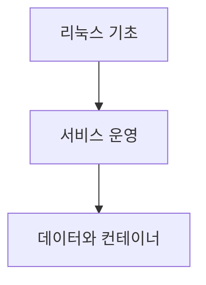

> [!abstract] 학습 경로
> 리눅스 운영 환경에서 시작해 명령·권한·네트워크·웹·데이터·컨테이너와 오픈소스 협업으로 확장한다.

## 학습 지도

## 노트

| 주제 | 노트 |
| :-- | :-- |
| 리눅스와 설치 | [리눅스 소개와 설치](<./notes/01.%20%EB%A6%AC%EB%88%85%EC%8A%A4%20%EC%86%8C%EA%B0%9C%EC%99%80%20%EC%84%A4%EC%B9%98.md>) |
| 명령줄과 경로 | [CLI와 리눅스 디렉터리](<./notes/02.%20CLI%EC%99%80%20%EB%A6%AC%EB%88%85%EC%8A%A4%20%EB%94%94%EB%A0%89%ED%84%B0%EB%A6%AC.md>) |
| 텍스트 편집 | [vi와 텍스트 편집](<./notes/03.%20vi%EC%99%80%20%ED%85%8D%EC%8A%A4%ED%8A%B8%20%ED%8E%B8%EC%A7%91.md>) |
| 셸 | [셸과 셸 프로그래밍](<./notes/04.%20%EC%85%B8%EA%B3%BC%20%EC%85%B8%20%ED%94%84%EB%A1%9C%EA%B7%B8%EB%9E%98%EB%B0%8D.md>) |
| 원격 접속 | [SSH와 리눅스 네트워킹](<./notes/05.%20SSH%EC%99%80%20%EB%A6%AC%EB%88%85%EC%8A%A4%20%EB%84%A4%ED%8A%B8%EC%9B%8C%ED%82%B9.md>) |
| 접근 제어 | [사용자·그룹과 권한](<./notes/06.%20%EC%82%AC%EC%9A%A9%EC%9E%90%C2%B7%EA%B7%B8%EB%A3%B9%EA%B3%BC%20%EA%B6%8C%ED%95%9C.md>) |
| 웹 API | [Flask와 REST](<./notes/07.%20Flask%EC%99%80%20REST.md>) |
| 회원 흐름 | [Flask 회원 기능](<./notes/08.%20Flask%20%ED%9A%8C%EC%9B%90%20%EA%B8%B0%EB%8A%A5.md>) |
| DB 개요 | [데이터베이스 요약](<./notes/08.%20%EB%8D%B0%EC%9D%B4%ED%84%B0%EB%B2%A0%EC%9D%B4%EC%8A%A4%20%EC%9A%94%EC%95%BD.md>) |
| 프로세스 명령 | [프로세스 요약](<./notes/09.%20%ED%94%84%EB%A1%9C%EC%84%B8%EC%8A%A4%20%EC%9A%94%EC%95%BD.md>) |
| SQL과 MySQL | [데이터베이스 기초](<./notes/10.%20%EB%8D%B0%EC%9D%B4%ED%84%B0%EB%B2%A0%EC%9D%B4%EC%8A%A4%20%EA%B8%B0%EC%B4%88.md>) |
| 도커 개요 | [도커 요약](<./notes/10.%20%EB%8F%84%EC%BB%A4%20%EC%9A%94%EC%95%BD.md>) |
| 프로세스 상태 | [프로세스 기초](<./notes/11.%20%ED%94%84%EB%A1%9C%EC%84%B8%EC%8A%A4%20%EA%B8%B0%EC%B4%88.md>) |
| 컨테이너 운용 | [도커 컨테이너](<./notes/13.%20%EB%8F%84%EC%BB%A4%20%EC%BB%A8%ED%85%8C%EC%9D%B4%EB%84%88.md>) |
| 협업과 라이선스 | [오픈소스 기반 프로젝트 관리](<./notes/90.%20%EC%98%A4%ED%94%88%EC%86%8C%EC%8A%A4%20%EA%B8%B0%EB%B0%98%20%ED%94%84%EB%A1%9C%EC%A0%9D%ED%8A%B8%20%EA%B4%80%EB%A6%AC.md>) |

출처 매핑과 중복 판정

주차별 기초·편집·셸·SSH·권한·Flask 노트는 해당 주차 추출 텍스트에 대응한다. 4주차의 두 자료는 셸 개념과 스크립트 문법을 보완하는 한 단원으로 합쳤다. 데이터베이스와 도커에는 요약 자료와 주차 자료가 함께 있으나, 전자는 개념 요약, 후자는 SQL·MySQL 또는 실행 수명주기·Compose에 초점을 분리했다. 프로세스도 명령 요약과 상태·작업 제어로 분리했다.

> [!warning] source warning
> 일부 주차 추출본의 표지 주차·문서 제목이 파일명 또는 강의 주제와 다르다. 각 노트는 확인 가능한 본문 내용만 사용했다.
