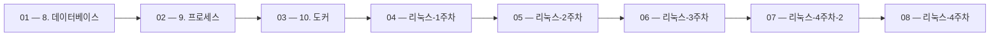

 > [!abstract] 사용법
 > 이 지도는 현재 폴더의 원본 PDF를 파일 순서대로 묶어 **강의 진행 → 핵심 단서 → 점검 포인트**를 연결합니다. 세부 개념은 같은 폴더의 주제 노트와 함께 대조하세요.

## 강의 흐름



<Tabs>
  <Tab label="파일 순서">파일명에 포함된 주차·장·버전 표기를 먼저 읽어 강의의 큰 흐름을 잡습니다.</Tab>
  <Tab label="중복 자료">같은 접두사나 버전이 겹치면 앞 자료를 기준으로 뒤 자료의 보충·실습 여부를 비교합니다.</Tab>
  <Tab label="검증">첫 페이지 단서는 방향만 제시하므로 정의·식·코드·수치는 원본 PDF에서 다시 확인합니다.</Tab>
</Tabs>

## 원본 PDF 목록

| 파일 | 쪽수 | 첫 페이지 단서 |
| :-- | --: | :-- |
| 8. 데이터베이스.pdf | 6 | 데이터베이스 데이터베이스 여러 사람이 데이터를 공유해서 사용하기 위해 체계적으로 통합해서 묶어놓은 데이터 집합 컴퓨터 시스템에서 데이터베이스는 데이터 집합을 관리하고 접근할 수 있게 하는 프로그램을 의미함 데이터베이스의 장점 데이터 중복 최소화 및 저장공간 절약 효율적인 데이터 접근 및 빠른 접근 속도 일관성, 무결성, 보안성 제공 데이터 표준화 관계형 데이터모델(Relational Data |
| 9. 프로세스.pdf | 2 | 프로세스 프로세스 개념 프로세스(Process) : 실행 중인 프로그램의 인스턴스. CPU, 메모리 등 시스템 자원을 소비하며 실행됨 PID(Process ID) : 프로세스를 식별하기 위한 고유번호 PPID(Parent Process ID) : 부모 프로세스의 PID 상태(State) : 프로세스의 현재 상태로 다음과 같은 상태가 있음 프로세스 명령어 # 프로세스 조회 ps ps aux p |
| 10. 도커.pdf | 4 | 도커 도커(Docker) 도커는 애플리케이션을 컨테이너에 담아 실행할 수 있게 하는 컨테이너 기반 가상화 기술 개발자가 만든 애플리케이션을 컨테이너에 넣으면 어디서나 동일한 환경에서 실행 컨테이너(Container) 애플리케이션과 그 실행에 필요한 모든 것을 포함한 독립적인 실행환경 컨테이너는 OS 커널을 공유하며 앱마다 격리된 환경을 제공함 가상머신(VM)보다 가볍고 빠름 VM과 도커 도커 |
| 리눅스-1주차.pdf | 29 | 리눅스 시스템 1주차 |
| 리눅스-2주차.pdf | 18 | 리눅스 시스템 3주차 |
| 리눅스-3주차.pdf | 19 | 리눅스 시스템 3주차 |
| 리눅스-4주차-2.pdf | 15 | 리눅스 시스템 4주차 |
| 리눅스-4주차.pdf | 16 | 리눅스 시스템 4주차 |
| 리눅스-5주차.pdf | 29 | 리눅스 시스템 5주차 |
| 리눅스-6주차.pdf | 17 | 리눅스 시스템 6주차 |
| 리눅스-7주차.pdf | 21 | 7주차 리눅스 시스템 2024.동계계절학기 |
| 리눅스-8주차.pdf | 17 | 8주차 리눅스 시스템 2024.동계계절학기 |
| 리눅스-10주차.pdf | 16 | 10주차 리눅스 시스템 2024.동계계절학기 |
| 리눅스-11주차.pdf | 8 | 10주차 리눅스 시스템 2024.동계계절학기 |
| 리눅스-13주차.pdf | 17 | 12주차 리눅스 시스템 2024.동계계절학기 |
| 오픈소스.pdf | 87 | 오픈소스 기반 프로젝트 관리 박종규 |

## 원본 단계 인터랙티브

```html preview
<div style="font-family:system-ui,sans-serif;padding:20px;color:var(--foreground)">
  <label for="flow4175263878" style="font-size:14px;font-weight:600">원본 자료 단계</label>
  <div id="flow4175263878-out" style="font-size:24px;font-weight:700;color:var(--chart-1);margin:6px 0">8. 데이터베이스</div>
  <input id="flow4175263878" type="range" min="1" max="16" step="1" value="1" style="width:100%;accent-color:var(--primary)" />
  <p style="font-size:13px;color:var(--muted-foreground)">슬라이더를 움직이면 파일명 순서대로 자료의 위치를 확인합니다.</p>
  <script>
    var flow4175263878 = document.getElementById('flow4175263878');
    var flow4175263878Out = document.getElementById('flow4175263878-out');
    var flow4175263878Steps = ["8. 데이터베이스","9. 프로세스","10. 도커","리눅스-1주차","리눅스-2주차","리눅스-3주차","리눅스-4주차-2","리눅스-4주차","리눅스-5주차","리눅스-6주차","리눅스-7주차","리눅스-8주차","리눅스-10주차","리눅스-11주차","리눅스-13주차","오픈소스"];
    flow4175263878.addEventListener('input', function () {
      flow4175263878Out.textContent = flow4175263878Steps[Number(flow4175263878.value) - 1] || '';
    });
  </script>
</div>
```

## 점검 포인트

- **범위:** 16개 PDF, 총 321쪽.
- **근거:** 표의 쪽수와 첫 페이지 단서는 현재 sources/ 파일에서 직접 추출했습니다.
- **학습 순서:** 흐름도와 슬라이더를 먼저 훑은 뒤, 주제 노트의 정의·절차·실습 결과를 순서대로 대조합니다.

> [!warning] 과해석 방지
> 이 지도에는 파일명·쪽수·첫 페이지 추출 단서만 기록했습니다. PDF에 없는 구현 세부, 성능 수치, 권장 설정은 추가하지 않습니다.

<details>
<summary>다음 읽기</summary>

현재 단계의 원본을 열어 제목·절차·도식을 확인한 뒤, 같은 폴더의 주제 노트에 해당 근거가 반영되었는지 점검하세요.

</details>
