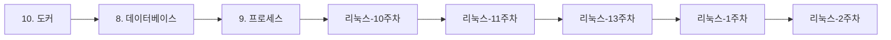

> [!abstract] 사용법
> 이 문서는 원본 PDF의 **순서 → 핵심 단서 → 학습 점검**을 한 번에 보는 지도입니다. 세부 개념은 같은 폴더의 주제 노트와 원본 PDF를 함께 대조하세요.

## 강의 흐름



<Tabs>
  <Tab label="파일 순서">파일명과 주차·장 제목을 강의 진행 신호로 삼아 처음부터 읽습니다.</Tab>
  <Tab label="읽기 전략">이론에서 실습·평가로 이동하며 같은 주제의 중복 PDF는 보조 자료로 비교합니다.</Tab>
  <Tab label="검증">텍스트가 빈약한 자료는 추출되지 않은 도식·수식을 임의로 채우지 않고 원본에서 확인합니다.</Tab>
</Tabs>

## 원본 PDF 목록

| 파일 | 쪽수 | 첫 페이지 단서 |
| :-- | --: | :-- |
| 10. 도커.pdf | — | 도커

   도커(Docker)
       도커는 애플리케이션을 컨테이너에 담아 실행할 수 있게 하는 컨테이너 기반 가상화 기술
       개발자가 만든 애플리케이션을 컨테이너에 넣으면 어디서나 동일한 환경에서 실행
   컨테이너(Container |
| 8. 데이터베이스.pdf | — | 데이터베이스

  데이터베이스
        여러 사람이 데이터를 공유해서 사용하기 위해 체계적으로 통합해서 묶어놓은 데이터 집합
        컴퓨터 시스템에서 데이터베이스는 데이터 집합을 관리하고 접근할 수 있게 하는 프로그램을 의미함
  데이터베 |
| 9. 프로세스.pdf | — | 프로세스

  프로세스 개념
      프로세스(Process) : 실행 중인 프로그램의 인스턴스. CPU, 메모리 등 시스템 자원을 소비하며 실행됨
      PID(Process ID) : 프로세스를 식별하기 위한 고유번호
      PPID(Pa |
| 리눅스-10주차.pdf | — | 10주차

리눅스 시스템


2024.동계계절학기 |
| 리눅스-11주차.pdf | — | 10주차

리눅스 시스템


2024.동계계절학기 |
| 리눅스-13주차.pdf | — | 12주차

리눅스 시스템


2024.동계계절학기 |
| 리눅스-1주차.pdf | — | 리눅스 시스템
1주차 |
| 리눅스-2주차.pdf | — | 리눅스 시스템
3주차 |
| 리눅스-3주차.pdf | — | 리눅스 시스템
3주차 |
| 리눅스-4주차-2.pdf | — | 리눅스 시스템
4주차 |
| 리눅스-4주차.pdf | — | 리눅스 시스템
4주차 |
| 리눅스-5주차.pdf | — | 리눅스 시스템
5주차 |
| 리눅스-6주차.pdf | — | 리눅스 시스템
6주차 |
| 리눅스-7주차.pdf | — | 7주차

리눅스 시스템


2024.동계계절학기 |
| 리눅스-8주차.pdf | — | 8주차

리눅스 시스템


2024.동계계절학기 |
| 오픈소스.pdf | — | 오픈소스 기반 프로젝트 관리


                  박종규 |

## 원본 단계 인터랙티브

```html preview
<div style="font-family:system-ui,sans-serif;padding:20px;color:var(--foreground)">
  <label for="flownfrastructurelinux" style="font-size:14px;font-weight:600">원본 자료 단계</label>
  <div id="flownfrastructurelinux-out" style="font-size:24px;font-weight:700;color:var(--chart-1);margin:6px 0">10. 도커</div>
  <input id="flownfrastructurelinux" type="range" min="1" max="16" step="1" value="1" style="width:100%;accent-color:var(--primary)" />
  <p style="font-size:13px;color:var(--muted-foreground)">슬라이더를 움직이면 파일명 순서대로 자료의 역할을 확인합니다.</p>
  <script>
    var flownfrastructurelinux = document.getElementById('flownfrastructurelinux');
    var flownfrastructurelinuxOut = document.getElementById('flownfrastructurelinux-out');
    var flownfrastructurelinuxSteps = ["10. 도커","8. 데이터베이스","9. 프로세스","리눅스-10주차","리눅스-11주차","리눅스-13주차","리눅스-1주차","리눅스-2주차","리눅스-3주차","리눅스-4주차-2","리눅스-4주차","리눅스-5주차","리눅스-6주차","리눅스-7주차","리눅스-8주차","오픈소스"];
    flownfrastructurelinux.addEventListener('input', function () {
      flownfrastructurelinuxOut.textContent = flownfrastructurelinuxSteps[Number(flownfrastructurelinux.value) - 1];
    });
  </script>
</div>
```

## 점검 포인트

- **범위:** 16개 PDF, 총 0쪽.
- **근거:** 첫 페이지 추출 단서를 표에 남겨 주제명과 흐름을 확인했습니다.
- **시각 자료:** 12개 파일은 첫 페이지 텍스트가 빈약하므로 필요한 경우 승인된 크롭 후보로만 별도 검토합니다.

> [!warning] 과해석 방지
> 이 지도에는 파일명·쪽수·추출된 첫 페이지 단서만 기록했습니다. PDF에 없는 구현 세부, 성능 수치, 권장 설정은 추가하지 않습니다.

<details>
<summary>다음 읽기</summary>

현재 단계의 파일을 선택한 뒤, 같은 폴더의 주제 노트에서 정의·절차·실습 결과를 대조하세요.

</details>
