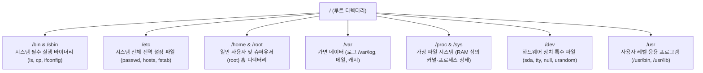

> [!abstract] 핵심 요약
> **리눅스(Linux)**는 리누스 토르발스가 개발한 오픈소스 유닉스 계열 모놀리식 커널이다.
> **"모든 것은 파일이다(Everything is a file)"**라는 유닉스 철학에 따라 하드웨어 장치(`/dev`), 프로세스 상태(`/proc`), 시스템 설정(`/etc`)이 단일 트리 구조인 **파일 시스템 계층 표준(FHS, Filesystem Hierarchy Standard)** 아래 통합 관리된다.

---

## 1. 리눅스 파일 시스템 계층 표준 (FHS: Filesystem Hierarchy Standard)



---

## 2. 필수 CLI 파일 조작 명령어 체계

| 명령어 | 기본 문법 및 핵심 옵션 | 설명 |
| :-- | :-- | :-- |
| `ls` | `ls -la [path]` | 숨김 파일(`-a`) 및 상세 권한/용량/수정일(`-l`) 목록 출력 |
| `cd` | `cd [dir]`, `cd ~`, `cd ..` | 디렉터리 이동 (홈 디렉터리, 상위 디렉터리) |
| `pwd` | `pwd` | 현재 작업 디렉터리(Current Working Directory) 절대 경로 출력 |
| `cp` | `cp -r src_dir/ dest_dir/` | 파일 및 디렉터리 재귀 복사(`-r`) |
| `mv` | `mv old_name new_name` | 파일 이동 및 이름 변경 |
| `rm` | `rm -rf dir/` | 파일 및 디렉터리 강제 재귀 삭제 (`-r`: 재귀, `-f`: 강제) |
| `find` | `find /path -name "*.log" -type f` | 조건 기반 실시간 파일 탐색 |

---

## 3. 실시간 리눅스 FHS 디렉터리 트리 탐색기

```html preview
<div style="font-family:system-ui,-apple-system,sans-serif;padding:20px;background:var(--card);color:var(--card-foreground);border:1px solid var(--border);border-radius:var(--radius)">
  <div style="font-size:16px;font-weight:700;margin-bottom:14px;color:var(--primary);display:flex;align-items:center;gap:8px">
    <span>📂 리눅스 파일 시스템 계층 표준(FHS) 대화형 탐색기</span>
  </div>

  <div style="display:grid;grid-template-columns:1fr 1fr;gap:12px;margin-bottom:14px">
    <div style="padding:10px;background:var(--background);border:1px solid var(--border);border-radius:var(--radius)">
      <div style="font-size:12px;font-weight:700;color:var(--chart-1);margin-bottom:6px">디렉터리 클릭:</div>
      <div style="display:flex;flex-wrap:wrap;gap:4px">
        <button class="fhs-btn" data-path="/" style="padding:4px 8px;background:var(--card);color:var(--foreground);border:1px solid var(--border);border-radius:var(--radius);font-family:monospace;font-size:11px;font-weight:700;cursor:pointer">/</button>
        <button class="fhs-btn" data-path="/etc" style="padding:4px 8px;background:var(--card);color:var(--foreground);border:1px solid var(--border);border-radius:var(--radius);font-family:monospace;font-size:11px;font-weight:700;cursor:pointer">/etc</button>
        <button class="fhs-btn" data-path="/var" style="padding:4px 8px;background:var(--card);color:var(--foreground);border:1px solid var(--border);border-radius:var(--radius);font-family:monospace;font-size:11px;font-weight:700;cursor:pointer">/var</button>
        <button class="fhs-btn" data-path="/proc" style="padding:4px 8px;background:var(--card);color:var(--foreground);border:1px solid var(--border);border-radius:var(--radius);font-family:monospace;font-size:11px;font-weight:700;cursor:pointer">/proc</button>
        <button class="fhs-btn" data-path="/dev" style="padding:4px 8px;background:var(--card);color:var(--foreground);border:1px solid var(--border);border-radius:var(--radius);font-family:monospace;font-size:11px;font-weight:700;cursor:pointer">/dev</button>
      </div>
    </div>

    <div style="padding:10px;background:var(--background);border:1px solid var(--border);border-radius:var(--radius)">
      <div style="font-size:12px;font-weight:700;color:var(--chart-2);margin-bottom:6px">선택 경로 정보:</div>
      <div style="font-family:monospace;font-size:12px;line-height:1.6">
        • 경로: <span id="fhsPathOut" style="font-weight:800;color:var(--primary)">/</span><br/>
        • 역할: <span id="fhsRoleOut" style="font-weight:700">최상위 루트 디렉터리</span>
      </div>
    </div>
  </div>

  <div id="fhsDetailOut" style="padding:10px;background:var(--background);border:1px solid var(--border);border-radius:var(--radius);font-size:11px">
    모든 디렉터리와 마운트 지점의 시작점이 되는 최상위 루트 디렉터리입니다.
  </div>

  <script>
    var fhsData = {
      "/": { role: "최상위 루트 디렉터리", desc: "모든 디렉터리와 저장 장치가 마운트되는 시작점입니다." },
      "/etc": { role: "시스템 전역 설정 디렉터리", desc: "네트워크 설정, 사용자 계정(/etc/passwd), 시스템 데몬 설정 파일이 위치합니다." },
      "/var": { role: "가변 데이터 디렉터리 (Variable)", desc: "시스템 실행 중 동적으로 변화하는 시스템 로그(/var/log), 메일, 캐시가 저장됩니다." },
      "/proc": { role: "가상 파일 시스템 (Virtual FS)", desc: "디스크가 아닌 RAM에 상주하며 현재 실행 중인 프로세스 ID 및 커널 파라미터 정보를 실시간 제공합니다." },
      "/dev": { role: "장치 파일 디렉터리 (Device Files)", desc: "하드디스크(/dev/sda), 널 디바이스(/dev/null), 랜덤 생성기(/dev/urandom) 등 하드웨어를 파일처럼 추상화합니다." }
    };

    var btns = document.querySelectorAll('.fhs-btn');
    btns.forEach(function(b) {
      b.addEventListener('click', function() {
        var p = this.getAttribute('data-path');
        var d = fhsData[p];
        document.getElementById('fhsPathOut').textContent = p;
        document.getElementById('fhsRoleOut').textContent = d.role;
        document.getElementById('fhsDetailOut').textContent = d.desc;
      });
    });
  </script>
</div>
```
