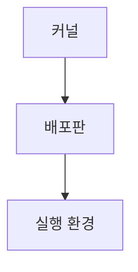

> [!abstract] 한 줄 요약
> 리눅스는 ==커널==에서 출발해 다중 사용자·다중 작업을 지원하는 운영체제로 확장되었다.

## 이 노트의 지도



## 핵심 개념

강의는 리눅스를 리누스 토발즈가 개발한 커널에서 출발해 운영체제로 확장된 사례로 소개한다. 자유 소프트웨어와 ==오픈소스==의 대표이며 다중 사용자·다중 작업·다중 스레드를 지원한다.

> [!important] 핵심 규칙
> 배포판은 리눅스 커널과 GNU 도구를 묶어 설치와 설정을 단순하게 만든다.

$$
\text{배포판}=\text{리눅스 커널}+\text{GNU 도구}
$$

<details>
<summary>배포판의 차이</summary>

RedHat, Fedora, Debian, Ubuntu, CentOS 등이 제시되며, 배포판마다 기본 프로그램과 설치 경로가 조금씩 다를 수 있다.

</details>

<Tabs>
  <Tab label="커널">운영체제의 핵심이 되는 리눅스 커널을 뜻한다.</Tab>
  <Tab label="배포판">커널과 도구를 설치·설정하기 쉽게 묶은 형태다.</Tab>
</Tabs>

> [!tip] 적용 단서
> 설치 방법을 고르기 전에 ==배포판==과 그 배포판의 기본 경로·도구 차이를 확인한다.

## 핵심 단서

```html preview
<div style="font-family:system-ui,sans-serif;padding:20px;color:var(--foreground)">
  <h3 style="margin:0 0 14px;font-size:15px;font-weight:600">강의의 세 주제</h3>
  <div id="bars" style="display:flex;align-items:flex-end;gap:14px;height:170px"></div>
  <script>
    var data = [["소개",1],["설치",2],["둘러보기",3]];
    var max = Math.max.apply(null, data.map(function (d) { return d[1]; })) || 1;
    document.getElementById('bars').innerHTML = data.map(function (d, i) {
      return '<div style="flex:1;display:flex;flex-direction:column;align-items:center;' +
        'gap:6px;height:100%;justify-content:flex-end">' +
        '<span style="font-size:12px;font-weight:600">' + d[1] + '</span>' +
        '<div style="width:100%;height:' + (d[1] / max * 100) + '%;' +
        'background:var(--chart-' + (i + 1) + ');' +
        'border-radius:var(--radius) var(--radius) 0 0"></div>' +
        '<span style="font-size:12px;color:var(--muted-foreground)">' + d[0] + '</span>' +
        '</div>';
    }).join('');
  </script>
</div>
```

$$
\text{OS}=\text{소프트웨어 계층}
$$

<details>
<summary>Ubuntu의 단서</summary>

강의는 Ubuntu를 사용성이 쉬운 배포판 중 하나로 소개하며 LTS를 함께 언급한다.

</details>

<details>
<summary>가상 환경</summary>

강의는 운영체제와 애플리케이션을 설치해 사용하는 가상 환경과 오픈소스 가상머신 프로그램을 설치 맥락으로 제시한다.

</details>

> [!question]- 스스로 점검
> **Q.** 배포판을 커널과 구분해 보는 이유는 무엇인가?
>
> **A.** 배포판은 커널만이 아니라 설치와 사용을 돕는 GNU 도구와 설정을 함께 묶기 때문이다.

## 작성 경계

> [!warning] 출처 경계
> 제공된 추출 텍스트만 사용했으며, 원본 시각자료·첨부물·페이지 표기는 넣지 않았다.
