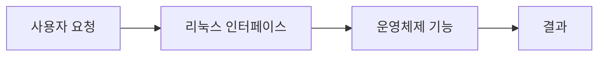

> [!abstract]
> 리눅스는 커널에서 출발해 자유 소프트웨어·오픈소스 생태계로 확장된 다중 사용자 운영체제다.

## 핵심 구조

<Tabs>
<Tab title="소개">커널과 운영체제의 관계</Tab>
<Tab title="설치">실행 환경을 준비하는 과정</Tab>
<Tab title="둘러보기">사용자·소프트웨어·하드웨어 계층</Tab>
</Tabs>



> [!important]
> 커널과 운영체제의 관계·실행 환경을 준비하는 과정·사용자·소프트웨어·하드웨어 계층은 실제 작업 흐름에서 연결되어야 한다.

```html preview h=135px
<div style="font-family:system-ui,sans-serif;padding:14px;border:1px solid var(--border);border-radius:12px;background:var(--card);color:var(--foreground)"><strong>01. 리눅스 소개와 설치</strong><div style="display:grid;grid-template-columns:repeat(3,1fr);gap:8px;margin-top:12px"><span style="padding:8px;border:1px solid var(--border);border-radius:7px">소개</span><span style="padding:8px;border:1px solid var(--border);border-radius:7px">설치</span><span style="padding:8px;border:1px solid var(--border);border-radius:7px">둘러보기</span></div></div>
```

<details>
<summary>커널만으로 사용자 환경이 완성되는가?</summary>

커널은 핵심 제어 부분이고, 배포판은 사용자 도구와 패키지를 함께 구성한다.
</details>

## 점검 흐름

==명령이나 설정을 외우기보다 입력·권한·실행 결과를 연결해 확인한다.==

```html preview h=125px
<div style="font-family:system-ui,sans-serif;padding:14px;border:1px solid var(--border);border-radius:12px;background:var(--card);color:var(--foreground)"><div style="display:flex;gap:9px;align-items:center"><span style="padding:8px;background:var(--chart-1);color:var(--background);border-radius:7px">입력</span><b>→</b><span style="padding:8px;background:var(--chart-2);color:var(--background);border-radius:7px">권한</span><b>→</b><span style="padding:8px;background:var(--chart-3);color:var(--background);border-radius:7px">결과</span></div></div>
```

<details><summary>실습 전 확인</summary>

작업 대상과 현재 사용자, 필요한 권한을 먼저 확인하고 결과를 기록한다.
</details>

> [!warning]
> 시스템 작업은 잘못된 대상이나 권한으로 실행하면 예상보다 큰 영향을 줄 수 있다.

다음 확인을 실제 작업 순서에 넣는다.

> [!tip]
> 작은 예시에서 먼저 실행 결과를 관찰하고, 같은 절차를 확장한다.

### 스스로 점검

- 소개의 역할을 설명할 수 있는가?
- 설치와 둘러보기가 어떤 순서로 연결되는가?
- 실행 전 무엇을 확인해야 하는가?
