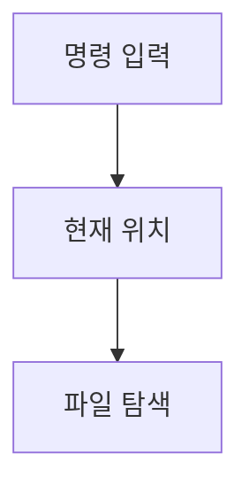

> [!abstract] 한 줄 요약
> CLI는 문자열 명령·출력으로 상호작용하며 ==디렉터리==는 파일을 계층적으로 정리한다.

## 이 노트의 지도



## 핵심 개념

CLI는 터미널을 통해 사용자와 컴퓨터가 상호작용하는 방식으로, 명령은 문자열로 입력되고 결과도 문자열로 출력된다. GUI는 아이콘·메뉴 버튼으로 명령을 대신한다.

> [!important] 핵심 규칙
> 현재 위치를 확인한 뒤 이동과 목록 확인을 분리하면 명령의 대상을 잃지 않는다.

$$
\text{현재 위치}=\operatorname{pwd}()
$$

<details>
<summary>기본 탐색 명령</summary>

강의는 현재 위치 출력 pwd, 디렉터리 이동 cd, 목록 출력 ls, 새 디렉터리 생성 mkdir을 제시한다.

</details>

<Tabs>
  <Tab label="CLI">문자열 형태의 명령과 결과를 중심으로 상호작용한다.</Tab>
  <Tab label="GUI">아이콘·메뉴와 이미지 형태의 결과도 사용하는 인터페이스다.</Tab>
</Tabs>

> [!tip] 적용 단서
> 명령을 실행하기 전 ==현재 디렉터리==를 확인하면 의도하지 않은 위치를 수정하는 일을 줄인다.

## 핵심 단서

```html preview
<div style="font-family:system-ui,sans-serif;padding:20px">
  <div id="cards" style="display:flex;gap:14px;flex-wrap:wrap"></div>
  <script>
    var stats = [["위치","pwd","현재 위치 출력","var(--chart-2)"],["이동","cd","디렉터리 이동","var(--chart-1)"],["목록","ls","파일 확인","var(--chart-5)"]];
    document.getElementById('cards').innerHTML = stats.map(function (s) {
      return '<div style="flex:1;min-width:150px;padding:16px;background:var(--card);' +
        'color:var(--card-foreground);border:1px solid var(--border);' +
        'border-radius:var(--radius)">' +
        '<div style="font-size:13px;color:var(--muted-foreground)">' + s[0] + '</div>' +
        '<div style="font-size:26px;font-weight:700;margin-top:4px">' + s[1] + '</div>' +
        '<div style="font-size:12px;font-weight:600;margin-top:4px;color:' + s[3] + '">' +
        s[2] + '</div>' +
        '</div>';
    }).join('');
  </script>
</div>
```

$$
\text{경로 탐색}=\text{확인}\rightarrow\text{이동}\rightarrow\text{목록}
$$

<details>
<summary>설정과 홈</summary>

강의는 /etc를 설정 파일의 위치로, /home을 사용자의 파일과 개인 설정 등을 포함하는 홈 디렉터리로 소개한다.

</details>

<details>
<summary>ls 옵션</summary>

ls에는 긴 형식과 숨김 파일을 확인하는 옵션이 함께 제시된다.

</details>

> [!question]- 스스로 점검
> **Q.** pwd 다음에 ls를 쓰는 흐름이 유용한 이유는 무엇인가?
>
> **A.** 현재 위치와 그 안의 파일을 순서대로 확인할 수 있기 때문이다.

## 작성 경계

> [!warning] source warning
> 추출본의 첫 화면은 파일명과 달리 3주차로 표기된다. 이 노트는 확인 가능한 CLI·디렉터리 내용만 사용했고, 원본 시각자료와 페이지 표기는 넣지 않았다.

---

## 원본 강의 흐름 인터랙티브

```html preview
<div style="font-family:system-ui,sans-serif;padding:20px;color:var(--foreground)">
  <label for="noteFlow621861" style="font-size:14px;font-weight:600">CLI와 리눅스 디렉터리 단계</label>
  <div id="noteFlow621861-out" style="font-size:26px;font-weight:700;color:var(--chart-1);margin:6px 0">CLI와 리눅스 디렉터리 핵심 개념</div>
  <input id="noteFlow621861" type="range" min="1" max="3" step="1" value="1" style="width:100%;accent-color:var(--primary)" />
  <p style="font-size:13px;color:var(--muted-foreground)">슬라이더를 움직이면 원본 PDF에서 정리한 이 노트의 흐름을 확인합니다.</p>
  <script>
    var noteFlow621861 = document.getElementById('noteFlow621861');
    var noteFlow621861Out = document.getElementById('noteFlow621861-out');
    var noteFlow621861Steps = ["CLI와 리눅스 디렉터리 핵심 개념","CLI와 리눅스 디렉터리 처리 절차","CLI와 리눅스 디렉터리 검증·응용"];
    noteFlow621861.addEventListener('input', function () { noteFlow621861Out.textContent = noteFlow621861Steps[Number(noteFlow621861.value) - 1]; });
  </script>
</div>
```
