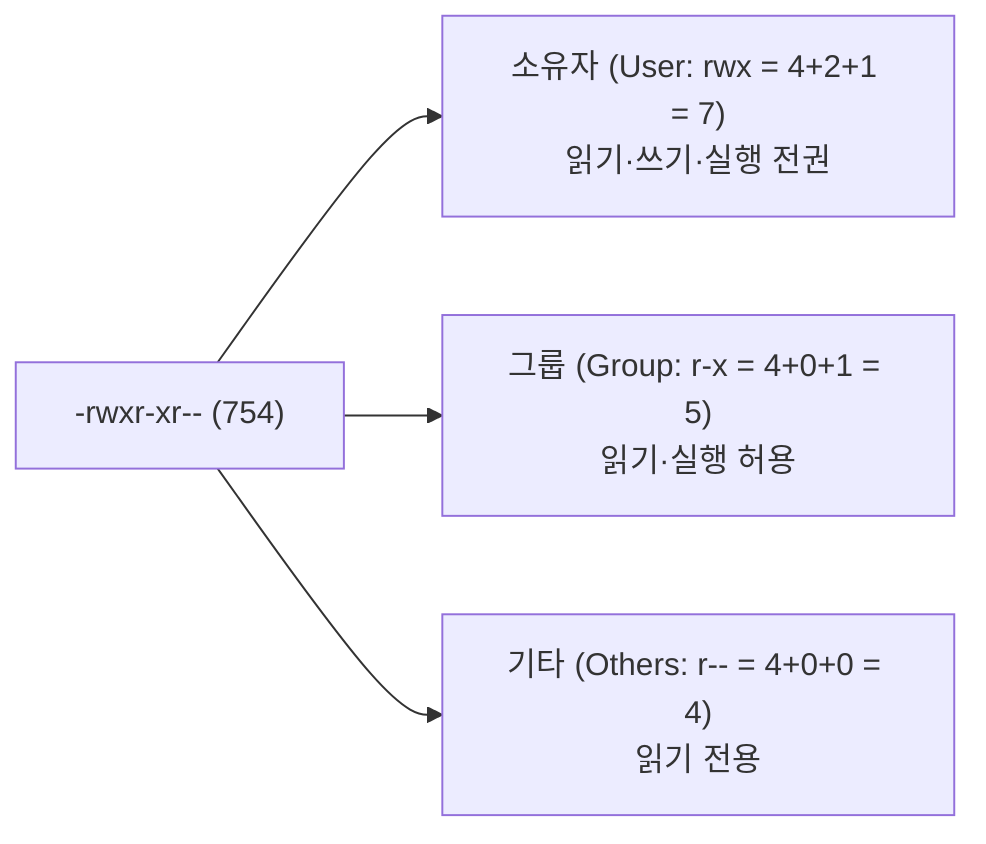

> [!abstract] 핵심 요약
> 리눅스는 강력한 **다중 사용자(Multi-User)** 및 **파일 보안(File Security)** 모델을 갖추고 있다.
> 모든 파일과 디렉터리는 소유자(User), 그룹(Group), 기타 사용자(Others)에 대해 **읽기(r=4), 쓰기(w=2), 실행(x=1)**의 8진수 권한으로 제어되며, 파일 생성 시 기본 권한을 감산하는 **umask**, 실행 시 소유자 권한을 임시 부여하는 **SetUID(4000)**, 공용 디렉터리 삭제를 방지하는 **Sticky Bit(1000)**는 시스템 보안의 핵심이다.

---

## 1. 8진수 파일 권한과 `chmod` / `chown`

$$\text{Permission Value} = (r \times 4) + (w \times 2) + (x \times 1)$$



---

## 2. umask와 특수 권한 (Special Permissions)

### 1) 기본 생성 권한과 umask
- 일반 파일 최대 기본 권한: `666 (rw-rw-rw-)`
- 디렉터리 최대 기본 권한: `777 (rwxrwxrwx)`
- 실제 생성 권한 = $\text{최대 권한} \setminus \text{umask}$ (비트 마스킹)

### 2) 3대 특수 권한
| 특수 권한 | 8진수 비트 | 표기 위치 | 주요 용도 및 대표 예시 |
| :-- | :--: | :--: | :-- |
| **SetUID** | `4000` | `rwsr-xr-x` (User x) | 실행 시 파일 소유자(root) 권한으로 프로세스 실행 (`/usr/bin/passwd`) |
| **SetGID** | `2000` | `rwxr-sr-x` (Group x) | 실행 시 그룹 권한 상속 또는 디렉터리 내 생성 파일 그룹 자동 일치 |
| **Sticky Bit** | `1000` | `rwxrwxrwt` (Other x) | 모든 사용자가 쓰기 가능하나 본인 소유 파일만 삭제 가능 (`/tmp`) |

---

## 3. 실시간 리눅스 8진수 권한(chmod) & umask 계산기

```html preview
<div style="font-family:system-ui,-apple-system,sans-serif;padding:20px;background:var(--card);color:var(--card-foreground);border:1px solid var(--border);border-radius:var(--radius)">
  <div style="font-size:16px;font-weight:700;margin-bottom:14px;color:var(--primary);display:flex;align-items:center;gap:8px">
    <span>🔒 리눅스 8진수 권한(chmod) & 심볼릭 표기 실시간 변환기</span>
  </div>

  <div style="display:grid;grid-template-columns:repeat(3, 1fr);gap:10px;margin-bottom:14px">
    <div style="padding:10px;background:var(--background);border:1px solid var(--border);border-radius:var(--radius)">
      <div style="font-size:11px;font-weight:700;color:var(--chart-1);margin-bottom:6px">소유자 (User)</div>
      <label style="font-size:11px"><input type="checkbox" id="u_r" checked /> 읽기 (r=4)</label><br/>
      <label style="font-size:11px"><input type="checkbox" id="u_w" checked /> 쓰기 (w=2)</label><br/>
      <label style="font-size:11px"><input type="checkbox" id="u_x" checked /> 실행 (x=1)</label>
    </div>

    <div style="padding:10px;background:var(--background);border:1px solid var(--border);border-radius:var(--radius)">
      <div style="font-size:11px;font-weight:700;color:var(--chart-2);margin-bottom:6px">그룹 (Group)</div>
      <label style="font-size:11px"><input type="checkbox" id="g_r" checked /> 읽기 (r=4)</label><br/>
      <label style="font-size:11px"><input type="checkbox" id="g_w" /> 쓰기 (w=2)</label><br/>
      <label style="font-size:11px"><input type="checkbox" id="g_x" checked /> 실행 (x=1)</label>
    </div>

    <div style="padding:10px;background:var(--background);border:1px solid var(--border);border-radius:var(--radius)">
      <div style="font-size:11px;font-weight:700;color:var(--chart-3);margin-bottom:6px">기타 (Others)</div>
      <label style="font-size:11px"><input type="checkbox" id="o_r" checked /> 읽기 (r=4)</label><br/>
      <label style="font-size:11px"><input type="checkbox" id="o_w" /> 쓰기 (w=2)</label><br/>
      <label style="font-size:11px"><input type="checkbox" id="o_x" /> 실행 (x=1)</label>
    </div>
  </div>

  <div style="display:grid;grid-template-columns:1fr 1fr;gap:12px">
    <div style="padding:10px;background:var(--background);border:1px solid var(--border);border-radius:var(--radius);text-align:center">
      <div style="font-size:10px;color:var(--muted-foreground)">8진수 권한 코드 (Octal)</div>
      <div id="octalOut" style="font-family:monospace;font-size:20px;font-weight:800;color:var(--primary);margin-top:2px">754</div>
    </div>
    <div style="padding:10px;background:var(--background);border:1px solid var(--border);border-radius:var(--radius);text-align:center">
      <div style="font-size:10px;color:var(--muted-foreground)">심볼릭 문자열 (Symbolic)</div>
      <div id="symbolicOut" style="font-family:monospace;font-size:18px;font-weight:800;color:var(--chart-2);margin-top:2px">-rwxr-xr--</div>
    </div>
  </div>

  <script>
    function updatePerms() {
      var ur = document.getElementById('u_r').checked ? 4 : 0;
      var uw = document.getElementById('u_w').checked ? 2 : 0;
      var ux = document.getElementById('u_x').checked ? 1 : 0;
      var uVal = ur + uw + ux;

      var gr = document.getElementById('g_r').checked ? 4 : 0;
      var gw = document.getElementById('g_w').checked ? 2 : 0;
      var gx = document.getElementById('g_x').checked ? 1 : 0;
      var gVal = gr + gw + gx;

      var or = document.getElementById('o_r').checked ? 4 : 0;
      var ow = document.getElementById('o_w').checked ? 2 : 0;
      var ox = document.getElementById('o_x').checked ? 1 : 0;
      var oVal = or + ow + ox;

      var octal = "" + uVal + gVal + oVal;
      var sym = "-" +
        (ur ? "r" : "-") + (uw ? "w" : "-") + (ux ? "x" : "-") +
        (gr ? "r" : "-") + (gw ? "w" : "-") + (gx ? "x" : "-") +
        (or ? "r" : "-") + (ow ? "w" : "-") + (ox ? "x" : "-");

      document.getElementById('octalOut').textContent = octal + " (chmod " + octal + " file)";
      document.getElementById('symbolicOut').textContent = sym;
    }

    var cbs = document.querySelectorAll('input[type=checkbox]');
    cbs.forEach(function(cb) { cb.addEventListener('change', updatePerms); });
    updatePerms();
  </script>
</div>
```
