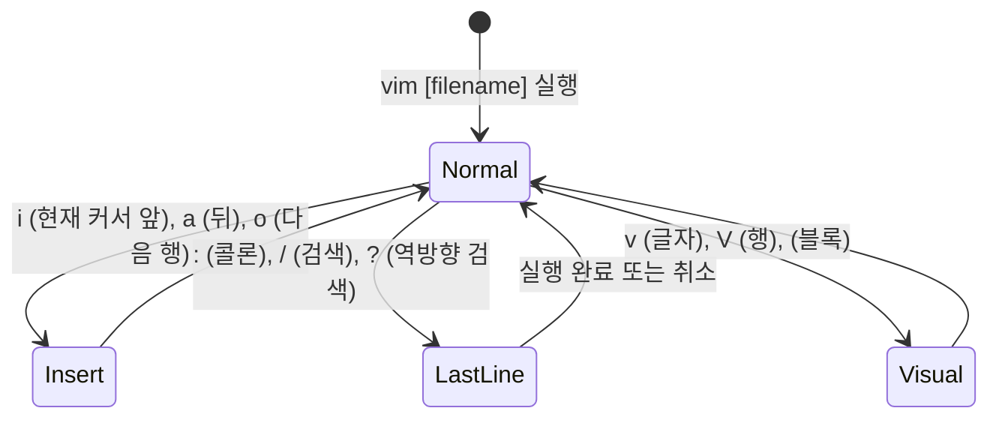

> [!abstract] 핵심 요약
> **Vim(Vi IMproved)**은 리눅스/유닉스 서버 환경의 표준 스크린 지향 텍스트 편집기이다.
> 키보드 타이핑이 그대로 입력되지 않고, 기본 상태인 **일반 모드(Normal Mode)**에서 탐색·복사·삭제를 수행하고, `i/a/o`를 통해 **입력 모드(Insert Mode)**로 전환하며, `:`을 통해 파일 저장 및 정규표현식 치환을 수행하는 **명령행 모드(Last-Line / Ex Mode)**로 분리된 모달(Modal) 인터페이스 구조를 갖는다.

---

## 1. Vim 3대 핵심 모드 전이 다이어그램



---

## 2. 필수 단축키 및 명령행 치환 공식

### 1) 일반 모드 버퍼 편집
- `yy`: 현재 줄 복사 (Yank), `3yy`: 3개 줄 복사
- `dd`: 현재 줄 잘라내기/삭제, `dw`: 한 단어 삭제
- `p`: 커서 아래에 복사된 버퍼 붙여넣기 (Paste)
- `u`: 실행 취소 (Undo), `Ctrl + r`: 다시 실행 (Redo)
- `gg`: 문서 첫 줄 이동, `G`: 문서 끝 줄 이동, `:$`: 마지막 행

### 2) 명령행 모드(Ex) 정규식 전역 치환
$$\text{Syntax: } :[범위]\text{s}/[찾을패턴]/[바꿀문자열]/[플래그]$$
- `:%s/foo/bar/g`: 문서 전체(`%`)에서 모든 `foo`를 `bar`로 일괄 치환(`g`)
- `:wq` 또는 `:x`: 저장 후 종료 (Write & Quit), `:q!`: 강제 종료

---

## 3. 실시간 Vim 대화형 모드 전환 & 단축키 시뮬레이터

```html preview
<div style="font-family:system-ui,-apple-system,sans-serif;padding:20px;background:var(--card);color:var(--card-foreground);border:1px solid var(--border);border-radius:var(--radius)">
  <div style="font-size:16px;font-weight:700;margin-bottom:14px;color:var(--primary);display:flex;align-items:center;gap:8px">
    <span>⌨️ Vim 3대 모드 전환 및 단축키 대화형 시뮬레이터</span>
  </div>

  <div style="display:grid;grid-template-columns:1fr 1fr;gap:12px;margin-bottom:14px">
    <div style="padding:10px;background:var(--background);border:1px solid var(--border);border-radius:var(--radius)">
      <div style="font-size:12px;font-weight:700;color:var(--chart-1);margin-bottom:6px">키 입력 시뮬레이션:</div>
      <div style="display:grid;grid-template-columns:1fr 1fr;gap:6px">
        <button id="key_i" style="padding:6px;background:var(--card);color:var(--foreground);border:1px solid var(--border);border-radius:var(--radius);font-family:monospace;font-size:11px;font-weight:700;cursor:pointer">i (Insert 진입)</button>
        <button id="key_esc" style="padding:6px;background:var(--card);color:var(--foreground);border:1px solid var(--border);border-radius:var(--radius);font-family:monospace;font-size:11px;font-weight:700;cursor:pointer">&lt;ESC&gt; (Normal 복귀)</button>
        <button id="key_colon" style="padding:6px;background:var(--card);color:var(--foreground);border:1px solid var(--border);border-radius:var(--radius);font-family:monospace;font-size:11px;font-weight:700;cursor:pointer">: (Ex 모드 진입)</button>
        <button id="key_dd" style="padding:6px;background:var(--card);color:var(--foreground);border:1px solid var(--border);border-radius:var(--radius);font-family:monospace;font-size:11px;font-weight:700;cursor:pointer">dd (1줄 삭제)</button>
      </div>
    </div>

    <div style="padding:10px;background:var(--background);border:1px solid var(--border);border-radius:var(--radius)">
      <div style="font-size:12px;font-weight:700;color:var(--chart-2);margin-bottom:6px">Vim 에디터 상태:</div>
      <div style="font-family:monospace;font-size:12px;line-height:1.8">
        • 현재 모드: <span id="vimModeOut" style="font-weight:800;color:var(--primary)">-- NORMAL --</span><br/>
        • 상태줄 표시: <span id="vimStatusLine" style="color:var(--muted-foreground)">"server.py" 3L, 45B</span>
      </div>
    </div>
  </div>

  <div id="vimBufferDesc" style="padding:10px;background:var(--background);border:1px solid var(--border);border-radius:var(--radius);font-family:monospace;font-size:11px">
    [Normal Mode] 커서 탐색, 줄 복사(yy), 삭제(dd), 실행취소(u)를 수행할 수 있습니다.
  </div>

  <script>
    var curVimMode = "NORMAL";

    document.getElementById('key_i').onclick = function() {
      curVimMode = "INSERT";
      document.getElementById('vimModeOut').textContent = "-- INSERT --";
      document.getElementById('vimModeOut').style.color = "var(--chart-2)";
      document.getElementById('vimBufferDesc').textContent = "[Insert Mode] 텍스트를 직접 입력 중입니다. 편집 완료 시 <ESC>를 누르세요.";
    };

    document.getElementById('key_esc').onclick = function() {
      curVimMode = "NORMAL";
      document.getElementById('vimModeOut').textContent = "-- NORMAL --";
      document.getElementById('vimModeOut').style.color = "var(--primary)";
      document.getElementById('vimBufferDesc').textContent = "[Normal Mode] 일반 명령 모드로 복귀했습니다.";
    };

    document.getElementById('key_colon').onclick = function() {
      if (curVimMode === "NORMAL") {
        curVimMode = "COMMAND_LINE";
        document.getElementById('vimModeOut').textContent = ":";
        document.getElementById('vimModeOut').style.color = "var(--chart-1)";
        document.getElementById('vimBufferDesc').textContent = "[Last-Line Mode] :wq(저장종료), :q!(강제종료), :%s/old/new/g(치환) 명령을 대기합니다.";
      }
    };

    document.getElementById('key_dd').onclick = function() {
      if (curVimMode === "NORMAL") {
        document.getElementById('vimBufferDesc').textContent = "✂️ [Cut Line] 현재 커서가 위치한 1줄을 잘라내어 클립보드 버퍼에 저장했습니다.";
      }
    };
  </script>
</div>
```
