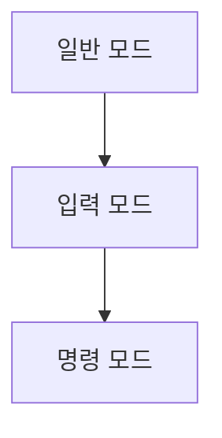

> [!abstract] 한 줄 요약
> vi는 ==일반 모드와 입력 모드==를 구분해 텍스트 편집을 제어한다.

## 이 노트의 지도



## 핵심 개념

강의는 vi를 대표적인 리눅스 텍스트 편집기로 소개한다. vi는 수정 가능한 커맨드 기반 편집기이며 글 수정·작성은 입력 모드에서만 가능하다.

> [!important] 핵심 규칙
> 모드 전환을 먼저 확인해야 입력 문자와 편집 명령을 혼동하지 않는다.

$$
\text{mode}\in\{\text{normal},\text{insert},\text{command}\}
$$

<details>
<summary>기본 전환</summary>

일반 모드에서 i로 입력 모드로 바꾸고, 입력 모드에서 esc로 일반 모드로 돌아간다. 일반 모드의 :는 명령 입력을 시작한다.

</details>

<Tabs>
  <Tab label="일반 모드">커서 이동과 모드 전환, 편집 명령을 처리한다.</Tab>
  <Tab label="입력 모드">글을 수정하거나 작성하는 모드다.</Tab>
</Tabs>

> [!tip] 적용 단서
> 저장·종료 전에 ==현재 모드==를 확인하면 명령이 본문에 입력되는 실수를 줄인다.

## 핵심 단서

```html preview
<div style="font-family:system-ui,sans-serif;padding:20px">
  <div id="cards" style="display:flex;gap:14px;flex-wrap:wrap"></div>
  <script>
    var stats = ["입력","i","입력 모드 전환","var(--chart-2)"],["복귀","esc","일반 모드 전환","var(--chart-1)"],["명령",":","커맨드 입력","var(--chart-5)"]("입력","i","입력 모드 전환","var(--chart-2)"],["복귀","esc","일반 모드 전환","var(--chart-1)"],["명령",":","커맨드 입력","var(--chart-5)".md);
    document.getElementById('cards').innerHTML = stats.map(function (s) {
      return '<div style="flex:1;min-width:150px;padding:16px;background:var(--card);' +
        'color:var(--card-foreground);border:1px solid var(--border);' +
        'border-radius:var(--radius)">' +
        '<div style="font-size:13px;color:var(--muted-foreground)">' + s[0] + '</div>' +
        '<div style="font-size:26px;font-weight:700;margin-top:4px">' + s[1] + '</div>' +
        '<div style="font-size:12px;font-weight:600;margin-top:4px;color:' + s[3] + '">' +
        s[2] + '</div>' +
        '</div>';
    }).join('');
  </script>
</div>
```

$$
\text{저장 후 종료}=wq
$$

<details>
<summary>저장과 종료</summary>

명령 모드에서 q, q!, wq는 종료·강제 종료·저장 후 종료에 대응하며, w는 저장에 대응한다.

</details>

<details>
<summary>vim과 vi</summary>

강의는 vim을 Vi Improved로 설명하고, 현재 리눅스에서는 vi를 실행해도 vim이 실행된다고 적는다.

</details>

> [!question]- 스스로 점검
> **Q.** 텍스트 작성 전에 입력 모드로 전환해야 하는 이유는 무엇인가?
>
> **A.** 일반 모드의 키는 이동·편집 명령으로 해석되며, 글 수정과 작성은 입력 모드에서만 가능하기 때문이다.

## 작성 경계

> [!warning] 출처 경계
> 제공된 추출 텍스트만 사용했으며, 원본 시각자료·첨부물·페이지 표기는 넣지 않았다.

---

## 원본 강의 흐름 인터랙티브

```html preview
<div style="font-family:system-ui,sans-serif;padding:20px;color:var(--foreground)">
  <label for="noteFlow374862" style="font-size:14px;font-weight:600">vi와 텍스트 편집 단계</label>
  <div id="noteFlow374862-out" style="font-size:26px;font-weight:700;color:var(--chart-1);margin:6px 0">vi와 텍스트 편집 핵심 개념</div>
  <input id="noteFlow374862" type="range" min="1" max="3" step="1" value="1" style="width:100%;accent-color:var(--primary)" />
  <p style="font-size:13px;color:var(--muted-foreground)">슬라이더를 움직이면 원본 PDF에서 정리한 이 노트의 흐름을 확인합니다.</p>
  <script>
    var noteFlow374862 = document.getElementById('noteFlow374862');
    var noteFlow374862Out = document.getElementById('noteFlow374862-out');
    var noteFlow374862Steps = ["vi와 텍스트 편집 핵심 개념","vi와 텍스트 편집 처리 절차","vi와 텍스트 편집 검증·응용"];
    noteFlow374862.addEventListener('input', function () { noteFlow374862Out.textContent = noteFlow374862Steps[Number(noteFlow374862.value) - 1]; });
  </script>
</div>
```
