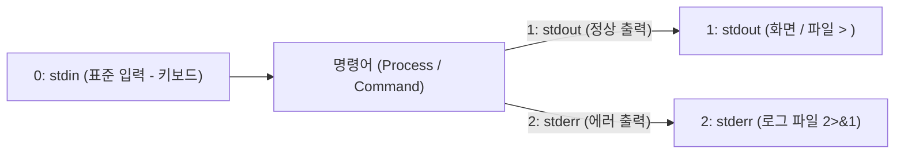
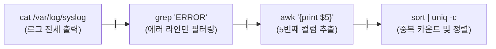

> [!abstract] 핵심 요약
> **셸(Shell)**은 커널과 사용자 사이에서 명령어를 해석하고 실행하는 명령어 인터프리터이다.
> 표준 입력(0), 표준 출력(1), 표준 에러(2)를 제어하는 **리다이렉션(`>`, `>>`, `2>&1`)**과 이전 명령어의 출력을 다음 명령어의 입력으로 연결하는 **파이프라인(`|`)**, 그리고 자동화 스크립트를 작성하기 위한 **Bash 변수·제어문(if, for, while, exit code `$?`)**은 리눅스 자동화 및 데브옵스의 핵심 기초이다.

---

## 1. 표준 파일 디스크립터와 입출력 리다이렉션



| 기호 | 디스크립터 문법 | 동작 설명 | 대표 예시 |
| :-- | :-- | :-- | :-- |
| `>` | `cmd > file` | 표준 출력(1)을 파일로 덮어쓰기 (Overwrite) | `echo "log" > app.log` |
| `>>` | `cmd >> file` | 표준 출력(1)을 파일 끝에 추가 (Append) | `date >> app.log` |
| `<` | `cmd < file` | 파일의 내용을 표준 입력(0)으로 전달 | `mysql -u root < dump.sql` |
| `2>` | `cmd 2> err.log` | 표준 에러(2)만 별도 파일로 분리 저장 | `find / -name "*.conf" 2> err.log` |
| `&>` / `2>&1` | `cmd > all.log 2>&1` | 표준 출력과 표준 에러를 동일한 파일에 병합 | `nohup python3 app.py > run.log 2>&1 &` |

---

## 2. 유닉스 파이프라인(Pipeline)과 텍스트 필터링



---

## 3. 실시간 Bash 파이프라인 텍스트 처리 시뮬레이터

```html preview
<div style="font-family:system-ui,-apple-system,sans-serif;padding:20px;background:var(--card);color:var(--card-foreground);border:1px solid var(--border);border-radius:var(--radius)">
  <div style="font-size:16px;font-weight:700;margin-bottom:14px;color:var(--primary);display:flex;align-items:center;gap:8px">
    <span>🐚 Bash 파이프라인(|) 및 grep / sort / wc 실시간 필터 시뮬레이터</span>
  </div>

  <div style="margin-bottom:12px">
    <label style="font-size:11px;color:var(--muted-foreground)">샘플 서버 로그 데이터 (Raw Logs):</label>
    <textarea id="rawLogInput" rows="4" style="width:100%;padding:6px;background:var(--background);color:var(--foreground);border:1px solid var(--border);border-radius:var(--radius);font-family:monospace;font-size:11px">2026-08-29 10:00:01 INFO Server Started
2026-08-29 10:01:15 ERROR Database Connection Failed
2026-08-29 10:02:40 INFO User Login Success
2026-08-29 10:05:12 ERROR Timeout Occurred on Port 3306
2026-08-29 10:06:00 WARN High Memory Usage</textarea>
  </div>

  <div style="display:flex;gap:8px;align-items:center;margin-bottom:12px">
    <button id="btnGrepError" style="padding:6px 12px;background:var(--primary);color:#fff;border:none;border-radius:var(--radius);font-size:11px;font-weight:700;cursor:pointer">grep "ERROR"</button>
    <button id="btnGrepWarn" style="padding:6px 12px;background:var(--chart-1);color:#fff;border:none;border-radius:var(--radius);font-size:11px;font-weight:700;cursor:pointer">grep "WARN"</button>
    <button id="btnCountLines" style="padding:6px 12px;background:var(--chart-2);color:#fff;border:none;border-radius:var(--radius);font-size:11px;font-weight:700;cursor:pointer">wc -l (줄 수 카운트)</button>
  </div>

  <div style="padding:10px;background:var(--background);border:1px solid var(--border);border-radius:var(--radius)">
    <div style="font-size:11px;font-weight:700;color:var(--primary);margin-bottom:4px">파이프라인 실행 결과 ($ stdout):</div>
    <pre id="pipeResultOut" style="margin:0;font-family:monospace;font-size:11px;line-height:1.5;white-space:pre-wrap;color:var(--card-foreground)"></pre>
  </div>

  <script>
    function filterLogs(filterType) {
      var lines = document.getElementById('rawLogInput').value.split('\n');
      var out = document.getElementById('pipeResultOut');

      if (filterType === 'ERROR') {
        var res = lines.filter(function(l) { return l.indexOf('ERROR') !== -1; });
        out.textContent = res.join('\n');
      } else if (filterType === 'WARN') {
        var res = lines.filter(function(l) { return l.indexOf('WARN') !== -1; });
        out.textContent = res.join('\n');
      } else if (filterType === 'WC') {
        out.textContent = lines.length + " lines in log stream";
      }
    }

    document.getElementById('btnGrepError').onclick = function() { filterLogs('ERROR'); };
    document.getElementById('btnGrepWarn').onclick = function() { filterLogs('WARN'); };
    document.getElementById('btnCountLines').onclick = function() { filterLogs('WC'); };

    filterLogs('ERROR');
  </script>
</div>
```
