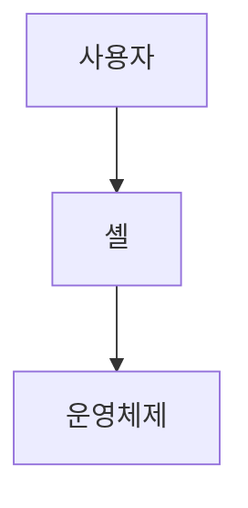

> [!abstract] 한 줄 요약
> 셸은 명령과 프로그램을 실행하는 인터페이스이며 ==스크립트==는 명령을 모아 한 번에 실행한다.

## 이 노트의 지도



## 핵심 개념

강의는 셸을 리눅스에서 명령어와 프로그램을 실행할 때 사용하는 인터페이스로 설명한다. Bourne shell, Bash, zsh 등의 셸이 제시된다.

> [!important] 핵심 규칙
> 스크립트는 첫 줄의 해석기 지정과 실행 권한을 갖춰야 직접 실행할 수 있다.

$$
\text{스크립트}=\text{명령 집합}+\text{실행 권한}
$$

<details>
<summary>셸의 역할</summary>

셸은 사용자의 명령과 운영체제 사이에서 결과를 돌려주는 인터페이스로 제시된다. Bash는 GNU 프로젝트를 위해 만들어져 여러 운영체제의 기본 셸로 사용된다.

</details>

<Tabs>
  <Tab label="대화형 셸">사용자가 명령을 입력하고 결과를 바로 받는다.</Tab>
  <Tab label="셸 스크립트">자주 쓰거나 복잡한 명령을 파일에 모아 한 번에 실행한다.</Tab>
</Tabs>

> [!tip] 적용 단서
> 첫 줄의 ==shebang==은 스크립트를 해석할 셸의 경로를 지정한다.

## 핵심 단서

```html preview
<div style="font-family:system-ui,sans-serif;padding:20px;display:flex;align-items:center;gap:20px;color:var(--foreground)">
  <svg width="120" height="120" viewBox="0 0 120 120" role="img" aria-label="강의에 제시된 셸">
    <circle cx="60" cy="60" r="46" stroke-width="14" style="fill: none; stroke: var(--border)" />
    <circle cx="60" cy="60" r="46" stroke-width="14"
      stroke-linecap="round" stroke-dasharray="289" stroke-dashoffset="0"
      transform="rotate(-90 60 60)" style="fill: none; stroke: var(--chart-1)" />
    <text x="60" y="67" text-anchor="middle" font-size="22" font-weight="700"
      style="fill: var(--foreground)">3</text>
  </svg>
  <div>
    <div style="font-weight:600;font-size:15px">강의에 제시된 셸</div>
    <div style="font-size:13px;color:var(--muted-foreground);margin-top:2px">Bourne·Bash·zsh 3/3</div>
  </div>
</div>
```

$$
\text{직접 실행}=\text{해석기 지정}+\text{chmod +x}
$$

<details>
<summary>생성과 실행</summary>

강의는 vi로 스크립트 파일을 만들고 chmod +x로 실행 권한을 준 뒤 ./로 실행하는 흐름을 제시한다.

</details>

<details>
<summary>변수와 조건</summary>

보조 자료는 변수 선언·출력, 명령 실행 결과 저장, if 조건문, 명령 치환을 스크립트 기초로 제시한다.

</details>

> [!question]- 스스로 점검
> **Q.** 명시적으로 bash 스크립트를 실행할 때 shebang의 역할은 어떻게 달라지는가?
>
> **A.** 강의는 bash script.sh처럼 해석기를 명시하면 shebang이 필수는 아니지만 일반적으로 추가를 권장한다고 설명한다.

## 작성 경계

> [!warning] 출처 경계
> 제공된 추출 텍스트만 사용했으며, 원본 시각자료·첨부물·페이지 표기는 넣지 않았다.

---

## 원본 강의 흐름 인터랙티브

```html preview
<div style="font-family:system-ui,sans-serif;padding:20px;color:var(--foreground)">
  <label for="noteFlow736073" style="font-size:14px;font-weight:600">셸과 셸 프로그래밍 단계</label>
  <div id="noteFlow736073-out" style="font-size:26px;font-weight:700;color:var(--chart-1);margin:6px 0">셸과 셸 프로그래밍 핵심 개념</div>
  <input id="noteFlow736073" type="range" min="1" max="3" step="1" value="1" style="width:100%;accent-color:var(--primary)" />
  <p style="font-size:13px;color:var(--muted-foreground)">슬라이더를 움직이면 원본 PDF에서 정리한 이 노트의 흐름을 확인합니다.</p>
  <script>
    var noteFlow736073 = document.getElementById('noteFlow736073');
    var noteFlow736073Out = document.getElementById('noteFlow736073-out');
    var noteFlow736073Steps = ["셸과 셸 프로그래밍 핵심 개념","셸과 셸 프로그래밍 처리 절차","셸과 셸 프로그래밍 검증·응용"];
    noteFlow736073.addEventListener('input', function () { noteFlow736073Out.textContent = noteFlow736073Steps[Number(noteFlow736073.value) - 1]; });
  </script>
</div>
```
