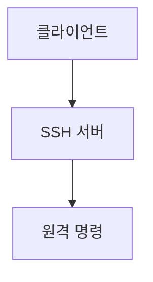

> [!abstract] 한 줄 요약
> SSH는 네트워크로 원격 로그인과 명령 실행을 가능하게 하며 기본 포트는 ==22==다.

## 이 노트의 지도



## 핵심 개념

강의는 SSH를 네트워크로 다른 시스템에 원격 로그인하여 명령을 내릴 수 있는 프로그램 또는 프로토콜로 소개하며 보안 데이터 전송과 원격 제어를 주요 기능으로 든다.

> [!important] 핵심 규칙
> 원격 접속에는 서버 설치, 포트 포워딩 같은 네트워크 설정, 클라이언트 준비가 함께 필요하다.

$$
\text{SSH 기본 포트}=22
$$

<details>
<summary>원격 로그인 준비</summary>

강의는 SSH 서버 설치, 포트 포워딩 설정, SSH 클라이언트 준비의 순서를 제시한다. Host Name에는 호스트 IP를 입력한다.

</details>

<Tabs>
  <Tab label="NAT">여러 사설 장치가 하나의 공인 IP를 사용하는 방식으로 제시된다.</Tab>
  <Tab label="Host-Only">호스트와 분리된 내부 네트워크를 구성하는 방식으로 제시된다.</Tab>
</Tabs>

> [!tip] 적용 단서
> 접속 실패를 살필 때 ==호스트 IP==와 게스트 IP, 포트 포워딩 규칙을 분리해서 확인한다.

## 핵심 단서

```html preview
<div style="font-family:system-ui,sans-serif;padding:20px">
  <div id="cards" style="display:flex;gap:14px;flex-wrap:wrap"></div>
  <script>
    var stats = [["기본 포트","22","SSH","var(--chart-2)"],["전송","SFTP","보안 전송","var(--chart-1)"],["연결","IP","호스트·게스트","var(--chart-5)"]];
    document.getElementById('cards').innerHTML = stats.map(function (s) {
      return '<div style="flex:1;min-width:150px;padding:16px;background:var(--card);' +
        'color:var(--card-foreground);border:1px solid var(--border);' +
        'border-radius:var(--radius)">' +
        '<div style="font-size:13px;color:var(--muted-foreground)">' + s[0] + '</div>' +
        '<div style="font-size:26px;font-weight:700;margin-top:4px">' + s[1] + '</div>' +
        '<div style="font-size:12px;font-weight:600;margin-top:4px;color:' + s[3] + '">' +
        s[2] + '</div>' +
        '</div>';
    }).join('');
  </script>
</div>
```

$$
\text{원격 접속}=\text{Client}\rightarrow\text{Server}
$$

<details>
<summary>가상머신 네트워크</summary>

강의는 가상화 네트워크로 Host PC와 Guest PC를 연결한다고 설명하며 NAT와 Host-Only Adapter를 함께 다룬다.

</details>

<details>
<summary>IP 확인</summary>

네트워크 설정 과정에서 호스트 IP와 게스트 IP를 각각 확인하는 단계가 제시된다.

</details>

> [!question]- 스스로 점검
> **Q.** SSH 원격 로그인에 포트 포워딩 설정이 필요한 맥락은 무엇인가?
>
> **A.** 강의의 가상머신 환경에서는 외부 연결과 게스트의 SSH 서비스를 연결하기 위해 네트워크 규칙을 구성하기 때문이다.

## 작성 경계

> [!warning] 출처 경계
> 제공된 추출 텍스트만 사용했으며, 원본 시각자료·첨부물·페이지 표기는 넣지 않았다.
