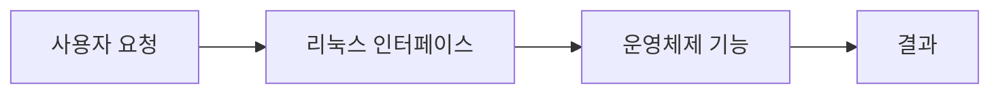

> [!abstract]
> SSH는 네트워크를 통해 다른 시스템에 원격 로그인하고 명령을 내릴 수 있게 하는 프로그램과 프로토콜이다.

## 핵심 구조

<Tabs>
<Tab title="클라이언트">원격 접속을 요청</Tab>
<Tab title="서버">접속과 명령 실행을 제공</Tab>
<Tab title="보안">데이터 전송과 원격 제어 보호</Tab>
</Tabs>



> [!important]
> 원격 접속을 요청·접속과 명령 실행을 제공·데이터 전송과 원격 제어 보호은 실제 작업 흐름에서 연결되어야 한다.

```html preview h=135px
<div style="font-family:system-ui,sans-serif;padding:14px;border:1px solid var(--border);border-radius:12px;background:var(--card);color:var(--foreground)"><strong>05. SSH와 리눅스 네트워킹</strong><div style="display:grid;grid-template-columns:repeat(3,1fr);gap:8px;margin-top:12px"><span style="padding:8px;border:1px solid var(--border);border-radius:7px">클라이언트</span><span style="padding:8px;border:1px solid var(--border);border-radius:7px">서버</span><span style="padding:8px;border:1px solid var(--border);border-radius:7px">보안</span></div></div>
```

<details>
<summary>원격 명령에 보안이 필요한 이유는?</summary>

네트워크 경로에서 인증 정보와 작업 내용을 보호해야 하기 때문이다.
</details>

## 점검 흐름

==명령이나 설정을 외우기보다 입력·권한·실행 결과를 연결해 확인한다.==

```html preview h=125px
<div style="font-family:system-ui,sans-serif;padding:14px;border:1px solid var(--border);border-radius:12px;background:var(--card);color:var(--foreground)"><div style="display:flex;gap:9px;align-items:center"><span style="padding:8px;background:var(--chart-1);color:var(--background);border-radius:7px">입력</span><b>→</b><span style="padding:8px;background:var(--chart-2);color:var(--background);border-radius:7px">권한</span><b>→</b><span style="padding:8px;background:var(--chart-3);color:var(--background);border-radius:7px">결과</span></div></div>
```

<details><summary>실습 전 확인</summary>

작업 대상과 현재 사용자, 필요한 권한을 먼저 확인하고 결과를 기록한다.
</details>

> [!warning]
> 시스템 작업은 잘못된 대상이나 권한으로 실행하면 예상보다 큰 영향을 줄 수 있다.

다음 확인을 실제 작업 순서에 넣는다.

> [!tip]
> 작은 예시에서 먼저 실행 결과를 관찰하고, 같은 절차를 확장한다.

### 스스로 점검

- 클라이언트의 역할을 설명할 수 있는가?
- 서버와 보안가 어떤 순서로 연결되는가?
- 실행 전 무엇을 확인해야 하는가?
