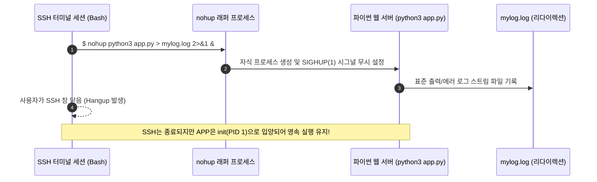

> [!abstract] 핵심 요약
> 서버 운영에서 프로세스의 라이프사이클을 백그라운드로 안전하게 유지하고 제어하는 것은 필수적이다.
> 터미널 세션이 종료되어도 `SIGHUP` 시그널을 무시하고 데몬 형태로 영속 실행되도록 하는 **`nohup ... &`**, 프로세스에 정상 종료(`SIGTERM 15`) 및 강제 종료(`SIGKILL 9`)를 전달하는 **시그널(Signal)** 체계, 그리고 정기적 배치 작업을 수행하는 **Cron**과 시스템 부팅 시 자동 기동을 책임지는 **systemd(`systemctl`)**를 마스터해야 한다.

---

## 1. 백그라운드 실행과 nohup의 원리



---

## 2. 주요 리눅스 시그널(Signal) 번호와 동작

| 시그널 번호 | 시그널 이름 | 기본 동작 | 핸들링/차단 가능 여부 | 발생 트리거 및 설명 |
| :--: | :-- | :-- | :--: | :-- |
| **1** | `SIGHUP` | 종료 (Hangup) | 가능 (nohup이 무시) | 제어 터미널 연결 끊김 발생 시 전달 |
| **2** | `SIGINT` | 프로세스 중단 | 가능 | 키보드 인터럽트 (`Ctrl + C`) 입력 |
| **9** | **`SIGKILL`** | **즉각 강제 종료** | **불가능 (커널이 직접 수거)** | 프로세스가 락에 걸려 응답하지 않을 때 강제 종료 |
| **15** | **`SIGTERM`** | **정상 안전 종료** | 가능 (Graceful Shutdown) | `kill [PID]`의 기본 시그널, 자원 정리 후 종료 |
| **19** | `SIGSTOP` | 프로세스 일시 정지 | 불가능 | 키보드 일시 정지 (`Ctrl + Z`), 백그라운드 대기 |

---

## 3. 실시간 리눅스 프로세스 상태 & 시그널(kill) 시뮬레이터

```html preview
<div style="font-family:system-ui,-apple-system,sans-serif;padding:20px;background:var(--card);color:var(--card-foreground);border:1px solid var(--border);border-radius:var(--radius)">
  <div style="font-size:16px;font-weight:700;margin-bottom:14px;color:var(--primary);display:flex;align-items:center;gap:8px">
    <span>⚙️ 리눅스 프로세스 백그라운드 실행 & 시그널(Kill) 제어기</span>
  </div>

  <table style="width:100%;border-collapse:collapse;font-size:11px;text-align:center;margin-bottom:14px">
    <thead style="border-bottom:1px solid var(--border);color:var(--muted-foreground)">
      <tr><th>PID</th><th>명령어 (CMD)</th><th>상태 (STAT)</th><th>CPU%</th><th>동작 제어</th></tr>
    </thead>
    <tbody>
      <tr>
        <td>1042</td>
        <td>python3 app.py</td>
        <td><span id="stat1042" style="font-weight:700;color:var(--chart-2)">R (Running)</span></td>
        <td>12.4%</td>
        <td>
          <button id="btnSigterm" style="padding:3px 8px;background:var(--chart-1);color:#fff;border:none;border-radius:var(--radius);font-size:10px;cursor:pointer">kill -15 (정상종료)</button>
          <button id="btnSigkill" style="padding:3px 8px;background:var(--destructive,#ef4444);color:#fff;border:none;border-radius:var(--radius);font-size:10px;cursor:pointer">kill -9 (강제종료)</button>
        </td>
      </tr>
    </tbody>
  </table>

  <div id="sigLogOut" style="padding:10px;background:var(--background);border:1px solid var(--border);border-radius:var(--radius);font-family:monospace;font-size:11px">
    백그라운드에서 Flask 웹 서버가 포트 5000에서 정상 서비스 중입니다.
  </div>

  <script>
    document.getElementById('btnSigterm').onclick = function() {
      document.getElementById('stat1042').textContent = "S (Graceful Terminated)";
      document.getElementById('stat1042').style.color = "var(--muted-foreground)";
      document.getElementById('sigLogOut').textContent = "🔔 [SIGTERM 15 전달] DB 커넥션 풀을 정상 닫고 메모리를 해제한 뒤 안전하게 종료되었습니다.";
    };

    document.getElementById('btnSigkill').onclick = function() {
      document.getElementById('stat1042').textContent = "KILLED (SIGKILL)";
      document.getElementById('stat1042').style.color = "var(--destructive,#ef4444)";
      document.getElementById('sigLogOut').textContent = "⚡ [SIGKILL 9 전달] 프로세스 핸들러를 거치지 않고 커널이 즉각 메모리를 강제 회수했습니다.";
    };
  </script>
</div>
```
