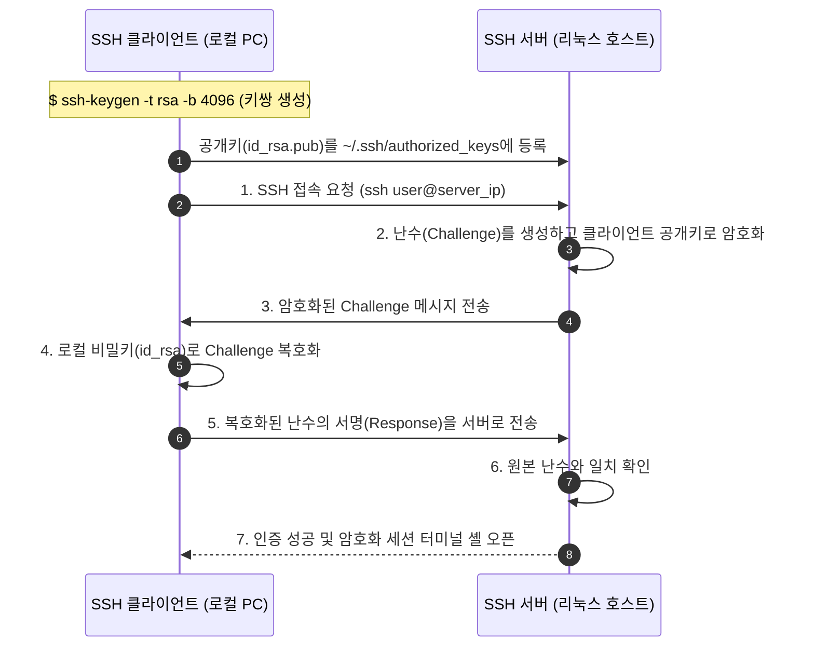

> [!abstract] 핵심 요약
> 원격 서버 인프라 운영의 기반은 **보안 네트워크 통신(SSH)**이다.
> 평문 전송인 텔넷(Telnet)의 도청 취약점을 해결하기 위해 대칭키와 비대칭키를 결합한 **SSH(Port 22)**가 표준으로 사용되며, `ssh-keygen`으로 생성한 공개키(`id_rsa.pub`)를 원격 서버의 `~/.ssh/authorized_keys`에 등록하여 안전한 비대칭 키 인증을 구현하고, `ss -tuln` 및 `ufw`로 포트 상태와 방화벽을 제어한다.

---

## 1. SSH 공개키 기반 무패스워드 인증 핸드셰이크



---

## 2. 필수 네트워크 진단 및 원격 파일 복사 명령어

| 명령어 | 기본 문법 및 플래그 | 설명 |
| :-- | :-- | :-- |
| **`ssh`** | `ssh -p 22 user@host` | 원격 리눅스 서버에 암호화 터미널 로그인 |
| **`scp`** | `scp -P 22 local.tar.gz user@host:/var/www/` | SSH 터널을 통한 파일 안전 복사 |
| **`ss`** | `ss -tuln` | TCP/UDP 수신 대기(LISTEN) 포트 및 소켓 상태 확인 |
| **`ip`** | `ip addr show` / `ip route` | 인터페이스 IP 주소 및 라우팅 테이블 조회 |
| **`ufw`** | `sudo ufw allow 22/tcp && sudo ufw enable` | 우분투 방화벽 포트 허용 및 활성화 |

---

## 3. 실시간 SSH 비대칭키 인증 & 소켓 포트 검사기

```html preview
<div style="font-family:system-ui,-apple-system,sans-serif;padding:20px;background:var(--card);color:var(--card-foreground);border:1px solid var(--border);border-radius:var(--radius)">
  <div style="font-size:16px;font-weight:700;margin-bottom:14px;color:var(--primary);display:flex;align-items:center;gap:8px">
    <span>🔑 SSH 비대칭 키(RSA/ED25519) 인증 & 포트 검사기</span>
  </div>

  <div style="display:grid;grid-template-columns:1fr 1fr;gap:12px;margin-bottom:14px">
    <div style="padding:10px;background:var(--background);border:1px solid var(--border);border-radius:var(--radius)">
      <div style="font-size:12px;font-weight:700;color:var(--chart-1);margin-bottom:6px">클라이언트 (~/.ssh/):</div>
      <div style="font-family:monospace;font-size:11px;line-height:1.6">
        • 개인키: <span style="color:var(--destructive,#ef4444);font-weight:700">id_rsa (비공개, 600 권한)</span><br/>
        • 공개키: <span style="color:var(--chart-2);font-weight:700">id_rsa.pub (서버 배포)</span>
      </div>
      <button id="btnConnectSsh" style="width:100%;padding:6px;background:var(--primary);color:#fff;border:none;border-radius:var(--radius);font-size:11px;font-weight:700;cursor:pointer;margin-top:8px">ssh user@192.168.1.100 접속</button>
    </div>

    <div style="padding:10px;background:var(--background);border:1px solid var(--border);border-radius:var(--radius)">
      <div style="font-size:12px;font-weight:700;color:var(--chart-2);margin-bottom:6px">서버 소켓 상태 ($ ss -tuln):</div>
      <div style="font-family:monospace;font-size:11px;line-height:1.6">
        • 0.0.0.0:22 (SSH Daemon) - LISTEN<br/>
        • 0.0.0.0:80 (HTTP Nginx) - LISTEN<br/>
        • 127.0.0.1:3306 (MySQL) - LISTEN
      </div>
    </div>
  </div>

  <div id="sshTermOut" style="padding:10px;background:var(--background);border:1px solid var(--border);border-radius:var(--radius);font-family:monospace;font-size:11px;min-height:40px">
    대기 중: 접속 버튼을 누르면 RSA 키 챌린지 핸드셰이크를 시작합니다.
  </div>

  <script>
    document.getElementById('btnConnectSsh').onclick = function() {
      var term = document.getElementById('sshTermOut');
      term.innerHTML = "Connecting to 192.168.1.100:22...<br/>" +
        "Verifying host key... Verified.<br/>" +
        "Sending public key signature (id_rsa)...<br/>" +
        "<span style='color:var(--chart-2);font-weight:700'>✅ Welcome to Ubuntu 24.04 LTS (GNU/Linux)! Login Success (Passwordless).</span>";
    };
  </script>
</div>
```
