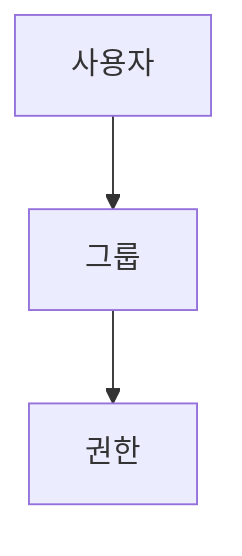

> [!abstract] 한 줄 요약
> 리눅스는 사용자·그룹·다른 사용자별 ==rwx 권한==으로 접근을 관리한다.

## 이 노트의 지도



## 핵심 개념

강의는 리눅스가 다중 사용자 환경을 지원하므로 사용자를 그룹으로 관리하고 서로 다른 사용자에게 권한을 달리 부여할 필요가 있다고 설명한다.

> [!caution] 권한 경계
> root는 모든 권한을 가지며, sudo는 일시적으로 root 권한을 얻는 명령이고 su는 root 계정을 일시적으로 사용하는 명령이다.

$$
\text{rwx}=4+2+1=7
$$

<details>
<summary>사용자와 그룹</summary>

모든 사용자는 하나 이상의 그룹에 속한다. 사용자 정보는 /etc/passwd, 비밀번호 정보는 /etc/shadow, 그룹 정보는 /etc/group에 정의된다고 제시된다.

</details>

<Tabs>
  <Tab label="소유자">파일의 첫 번째 권한 묶음에 해당한다.</Tab>
  <Tab label="그룹·다른 사용자">각각 두 번째와 세 번째 권한 묶음에 해당한다.</Tab>
</Tabs>

> [!tip] 적용 단서
> chmod 숫자 표기를 읽을 때 ==7=모든 권한==처럼 읽기·쓰기·실행을 합산한다.

## 핵심 단서

```html preview
<div style="font-family:system-ui,sans-serif;padding:20px;color:var(--foreground)">
  <h3 style="margin:0 0 14px;font-size:15px;font-weight:600">강의의 권한 코드</h3>
  <div id="bars" style="display:flex;align-items:flex-end;gap:14px;height:170px"></div>
  <script>
    var data = [["rwx",7],["r-x",5],["--x",1]];
    var max = Math.max.apply(null, data.map(function (d) { return d[1]; })) || 1;
    document.getElementById('bars').innerHTML = data.map(function (d, i) {
      return '<div style="flex:1;display:flex;flex-direction:column;align-items:center;' +
        'gap:6px;height:100%;justify-content:flex-end">' +
        '<span style="font-size:12px;font-weight:600">' + d[1] + '</span>' +
        '<div style="width:100%;height:' + (d[1] / max * 100) + '%;' +
        'background:var(--chart-' + (i + 1) + ');' +
        'border-radius:var(--radius) var(--radius) 0 0"></div>' +
        '<span style="font-size:12px;color:var(--muted-foreground)">' + d[0] + '</span>' +
        '</div>';
    }).join('');
  </script>
</div>
```

$$
\text{chmod 755}=\text{rwxr-xr-x}
$$

<details>
<summary>파일과 디렉터리</summary>

파일은 소유자·그룹·다른 사용자별로 권한을 설정한다. 디렉터리는 x 권한이 없으면 cd로 접근할 수 없다고 설명한다.

</details>

<details>
<summary>권한 변경</summary>

강의는 u, g, o, a로 대상을 구분하고 chmod 755를 rwxr-xr-x로 읽는 예를 제시한다.

</details>

> [!question]- 스스로 점검
> **Q.** 디렉터리에 x 권한이 없으면 어떤 일이 생기는가?
>
> **A.** 강의 설명처럼 cd 명령으로 그 디렉터리에 접근할 수 없다.

## 작성 경계

> [!warning] 출처 경계
> 제공된 추출 텍스트만 사용했으며, 원본 시각자료·첨부물·페이지 표기는 넣지 않았다.

---

## 원본 강의 흐름 인터랙티브

```html preview
<div style="font-family:system-ui,sans-serif;padding:20px;color:var(--foreground)">
  <label for="noteFlow60455" style="font-size:14px;font-weight:600">사용자·그룹과 권한 단계</label>
  <div id="noteFlow60455-out" style="font-size:26px;font-weight:700;color:var(--chart-1);margin:6px 0">사용자·그룹과 권한 핵심 개념</div>
  <input id="noteFlow60455" type="range" min="1" max="3" step="1" value="1" style="width:100%;accent-color:var(--primary)" />
  <p style="font-size:13px;color:var(--muted-foreground)">슬라이더를 움직이면 원본 PDF에서 정리한 이 노트의 흐름을 확인합니다.</p>
  <script>
    var noteFlow60455 = document.getElementById('noteFlow60455');
    var noteFlow60455Out = document.getElementById('noteFlow60455-out');
    var noteFlow60455Steps = ["사용자·그룹과 권한 핵심 개념","사용자·그룹과 권한 처리 절차","사용자·그룹과 권한 검증·응용"];
    noteFlow60455.addEventListener('input', function () { noteFlow60455Out.textContent = noteFlow60455Steps[Number(noteFlow60455.value) - 1]; });
  </script>
</div>
```
