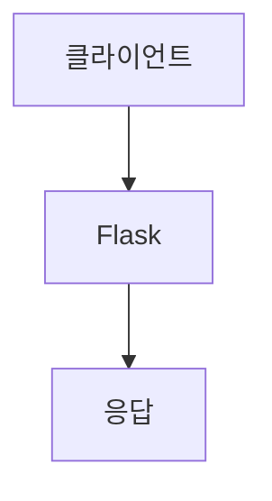

> [!abstract] 한 줄 요약
> Flask는 요청에 응답하는 서버 역할을 하며 REST는 ==리소스와 HTTP 메서드==로 API를 설계한다.

## 이 노트의 지도



## 핵심 개념

강의는 Flask를 Python 기반 웹 프레임워크로 소개하며 빠르고 가벼운 웹 앱과 RESTful API 개발에 적합하다고 설명한다. 서버는 클라이언트 요청에 응답한다.

> [!important] 핵심 규칙
> RESTful 설계에서 URL은 리소스를 나타내고 HTTP 메서드는 리소스에 수행할 동작을 나타낸다.

$$
\text{API 요청}=\text{리소스 URL}+\text{HTTP 메서드}
$$

<details>
<summary>GET과 POST</summary>

강의는 GET을 페이지 접근, POST를 사용자 요청 전송으로 제시하며 하나의 경로에서 두 메서드를 처리하는 사례를 보인다.

</details>

<Tabs>
  <Tab label="Flask">요청을 받아 응답하는 서버 역할을 수행한다.</Tab>
  <Tab label="REST">웹을 위한 네트워크 아키텍처 스타일과 그 원칙을 뜻한다.</Tab>
</Tabs>

> [!tip] 적용 단서
> API를 읽을 때 ==URL==과 메서드를 따로 보면 같은 경로에서 수행하는 동작을 구분할 수 있다.

## 핵심 단서

```html preview
<div style="font-family:system-ui,sans-serif;padding:20px;display:flex;align-items:center;gap:20px;color:var(--foreground)">
  <svg width="120" height="120" viewBox="0 0 120 120" role="img" aria-label="REST 기본 메서드">
    <circle cx="60" cy="60" r="46" stroke-width="14" style="fill: none; stroke: var(--border)" />
    <circle cx="60" cy="60" r="46" stroke-width="14"
      stroke-linecap="round" stroke-dasharray="289" stroke-dashoffset="0"
      transform="rotate(-90 60 60)" style="fill: none; stroke: var(--chart-1)" />
    <text x="60" y="67" text-anchor="middle" font-size="22" font-weight="700"
      style="fill: var(--foreground)">4</text>
  </svg>
  <div>
    <div style="font-weight:600;font-size:15px">REST 기본 메서드</div>
    <div style="font-size:13px;color:var(--muted-foreground);margin-top:2px">GET·POST·PUT·DELETE 4/4</div>
  </div>
</div>
```

$$
\text{CRUD}=\{\text{Create, Read, Update, Delete}\}
$$

<details>
<summary>무상태성</summary>

강의는 각 요청이 독립적이어야 하며 서버가 클라이언트 상태 정보를 저장하지 않고 필요한 정보가 요청과 함께 전송되어야 한다고 설명한다.

</details>

<details>
<summary>REST API 메서드</summary>

GET은 조회, POST는 생성, PUT은 갱신, DELETE는 삭제에 대응한다고 제시된다.

</details>

> [!question]- 스스로 점검
> **Q.** 무상태성이 서버 설계에 주는 장점은 무엇인가?
>
> **A.** 서버가 이전 요청 상태를 기억할 필요가 없어 요청을 어느 서버에 배치해도 같은 방식으로 처리하기 쉬워진다.

## 작성 경계

> [!warning] 출처 경계
> 제공된 추출 텍스트만 사용했으며, 원본 시각자료·첨부물·페이지 표기는 넣지 않았다.
