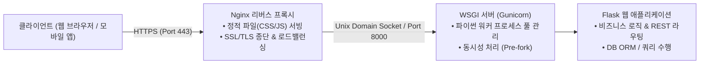

> [!abstract] 핵심 요약
> 리눅스 환경에서 경량 백엔드 서비스를 구축할 때 **Python venv(가상환경)**와 **Flask** 프레임워크가 널리 사용된다.
> 클라이언트와 서버 간의 자원(Resource)을 표준 HTTP URI로 명시하고 **GET(조회), POST(생성), PUT(수정), DELETE(삭제)** 메서드와 **JSON** 데이터 포맷으로 통신하는 **RESTful API** 설계 원칙과, 프로덕션 환경에서 WSGI(Gunicorn) 및 Nginx를 연결하는 3계층 웹 아키텍처를 이해하는 것이 핵심이다.

---

## 1. 리눅스 서버 프로덕션 웹 아키텍처 (Nginx ➔ Gunicorn ➔ Flask)



---

## 2. REST API 4대 CRUD 메서드와 HTTP 상태 코드

| HTTP Method | CRUD 동작 | 멱등성 (Idempotent) | 성공 상태 코드 | 대표 예시 |
| :-- | :-- | :--: | :--: | :-- |
| **GET** | 자원 조회 (Read) | O | `200 OK` | `GET /api/users/42` |
| **POST** | 자원 신규 생성 (Create) | X | `201 Created` | `POST /api/users` (JSON Payload) |
| **PUT** | 자원 전체 갱신 (Update) | O | `200 OK` | `PUT /api/users/42` |
| **DELETE** | 자원 삭제 (Delete) | O | `200 OK` / `204 No Content` | `DELETE /api/users/42` |

---

## 3. 실시간 Flask REST API 모의 요청-응답 테스터

```html preview
<div style="font-family:system-ui,-apple-system,sans-serif;padding:20px;background:var(--card);color:var(--card-foreground);border:1px solid var(--border);border-radius:var(--radius)">
  <div style="font-size:16px;font-weight:700;margin-bottom:14px;color:var(--primary);display:flex;align-items:center;gap:8px">
    <span>🌐 Flask REST API 엔드포인트 모의 테스터</span>
  </div>

  <div style="display:flex;gap:8px;margin-bottom:12px">
    <select id="apiMethod" style="padding:6px;background:var(--background);color:var(--foreground);border:1px solid var(--border);border-radius:var(--radius);font-weight:700">
      <option value="GET">GET</option>
      <option value="POST">POST</option>
      <option value="DELETE">DELETE</option>
    </select>
    <input id="apiUrl" type="text" value="/api/items" style="flex:1;padding:6px 10px;background:var(--background);color:var(--foreground);border:1px solid var(--border);border-radius:var(--radius);font-family:monospace;font-size:12px" />
    <button id="sendApiBtn" style="padding:6px 16px;background:var(--primary);color:#fff;border:none;border-radius:var(--radius);font-weight:700;cursor:pointer">Send Request</button>
  </div>

  <div style="padding:10px;background:var(--background);border:1px solid var(--border);border-radius:var(--radius)">
    <div style="display:flex;justify-content:space-between;margin-bottom:6px">
      <span style="font-size:11px;font-weight:700;color:var(--muted-foreground)">HTTP Response:</span>
      <span id="apiStatusOut" style="font-family:monospace;font-size:11px;font-weight:800;color:var(--chart-2)">200 OK</span>
    </div>
    <pre id="apiBodyOut" style="margin:0;font-family:monospace;font-size:11px;line-height:1.5;color:var(--card-foreground)">{
  "status": "success",
  "data": [
    { "id": 1, "name": "Linux Ubuntu Server" },
    { "id": 2, "name": "Nginx Web Gateway" }
  ]
}</pre>
  </div>

  <script>
    document.getElementById('sendApiBtn').onclick = function() {
      var method = document.getElementById('apiMethod').value;
      var statusEl = document.getElementById('apiStatusOut');
      var bodyEl = document.getElementById('apiBodyOut');

      if (method === 'GET') {
        statusEl.textContent = "200 OK";
        statusEl.style.color = "var(--chart-2)";
        bodyEl.textContent = '{\n  "status": "success",\n  "count": 2,\n  "items": [{"id": 1, "name": "Linux"}, {"id": 2, "name": "Docker"}]\n}';
      } else if (method === 'POST') {
        statusEl.textContent = "201 Created";
        statusEl.style.color = "var(--primary)";
        bodyEl.textContent = '{\n  "status": "created",\n  "new_id": 3,\n  "message": "Item successfully registered"\n}';
      } else if (method === 'DELETE') {
        statusEl.textContent = "200 OK";
        statusEl.style.color = "var(--chart-1)";
        bodyEl.textContent = '{\n  "status": "deleted",\n  "message": "Resource removed"\n}';
      }
    };
  </script>
</div>
```
