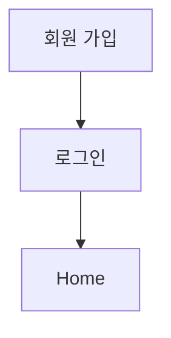

> [!abstract] 한 줄 요약
> 회원 기능은 가입 정보 저장, 로그인 후 ==세션== 확인, 로그아웃의 흐름으로 구성된다.

## 이 노트의 지도



## 핵심 개념

강의 요구사항은 회원 가입과 로그인이 가능한 사이트다. 가입 정보는 서버의 JSON 파일에 저장하며 로그인 성공 후 Home으로 이동하고 로그아웃할 수 있다.

> [!important] 핵심 규칙
> Home은 로그인 세션이 있을 때 보여 주고, 세션이 없으면 로그인 화면으로 보낸다.

$$
\text{Home 접근} \Rightarrow \text{session 존재}
$$

<details>
<summary>화면 흐름</summary>

로그인 페이지에서 아이디가 없으면 회원 가입으로 이동할 수 있다. 로그인 실패는 실패 메시지, 성공은 Home 이동으로 이어진다.

</details>

> [!tip] 적용 단서
> 접근 제어를 읽을 때 ==세션== 생성·확인·제거의 세 단계를 분리한다.

## 핵심 단서

```html preview
<div style="font-family:system-ui,sans-serif;padding:20px">
  <div id="cards" style="display:flex;gap:14px;flex-wrap:wrap"></div>
  <script>
    var stats = ["화면","3","login·register·home","var(--chart-2)"],["저장","JSON","회원 정보","var(--chart-1)"],["상태","session","로그인 확인","var(--chart-5)"]("화면","3","login·register·home","var(--chart-2)"],["저장","JSON","회원 정보","var(--chart-1)"],["상태","session","로그인 확인","var(--chart-5)".md);
    document.getElementById('cards').innerHTML = stats.map(function (s) {
      return '<div style="flex:1;min-width:150px;padding:16px;background:var(--card);' +
        'color:var(--card-foreground);border:1px solid var(--border);' +
        'border-radius:var(--radius)">' +
        '<div style="font-size:13px;color:var(--muted-foreground)">' + s[0] + '</div>' +
        '<div style="font-size:26px;font-weight:700;margin-top:4px">' + s[1] + '</div>' +
        '<div style="font-size:12px;font-weight:600;margin-top:4px;color:' + s[3] + '">' +
        s[2] + '</div>' +
        '</div>';
    }).join('');
  </script>
</div>
```

$$
\text{로그아웃}=\operatorname{session.pop}(\text{user})
$$

<details>
<summary>로그아웃</summary>

강의는 로그아웃에서 세션을 제거하고 로그인 화면으로 보낸다고 설명한다.

</details>

<details>
<summary>추가 요구</summary>

회원 가입 시 암호 재확인, 중복 이름 확인, 빈 입력 검사를 추가 기능으로 제시한다.

</details>

> [!question]- 스스로 점검
> **Q.** 로그인하지 않은 사용자가 Home을 요청하면 어떻게 처리하는가?
>
> **A.** 세션이 없으므로 로그인 페이지로 보낸다.

## 작성 경계

> [!warning] source warning
> 추출본의 문서 제목은 다른 과목명으로 표시되지만, 확인 가능한 Flask 회원 기능 내용만 사용했다. 원본 시각자료와 페이지 표기는 넣지 않았다.

---

## 원본 강의 흐름 인터랙티브

```html preview
<div style="font-family:system-ui,sans-serif;padding:20px;color:var(--foreground)">
  <label for="noteFlow780667" style="font-size:14px;font-weight:600">Flask 회원 기능 단계</label>
  <div id="noteFlow780667-out" style="font-size:26px;font-weight:700;color:var(--chart-1);margin:6px 0">Flask 회원 기능 핵심 개념</div>
  <input id="noteFlow780667" type="range" min="1" max="3" step="1" value="1" style="width:100%;accent-color:var(--primary)" />
  <p style="font-size:13px;color:var(--muted-foreground)">슬라이더를 움직이면 원본 PDF에서 정리한 이 노트의 흐름을 확인합니다.</p>
  <script>
    var noteFlow780667 = document.getElementById('noteFlow780667');
    var noteFlow780667Out = document.getElementById('noteFlow780667-out');
    var noteFlow780667Steps = ["Flask 회원 기능 핵심 개념","Flask 회원 기능 처리 절차","Flask 회원 기능 검증·응용"];
    noteFlow780667.addEventListener('input', function () { noteFlow780667Out.textContent = noteFlow780667Steps[Number(noteFlow780667.value) - 1]; });
  </script>
</div>
```
