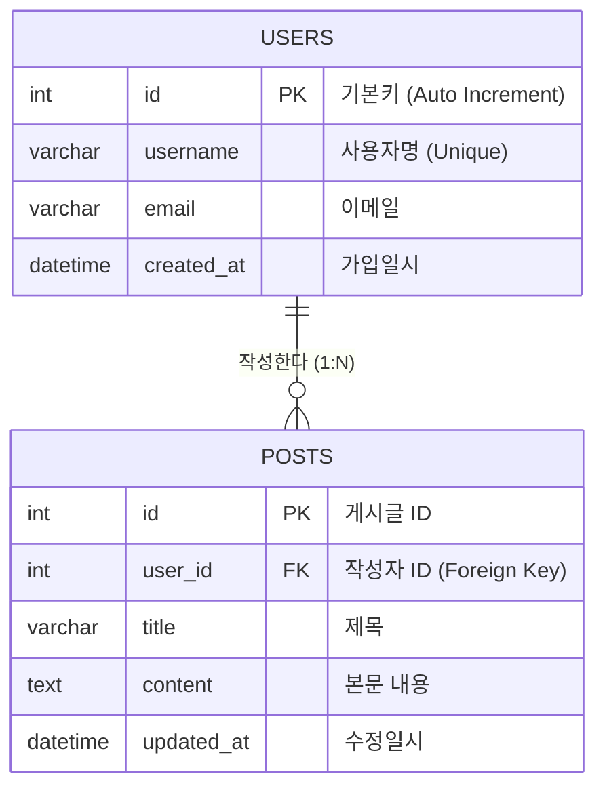

> [!abstract] 핵심 요약
> **관계형 데이터베이스(RDBMS, MySQL/MariaDB)**는 데이터를 테이블(2차원 행과 열) 구조로 영구 보관하고 무결성을 보장하는 핵심 인프라이다.
> 데이터베이스 스키마를 정의하는 **DDL(`CREATE`, `ALTER`)**과 데이터를 조작하는 **DML(`SELECT`, `INSERT`, `UPDATE`, `DELETE`)**, 그리고 데이터 변경의 원자성과 일관성을 보장하는 **트랜잭션(ACID: 원자성·일관성·격리성·영속성)** 제어는 웹 백엔드 구축의 필수 요건이다.

---

## 1. 관계형 데이터베이스 1:N 외래키(FK) 참조 관계



---

## 2. SQL 언어 3대 분류 체계

| 분류 | 명령어 집합 | 주요 역할 |
| :-- | :-- | :-- |
| **DDL (데이터 정의어)** | `CREATE`, `ALTER`, `DROP`, `TRUNCATE` | 데이터베이스 및 테이블 구조/스키마 생성 및 변경 |
| **DML (데이터 조작어)** | `SELECT`, `INSERT`, `UPDATE`, `DELETE` | 테이블 내 레코드(튜플) 검색, 삽입, 갱신, 삭제 |
| **DCL (데이터 제어어)** | `GRANT`, `REVOKE`, `COMMIT`, `ROLLBACK` | 사용자 권한 부여/회수 및 트랜잭션 확정/취소 |

---

## 3. 실시간 SQL DML (SELECT / INSERT) 쿼리 시뮬레이터

```html preview
<div style="font-family:system-ui,-apple-system,sans-serif;padding:20px;background:var(--card);color:var(--card-foreground);border:1px solid var(--border);border-radius:var(--radius)">
  <div style="font-size:16px;font-weight:700;margin-bottom:14px;color:var(--primary);display:flex;align-items:center;gap:8px">
    <span>🗄️ MySQL/MariaDB SQL CRUD 실시간 테이블 시뮬레이터</span>
  </div>

  <div style="display:flex;gap:8px;margin-bottom:12px">
    <input id="inUserName" type="text" placeholder="새 사용자명 입력 (e.g. alice)" style="flex:1;padding:6px;background:var(--background);color:var(--foreground);border:1px solid var(--border);border-radius:var(--radius);font-size:11px" />
    <button id="btnInsertUser" style="padding:6px 14px;background:var(--primary);color:#fff;border:none;border-radius:var(--radius);font-weight:700;cursor:pointer">INSERT INTO users</button>
  </div>

  <div style="overflow-x:auto;background:var(--background);border:1px solid var(--border);border-radius:var(--radius);padding:8px">
    <table style="width:100%;border-collapse:collapse;font-size:11px;font-family:monospace;text-align:center">
      <thead style="border-bottom:1px solid var(--border);color:var(--muted-foreground)">
        <tr><th>id (PK)</th><th>username</th><th>status</th><th>role</th></tr>
      </thead>
      <tbody id="userTableBody">
        <tr><td>1</td><td>admin</td><td>ACTIVE</td><td>ROOT</td></tr>
        <tr><td>2</td><td>yunsang</td><td>ACTIVE</td><td>STUDENT</td></tr>
      </tbody>
    </table>
  </div>

  <div id="sqlLogOut" style="margin-top:10px;font-size:11px;font-family:monospace;color:var(--chart-2)">
    Query OK: 2 rows in set (0.00 sec)
  </div>

  <script>
    var nextId = 3;
    document.getElementById('btnInsertUser').onclick = function() {
      var nameInput = document.getElementById('inUserName');
      var name = nameInput.value.trim();
      if (!name) return;

      var tbody = document.getElementById('userTableBody');
      var tr = document.createElement('tr');
      tr.innerHTML = "<td>" + nextId + "</td><td>" + name + "</td><td>ACTIVE</td><td>USER</td>";
      tbody.appendChild(tr);

      document.getElementById('sqlLogOut').textContent = "Query OK: 1 row affected (INSERT INTO users VALUES (" + nextId + ", '" + name + "'))";
      nextId++;
      nameInput.value = "";
    };
  </script>
</div>
```
