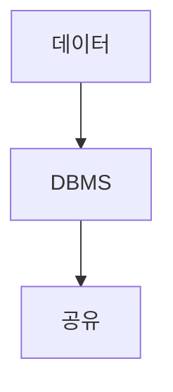

> [!abstract] 한 줄 요약
> 데이터베이스는 여러 사람이 공유할 데이터를 통합 관리하며 ==중복·일관성== 문제를 다룬다.

## 이 노트의 지도



## 핵심 개념

강의는 데이터베이스를 여러 사람이 데이터를 공유하기 위해 체계적으로 통합해 묶어 둔 데이터 집합으로 설명한다. 컴퓨터 시스템에서는 데이터 집합을 관리하고 접근하게 하는 프로그램을 뜻한다.

> [!important] 핵심 규칙
> 데이터베이스의 장점은 중복 최소화·저장공간 절약, 효율적 접근, 일관성·무결성·보안성, 표준화로 제시된다.

$$
\text{DB}=\text{공유 데이터}+\text{통합 관리}
$$

<details>
<summary>관계형 모델</summary>

관계형 데이터 모델은 데이터를 테이블에 대입해 관계를 묘사하는 이론적 모델이며, 이를 다루는 시스템을 RDBMS라고 한다.

</details>

<Tabs>
  <Tab label="RDBMS">사전에 정의한 테이블과 관계를 중심으로 데이터를 관리한다.</Tab>
  <Tab label="NoSQL">전통적 관계형 방식의 한계를 보완하려는 다양한 저장 방식을 지원한다.</Tab>
</Tabs>

> [!tip] 적용 단서
> 데이터 구조가 자주 바뀌는지 먼저 확인하면 ==스키마 유연성==이 필요한 맥락을 판단할 수 있다.

## 핵심 단서

```html preview
<div style="font-family:system-ui,sans-serif;padding:20px;display:flex;align-items:center;gap:20px;color:var(--foreground)">
  <svg width="120" height="120" viewBox="0 0 120 120" role="img" aria-label="CRUD 기본 기능">
    <circle cx="60" cy="60" r="46" stroke-width="14" style="fill: none; stroke: var(--border)" />
    <circle cx="60" cy="60" r="46" stroke-width="14"
      stroke-linecap="round" stroke-dasharray="289" stroke-dashoffset="0"
      transform="rotate(-90 60 60)" style="fill: none; stroke: var(--chart-1)" />
    <text x="60" y="67" text-anchor="middle" font-size="22" font-weight="700"
      style="fill: var(--foreground)">4</text>
  </svg>
  <div>
    <div style="font-weight:600;font-size:15px">CRUD 기본 기능</div>
    <div style="font-size:13px;color:var(--muted-foreground);margin-top:2px">생성·읽기·수정·삭제 4/4</div>
  </div>
</div>
```

$$
\text{CRUD}=\{\text{Create, Read, Update, Delete}\}
$$

<details>
<summary>SQL</summary>

SQL은 관계형 데이터베이스를 관리하는 질의 언어로, 스키마 생성과 데이터 생성·읽기·수정·삭제를 다룬다.

</details>

<details>
<summary>NoSQL 단서</summary>

강의는 NoSQL의 스키마 유연성과 수평적 확장을 주요 개념으로 제시한다.

</details>

> [!question]- 스스로 점검
> **Q.** 데이터베이스가 단순 파일 모음과 구별되는 핵심은 무엇인가?
>
> **A.** 여러 사용자의 공유 데이터를 통합해 관리하고 접근하게 하며 일관성·무결성 같은 관리 특성을 제공한다.

## 작성 경계

> [!warning] 출처 경계
> 제공된 추출 텍스트만 사용했으며, 원본 시각자료·첨부물·페이지 표기는 넣지 않았다.
