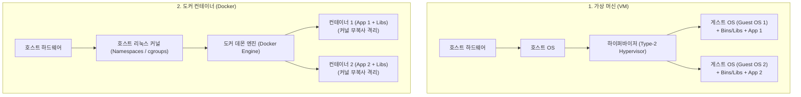
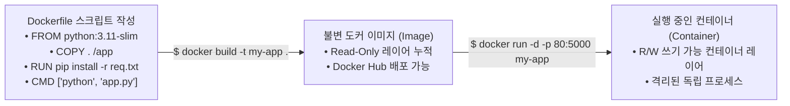

> [!abstract] 핵심 요약
> **도커(Docker)**는 응용 프로그램과 그 실행에 필요한 모든 런타임 환경을 **컨테이너(Container)**라는 격리된 패키지로 표준화하는 오픈소스 플랫폼이다.
> 무거운 게스트 OS를 설치하는 전통적 가상 머신(VM)과 달리, 리눅스 커널의 **네임스페이스(Namespaces - 격리)**와 **cgroups(자원 제한)**를 활용하여 호스트 커널을 직접 공유함으로써 수 초 만에 기동되는 초경량 가상화를 실현한다.

---

## 1. 가상 머신(VM) vs 도커 컨테이너(Docker Container) 아키텍처



---

## 2. Dockerfile 지시어와 빌드 파이프라인



---

## 3. 실시간 도커 컨테이너 실행 & 포트 매핑 시뮬레이터

```html preview
<div style="font-family:system-ui,-apple-system,sans-serif;padding:20px;background:var(--card);color:var(--card-foreground);border:1px solid var(--border);border-radius:var(--radius)">
  <div style="font-size:16px;font-weight:700;margin-bottom:14px;color:var(--primary);display:flex;align-items:center;gap:8px">
    <span>🐳 도커(Docker) 컨테이너 기동 및 포트 포워딩(-p) 시뮬레이터</span>
  </div>

  <div style="margin-bottom:12px">
    <div style="font-size:11px;color:var(--muted-foreground)">실행 명령어:</div>
    <code style="display:block;padding:6px;background:var(--background);border:1px solid var(--border);border-radius:var(--radius);font-family:monospace;font-size:11px">
      $ docker run -d --name web-server -p 8080:80 nginx:alpine
    </code>
  </div>

  <div style="display:grid;grid-template-columns:1fr 1fr;gap:12px;margin-bottom:14px">
    <div style="padding:10px;background:var(--background);border:1px solid var(--border);border-radius:var(--radius)">
      <div style="font-size:12px;font-weight:700;color:var(--chart-1);margin-bottom:4px">호스트 머신 (Host OS)</div>
      <div style="font-family:monospace;font-size:11px">
        • 접속 주소: <b>http://localhost:8080</b><br/>
        • 호스트 포트: 8080 수신 대기 (LISTEN)
      </div>
    </div>

    <div style="padding:10px;background:var(--background);border:1px solid var(--border);border-radius:var(--radius)">
      <div style="font-size:12px;font-weight:700;color:var(--chart-2);margin-bottom:4px">도커 컨테이너 (Container)</div>
      <div style="font-family:monospace;font-size:11px">
        • 가상 IP: 172.17.0.2<br/>
        • 컨테이너 내부 포트: 80 (Nginx HTTP)
      </div>
    </div>
  </div>

  <button id="btnRunDocker" style="padding:8px 16px;background:var(--primary);color:#fff;border:none;border-radius:var(--radius);font-weight:700;cursor:pointer">컨테이너 기동 ($ docker run)</button>

  <div id="dockerOutLog" style="margin-top:10px;padding:10px;background:var(--background);border:1px solid var(--border);border-radius:var(--radius);font-family:monospace;font-size:11px">
    대기 중: 컨테이너를 기동하세요.
  </div>

  <script>
    document.getElementById('btnRunDocker').onclick = function() {
      var log = document.getElementById('dockerOutLog');
      log.innerHTML = "<span style='color:var(--chart-2);font-weight:700'>e4b8f32c91a0... (Container ID Generated)</span><br/>" +
        "Status: Up 2 seconds (healthy)<br/>" +
        "Port Mapping: 0.0.0.0:8080 ➔ 80/tcp<br/>" +
        "✅ 호스트의 8080 포트로 유입된 트래픽이 iptables NAT를 거쳐 컨테이너 80 포트로 정상 포워딩됩니다.";
    };
  </script>
</div>
```
