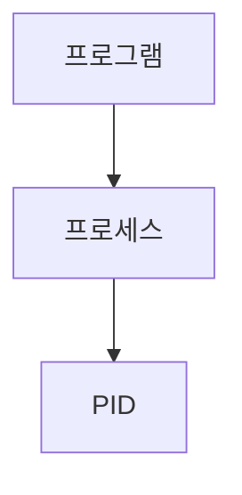

> [!abstract] 한 줄 요약
> 프로세스는 실행 중인 프로그램의 인스턴스이며 ==PID==로 식별한다.

## 이 노트의 지도



## 핵심 개념

강의는 프로세스를 CPU와 메모리 같은 시스템 자원을 소비하며 실행되는 프로그램 인스턴스로 정의한다. PID는 고유 식별번호이고 PPID는 부모 프로세스의 PID다.

> [!important] 핵심 규칙
> 종료 명령은 대상 PID와 시그널을 함께 사용하므로, 먼저 조회로 대상을 확인해야 한다.

$$
\text{PPID}=\text{부모 프로세스의 PID}
$$

<details>
<summary>프로세스 조회</summary>

강의는 ps, ps aux, ps -ef를 조회 명령으로 제시한다. a는 다른 사용자 프로세스, u는 사용자와 CPU·메모리 표시, x는 터미널과 연결되지 않은 프로세스를 뜻한다.

</details>

<Tabs>
  <Tab label="정상 종료">SIGTERM은 정상 종료 시그널로 제시된다.</Tab>
  <Tab label="강제 종료">SIGKILL은 강제 종료 시그널로 제시된다.</Tab>
</Tabs>

> [!caution] 종료 전 확인
> 실행 중인 프로세스를 종료하기 전에 ==PID==와 시그널의 의미를 함께 확인한다.

## 핵심 단서

```html preview
<div style="font-family:system-ui,sans-serif;padding:20px">
  <div id="cards" style="display:flex;gap:14px;flex-wrap:wrap"></div>
  <script>
    var stats = [["식별","PID","고유 번호","var(--chart-2)"],["종료","SIGTERM","정상 종료","var(--chart-1)"],["실행","&","백그라운드","var(--chart-5)"]];
    document.getElementById('cards').innerHTML = stats.map(function (s) {
      return '<div style="flex:1;min-width:150px;padding:16px;background:var(--card);' +
        'color:var(--card-foreground);border:1px solid var(--border);' +
        'border-radius:var(--radius)">' +
        '<div style="font-size:13px;color:var(--muted-foreground)">' + s[0] + '</div>' +
        '<div style="font-size:26px;font-weight:700;margin-top:4px">' + s[1] + '</div>' +
        '<div style="font-size:12px;font-weight:600;margin-top:4px;color:' + s[3] + '">' +
        s[2] + '</div>' +
        '</div>';
    }).join('');
  </script>
</div>
```

$$
\text{백그라운드 실행}=\text{명령어}\ \&
$$

<details>
<summary>시그널</summary>

SIGSTOP은 실행 중지, SIGCONT는 중지된 프로세스 재실행으로 제시된다.

</details>

<details>
<summary>백그라운드</summary>

명령어 끝에 &를 추가하면 터미널 제어권을 돌려주면서 프로세스는 계속 실행된다고 설명한다.

</details>

> [!question]- 스스로 점검
> **Q.** PPID가 필요한 이유는 무엇인가?
>
> **A.** 프로세스가 어떤 부모 프로세스에서 파생되었는지 식별하기 위해서다.

## 작성 경계

> [!warning] 출처 경계
> 제공된 추출 텍스트만 사용했으며, 원본 시각자료·첨부물·페이지 표기는 넣지 않았다.
