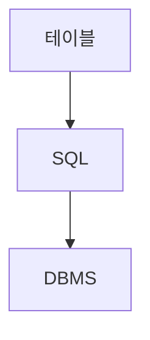

> [!abstract] 한 줄 요약
> 관계형 데이터베이스는 테이블로 관계를 묘사하고 SQL로 ==스키마와 CRUD==를 관리한다.

## 이 노트의 지도



## 핵심 개념

강의는 관계형 데이터 모델을 데이터를 테이블에 대입하여 관계를 묘사하는 이론적 모델로 설명하며, SQL은 관계형 데이터베이스를 관리하는 질의 언어라고 소개한다.

> [!important] 핵심 규칙
> SQL에서는 스키마 생성과 Create·Read·Update·Delete가 기본 데이터 관리 기능으로 제시된다.

$$
\text{RDBMS}=\text{테이블}+\text{관계}
$$

<details>
<summary>MySQL</summary>

강의는 MySQL을 널리 사용되는 오픈소스 데이터베이스 관리 시스템으로 소개하며 SQL 지원과 여러 플랫폼 지원을 언급한다.

</details>

> [!tip] 적용 단서
> 테이블을 다룰 때 ==스키마==와 데이터 조작을 구분하면 명령의 대상을 명확히 할 수 있다.

## 핵심 단서

```html preview
<div style="font-family:system-ui,sans-serif;padding:20px">
  <div id="cards" style="display:flex;gap:14px;flex-wrap:wrap"></div>
  <script>
    var stats = [["모델","관계형","테이블 관계","var(--chart-2)"],["언어","SQL","질의 언어","var(--chart-1)"],["DBMS","MySQL","오픈소스","var(--chart-5)"]];
    document.getElementById('cards').innerHTML = stats.map(function (s) {
      return '<div style="flex:1;min-width:150px;padding:16px;background:var(--card);' +
        'color:var(--card-foreground);border:1px solid var(--border);' +
        'border-radius:var(--radius)">' +
        '<div style="font-size:13px;color:var(--muted-foreground)">' + s[0] + '</div>' +
        '<div style="font-size:26px;font-weight:700;margin-top:4px">' + s[1] + '</div>' +
        '<div style="font-size:12px;font-weight:600;margin-top:4px;color:' + s[3] + '">' +
        s[2] + '</div>' +
        '</div>';
    }).join('');
  </script>
</div>
```

$$
\text{SQL 관리}=\text{스키마}+\text{CRUD}
$$

<details>
<summary>테이블 변경</summary>

강의는 테이블 생성, 열 추가를 위한 ALTER TABLE, 테이블 삭제를 위한 DROP TABLE 사례를 제시한다.

</details>

> [!question]- 스스로 점검
> **Q.** SQL과 MySQL의 역할은 어떻게 구분되는가?
>
> **A.** SQL은 관계형 데이터베이스 관리에 쓰는 질의 언어이고, MySQL은 이를 지원하는 데이터베이스 관리 시스템이다.

## 작성 경계

> [!warning] 출처 경계
> 추출본의 문서 제목은 다른 과목명으로 표시된다. 이 노트는 확인 가능한 데이터베이스·MySQL 본문만 사용했으며, 원본 시각자료·첨부물·페이지 표기는 넣지 않았다.

---

## 원본 강의 흐름 인터랙티브

```html preview
<div style="font-family:system-ui,sans-serif;padding:20px;color:var(--foreground)">
  <label for="noteFlow7263310" style="font-size:14px;font-weight:600">데이터베이스 기초 단계</label>
  <div id="noteFlow7263310-out" style="font-size:26px;font-weight:700;color:var(--chart-1);margin:6px 0">데이터베이스 기초 핵심 개념</div>
  <input id="noteFlow7263310" type="range" min="1" max="3" step="1" value="1" style="width:100%;accent-color:var(--primary)" />
  <p style="font-size:13px;color:var(--muted-foreground)">슬라이더를 움직이면 원본 PDF에서 정리한 이 노트의 흐름을 확인합니다.</p>
  <script>
    var noteFlow7263310 = document.getElementById('noteFlow7263310');
    var noteFlow7263310Out = document.getElementById('noteFlow7263310-out');
    var noteFlow7263310Steps = ["데이터베이스 기초 핵심 개념","데이터베이스 기초 처리 절차","데이터베이스 기초 검증·응용"];
    noteFlow7263310.addEventListener('input', function () { noteFlow7263310Out.textContent = noteFlow7263310Steps[Number(noteFlow7263310.value) - 1]; });
  </script>
</div>
```
