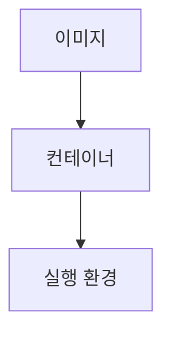

> [!abstract] 한 줄 요약
> 도커는 애플리케이션을 ==컨테이너==에 담아 동일한 환경에서 실행하는 가상화 기술이다.

## 이 노트의 지도



## 핵심 개념

강의는 도커를 애플리케이션을 컨테이너에 담아 실행하게 하는 컨테이너 기반 가상화 기술로 소개한다. 컨테이너는 실행에 필요한 것을 포함한 독립 실행 환경이다.

> [!important] 핵심 규칙
> 컨테이너는 OS 커널을 공유하면서 앱마다 격리된 환경을 제공하므로 가상머신보다 가볍고 빠르다고 설명한다.

$$
\text{컨테이너}=\text{애플리케이션}+\text{실행에 필요한 것}
$$

<details>
<summary>이미지와 컨테이너</summary>

이미지는 컨테이너 실행에 필요한 파일과 설정을 묶어 둔 파일이고, 컨테이너는 이미지를 실행한 상태의 독립 실행 환경이다.

</details>

<Tabs>
  <Tab label="이미지">컨테이너 실행에 필요한 파일과 설정을 묶어 둔 형태다.</Tab>
  <Tab label="컨테이너">이미지를 실행한 상태의 독립 애플리케이션 실행 환경이다.</Tab>
</Tabs>

> [!tip] 적용 단서
> 도커를 읽을 때 ==이미지==와 실행 중인 컨테이너를 같은 대상으로 섞지 않는다.

## 핵심 단서

```html preview
<div style="font-family:system-ui,sans-serif;padding:20px;color:var(--foreground)">
  <h3 style="margin:0 0 14px;font-size:15px;font-weight:600">강의의 도커 구성요소</h3>
  <div id="bars" style="display:flex;align-items:flex-end;gap:14px;height:170px"></div>
  <script>
    var data = [["이미지",1],["컨테이너",2],["Dockerfile",3],["레지스트리",4]];
    var max = Math.max.apply(null, data.map(function (d) { return d[1]; })) || 1;
    document.getElementById('bars').innerHTML = data.map(function (d, i) {
      return '<div style="flex:1;display:flex;flex-direction:column;align-items:center;' +
        'gap:6px;height:100%;justify-content:flex-end">' +
        '<span style="font-size:12px;font-weight:600">' + d[1] + '</span>' +
        '<div style="width:100%;height:' + (d[1] / max * 100) + '%;' +
        'background:var(--chart-' + (i + 1) + ');' +
        'border-radius:var(--radius) var(--radius) 0 0"></div>' +
        '<span style="font-size:12px;color:var(--muted-foreground)">' + d[0] + '</span>' +
        '</div>';
    }).join('');
  </script>
</div>
```

$$
\text{Dockerfile}\rightarrow\text{이미지}\rightarrow\text{컨테이너}
$$

<details>
<summary>Dockerfile</summary>

Dockerfile은 도커 이미지를 생성하기 위한 설정 파일이며, 강의는 빌드 스크립트와 비슷한 형태로 설명한다.

</details>

<details>
<summary>Compose와 레지스트리</summary>

Docker Compose는 여러 컨테이너를 정의·실행하는 유틸리티이고, Docker Registry는 이미지를 저장한다.

</details>

> [!question]- 스스로 점검
> **Q.** 도커가 동일한 실행 환경을 제공한다는 말의 기반은 무엇인가?
>
> **A.** 애플리케이션과 실행에 필요한 것을 함께 컨테이너에 포함하기 때문이다.

## 작성 경계

> [!warning] 출처 경계
> 제공된 추출 텍스트만 사용했으며, 원본 시각자료·첨부물·페이지 표기는 넣지 않았다.
