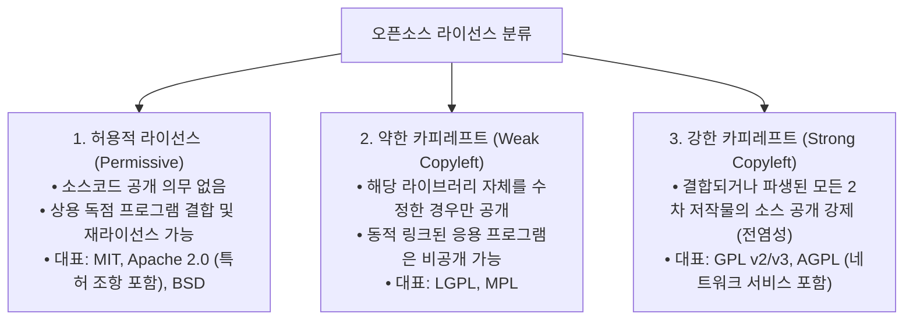
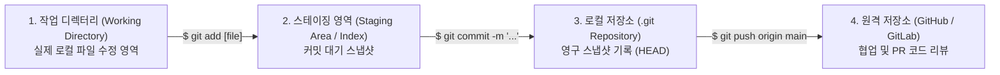

> [!abstract] 핵심 요약
> **오픈소스 소프트웨어(OSS)**는 소스코드가 공개되어 자유로운 수정과 재배포가 허용되지만, 저작권자가 명시한 **라이선스(License) 조건**을 반드시 준수해야 한다.
> 2차적 저작물의 소스코드 공개를 강제하는 **강한 카피레프트(GPL)**와 상업적 독점 소프트웨어 결합이 자유로운 **허용적(Permissive) 라이선스(MIT, Apache 2.0)**의 차이를 이해하고, 분산 버전 관리 도구인 **Git**을 통한 협업 파이프라인을 구축하는 것은 현대 개발자의 핵심 소양이다.

---

## 1. 오픈소스 라이선스 3대 분류 비교



---

## 2. Git 분산 버전 관리 시스템의 3대 영역 (Three Trees)



---

## 3. 실시간 프로젝트 목적별 오픈소스 라이선스 추천 판별기

```html preview
<div style="font-family:system-ui,-apple-system,sans-serif;padding:20px;background:var(--card);color:var(--card-foreground);border:1px solid var(--border);border-radius:var(--radius)">
  <div style="font-size:16px;font-weight:700;margin-bottom:14px;color:var(--primary);display:flex;align-items:center;gap:8px">
    <span>📜 프로젝트 요구사항별 오픈소스 라이선스 추천기</span>
  </div>

  <div style="display:flex;flex-direction:column;gap:8px;margin-bottom:14px">
    <label style="font-size:12px;font-weight:700">프로젝트 배포 및 상용화 전략을 선택하세요:</label>
    <select id="licStrategySelect" style="padding:6px 10px;background:var(--background);color:var(--foreground);border:1px solid var(--border);border-radius:var(--radius);font-weight:700">
      <option value="mit">1. 최대한 자유롭게 배포하고 상용 제품에도 제한 없이 쓰고 싶다.</option>
      <option value="apache">2. 상용화가 가능하면서도 명시적인 특허 라이선스 보호가 필요하다.</option>
      <option value="gpl">3. 누군가 내 코드를 수정해 배포할 경우 무조건 소스코드를 공개하게 만들고 싶다.</option>
      <option value="agpl">4. 웹/클라우드 SaaS 형태로 호스팅되어 제공되는 경우에도 소스코드를 공개시키고 싶다.</option>
    </select>
  </div>

  <div style="padding:12px;background:var(--background);border:1px solid var(--primary);border-radius:var(--radius)">
    <div style="font-size:11px;color:var(--muted-foreground)">추천 라이선스:</div>
    <div id="licNameOut" style="font-size:18px;font-weight:800;color:var(--primary);margin:4px 0">MIT License</div>
    <div id="licDescOut" style="font-size:11px;line-height:1.5;color:var(--card-foreground)">
      간결하고 직관적인 허용적 라이선스로, 저작권 고지만 유지하면 상업적 이용 및 폐쇄 소스 결합이 완벽히 허용됩니다.
    </div>
  </div>

  <script>
    var licData = {
      mit: { name: "MIT License", desc: "간결하고 직관적인 허용적 라이선스로, 저작권 고지만 유지하면 상업적 이용 및 폐쇄 소스 결합이 완벽히 허용됩니다." },
      apache: { name: "Apache License 2.0", desc: "사용자에게 자유로운 상업적 이용을 허용하면서도, 기여자들의 명시적 특허권 부여 및 상표권 보호 조항이 포함되어 있습니다." },
      gpl: { name: "GNU GPL v3 (General Public License)", desc: "강력한 카피레프트 라이선스로, 본 코드를 포함하거나 수정한 2차 저작물은 반드시 동일한 GPLv3로 소스코드를 전면 공개해야 합니다." },
      agpl: { name: "GNU AGPL v3 (Affero GPL)", desc: "네트워크/클라우드 서버 상에서 SaaS 형태로 구동되는 경우에도 클라이언트에게 소스코드 다운로드 링크를 제공하도록 의무화한 라이선스입니다." }
    };

    document.getElementById('licStrategySelect').addEventListener('change', function() {
      var item = licData[this.value];
      document.getElementById('licNameOut').textContent = item.name;
      document.getElementById('licDescOut').textContent = item.desc;
    });
  </script>
</div>
```
