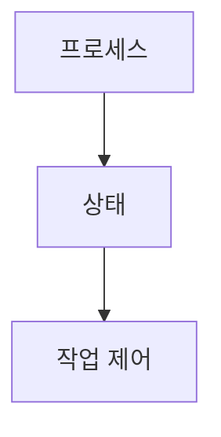

> [!abstract] 한 줄 요약
> 프로세스 상태는 실행·대기·중지 등으로 구분되며 ==상태 코드==로 관찰한다.

## 이 노트의 지도



## 핵심 개념

강의는 프로세스를 실행 중인 프로그램 인스턴스로 정의하고 PID·PPID·상태를 함께 제시한다. 상태는 Running, Sleeping, Disk sleep, Zombie, Stopped, Idle, Dead 등으로 구분된다.

> [!important] 핵심 규칙
> 상태 코드는 현재 실행 여부뿐 아니라 I/O 대기, 부모가 처리하지 않은 종료, 중지처럼 관리상 중요한 차이를 드러낸다.

$$
\text{프로세스 상태}\in\{R,S,D,Z,T,I,X\}
$$

<details>
<summary>상태 코드</summary>

R은 실행 중, S는 대기, D는 디스크 I/O 대기, Z는 종료됐지만 부모가 처리하지 않은 좀비, T는 중지 상태로 제시된다.

</details>

<Tabs>
  <Tab label="실행·대기">R, S, D처럼 실행 또는 대기 상태를 읽는다.</Tab>
  <Tab label="종료·중지">Z, T, X처럼 종료 처리나 중지와 관련한 상태를 읽는다.</Tab>
</Tabs>

> [!tip] 적용 단서
> ps 결과에서 ==Z==는 종료 뒤 부모 처리 여부를 함께 확인해야 하는 상태다.

## 핵심 단서

```html preview
<div style="font-family:system-ui,sans-serif;padding:20px;display:flex;align-items:center;gap:20px;color:var(--foreground)">
  <svg width="120" height="120" viewBox="0 0 120 120" role="img" aria-label="강의의 프로세스 상태">
    <circle cx="60" cy="60" r="46" stroke-width="14" style="fill: none; stroke: var(--border)" />
    <circle cx="60" cy="60" r="46" stroke-width="14"
      stroke-linecap="round" stroke-dasharray="289" stroke-dashoffset="0"
      transform="rotate(-90 60 60)" style="fill: none; stroke: var(--chart-1)" />
    <text x="60" y="67" text-anchor="middle" font-size="22" font-weight="700"
      style="fill: var(--foreground)">7</text>
  </svg>
  <div>
    <div style="font-weight:600;font-size:15px">강의의 프로세스 상태</div>
    <div style="font-size:13px;color:var(--muted-foreground);margin-top:2px">R·S·D·Z·T·I·X 7/7</div>
  </div>
</div>
```

$$
\text{작업 제어}=\text{조회}+\text{시그널}
$$

<details>
<summary>조회와 종료</summary>

강의는 ps aux와 ps -ef를 조회 명령으로, kill SIGNAL PID를 종료 형식으로 제시한다.

</details>

<details>
<summary>백그라운드 작업</summary>

명령어 끝의 &는 백그라운드 실행을 뜻하며, 중지된 작업을 백그라운드에서 계속 실행하는 흐름도 제시된다.

</details>

> [!question]- 스스로 점검
> **Q.** Zombie 상태가 단순히 실행 중인 상태와 다른 이유는 무엇인가?
>
> **A.** 프로세스는 종료됐지만 부모 프로세스가 아직 처리하지 않은 상태이기 때문이다.

## 작성 경계

> [!warning] source warning
> 추출본의 첫 화면은 파일명과 다르게 10주차로 표기된다. 이 노트는 확인 가능한 프로세스 상태·작업 제어 내용만 사용했고, 원본 시각자료와 페이지 표기는 넣지 않았다.
