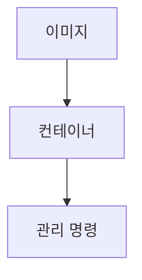

> [!abstract] 한 줄 요약
> 도커는 이미지에서 컨테이너를 만들고, ==실행·조회·중지·삭제== 같은 명령으로 수명주기를 관리한다.

## 이 노트의 지도



## 핵심 개념

강의는 이미지가 컨테이너 실행에 필요한 파일·설정을 묶은 것이고, 컨테이너는 이미지를 실행한 독립 실행 환경이라고 설명한다.

> [!important] 핵심 규칙
> 컨테이너가 종료돼도 자동으로 제거되지는 않으므로 시작·조회·삭제를 구분해 관리해야 한다.

$$
\text{이미지}\xrightarrow{\text{run}}\text{컨테이너}
$$

<details>
<summary>run의 흐름</summary>

강의는 로컬에 이미지가 없으면 레지스트리에서 가져오고, 새 컨테이너를 만든 뒤 기본 네트워크에 연결하고 시작하는 흐름을 설명한다.

</details>

<Tabs>
  <Tab label="이미지 관리">pull·images·rmi로 다운로드·조회·삭제를 다룬다.</Tab>
  <Tab label="컨테이너 관리">run·ps·start·rm·exec·logs로 실행 환경을 다룬다.</Tab>
</Tabs>

> [!caution] 네트워크 경계
> 컨테이너 안의 localhost는 ==컨테이너 자신==을 가리킨다는 점을 네트워크 연결에서 구분한다.

## 핵심 단서

```html preview
<div style="font-family:system-ui,sans-serif;padding:20px">
  <div id="cards" style="display:flex;gap:14px;flex-wrap:wrap"></div>
  <script>
    var stats = [["실행","run","생성·실행","var(--chart-2)"],["조회","ps","실행 중 확인","var(--chart-1)"],["삭제","rm","종료 컨테이너","var(--chart-5)"]];
    document.getElementById('cards').innerHTML = stats.map(function (s) {
      return '<div style="flex:1;min-width:150px;padding:16px;background:var(--card);' +
        'color:var(--card-foreground);border:1px solid var(--border);' +
        'border-radius:var(--radius)">' +
        '<div style="font-size:13px;color:var(--muted-foreground)">' + s[0] + '</div>' +
        '<div style="font-size:26px;font-weight:700;margin-top:4px">' + s[1] + '</div>' +
        '<div style="font-size:12px;font-weight:600;margin-top:4px;color:' + s[3] + '">' +
        s[2] + '</div>' +
        '</div>';
    }).join('');
  </script>
</div>
```

$$
\text{관리}=\text{pull}\rightarrow\text{run}\rightarrow\text{ps}\rightarrow\text{rm}
$$

<details>
<summary>네트워크와 볼륨</summary>

강의는 네트워크 생성·연결, 볼륨 생성·조회, 컨테이너 실행 시 볼륨이나 호스트 디렉터리 연결을 제시한다.

</details>

<details>
<summary>Dockerfile과 Compose</summary>

Dockerfile은 프로젝트를 이미지로 만드는 빌드 스크립트이며, Compose는 YAML 파일로 여러 컨테이너를 함께 관리하는 유틸리티다.

</details>

> [!question]- 스스로 점검
> **Q.** 컨테이너 종료와 삭제를 구분해야 하는 이유는 무엇인가?
>
> **A.** 강의 설명처럼 exit 뒤 컨테이너는 중지되지만 자동으로 제거되지는 않기 때문이다.

## 작성 경계

> [!warning] source warning
> 추출본의 첫 화면은 파일명과 다르게 12주차로 표기된다. 이 노트는 확인 가능한 도커 명령·구성 내용만 사용했고, 원본 시각자료와 페이지 표기는 넣지 않았다.

---

## 원본 강의 흐름 인터랙티브

```html preview
<div style="font-family:system-ui,sans-serif;padding:20px;color:var(--foreground)">
  <label for="noteFlow9189613" style="font-size:14px;font-weight:600">도커 컨테이너 단계</label>
  <div id="noteFlow9189613-out" style="font-size:26px;font-weight:700;color:var(--chart-1);margin:6px 0">도커 컨테이너 핵심 개념</div>
  <input id="noteFlow9189613" type="range" min="1" max="3" step="1" value="1" style="width:100%;accent-color:var(--primary)" />
  <p style="font-size:13px;color:var(--muted-foreground)">슬라이더를 움직이면 원본 PDF에서 정리한 이 노트의 흐름을 확인합니다.</p>
  <script>
    var noteFlow9189613 = document.getElementById('noteFlow9189613');
    var noteFlow9189613Out = document.getElementById('noteFlow9189613-out');
    var noteFlow9189613Steps = ["도커 컨테이너 핵심 개념","도커 컨테이너 처리 절차","도커 컨테이너 검증·응용"];
    noteFlow9189613.addEventListener('input', function () { noteFlow9189613Out.textContent = noteFlow9189613Steps[Number(noteFlow9189613.value) - 1]; });
  </script>
</div>
```
