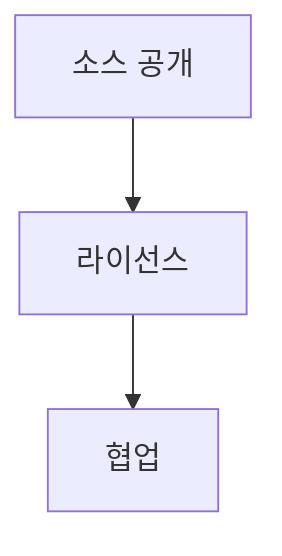

> [!abstract] 한 줄 요약
> 오픈소스는 단순한 무료가 아니라 ==소스코드 공개와 공유==에서 출발하며 라이선스 조건을 함께 읽어야 한다.

## 이 노트의 지도



## 핵심 개념

강의는 오픈소스를 공개된 소스코드만의 개념으로 보지 않고, 공개 프로젝트를 함께 개발하는 방식과 팀 커뮤니케이션의 맥락까지 연결한다. 오픈소스는 무료라는 뜻만으로 규정되지 않는다.

> [!important] 핵심 규칙
> 소스코드를 공개했다고 자동으로 오픈소스가 되는 것은 아니며, 라이선스와 그 철학·조건을 함께 확인해야 한다.

$$
\text{오픈소스}\ne\text{무료}
$$

<details>
<summary>공유와 기여</summary>

강의는 오픈소스의 가치를 나눔으로써 커지는 것으로 설명하며, 제안이 승인되어 반영되는 일을 PR과 기여의 맥락으로 소개한다.

</details>

<Tabs>
  <Tab label="소스 공개">누구나 소스코드를 확인하고 수정·제안할 수 있는 출발점이다.</Tab>
  <Tab label="라이선스">배포·수정·파생 저작물에 적용되는 조건을 규정한다.</Tab>
</Tabs>

> [!caution] 라이선스 확인
> 프로젝트에서 ==라이선스==를 확인할 때 사용 가능 여부만이 아니라 배포와 수정의 조건까지 함께 읽는다.

## 핵심 단서

```html preview
<div style="font-family:system-ui,sans-serif;padding:20px;display:flex;align-items:center;gap:20px;color:var(--foreground)">
  <svg width="120" height="120" viewBox="0 0 120 120" role="img" aria-label="강의의 세 축">
    <circle cx="60" cy="60" r="46" stroke-width="14" style="fill: none; stroke: var(--border)" />
    <circle cx="60" cy="60" r="46" stroke-width="14"
      stroke-linecap="round" stroke-dasharray="289" stroke-dashoffset="0"
      transform="rotate(-90 60 60)" style="fill: none; stroke: var(--chart-1)" />
    <text x="60" y="67" text-anchor="middle" font-size="22" font-weight="700"
      style="fill: var(--foreground)">3</text>
  </svg>
  <div>
    <div style="font-weight:600;font-size:15px">강의의 세 축</div>
    <div style="font-size:13px;color:var(--muted-foreground);margin-top:2px">오픈소스·공학·리눅스 3/3</div>
  </div>
</div>
```

$$
\text{협업}=\text{공개}+\text{커뮤니케이션}
$$

<details>
<summary>OSI 정의의 단서</summary>

강의는 OSI가 오픈소스 정의를 만들고 승인 라이선스를 구분한다고 설명하며, 라이선스는 수정과 파생 저작물 배포를 다룬다고 제시한다.

</details>

<details>
<summary>자유 소프트웨어와의 관계</summary>

강의는 자유 소프트웨어와 오픈소스가 소스코드 공유라는 점에서 유사하지만, 규정과 출발 배경이 완전히 같지는 않다고 설명한다.

</details>

> [!question]- 스스로 점검
> **Q.** 오픈소스를 무료와 동일시하면 안 되는 이유는 무엇인가?
>
> **A.** 강의는 오픈소스가 소스코드 공개·공유와 라이선스 조건을 함께 포함하는 개념이라고 설명하기 때문이다.

## 작성 경계

> [!warning] 출처 경계
> 제공된 추출 텍스트만 사용했으며, 원본 시각자료·첨부물·페이지 표기는 넣지 않았다.
