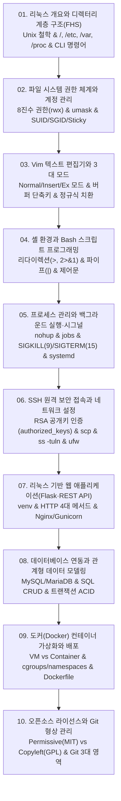

# 📚 리눅스 시스템 및 서버 인프라 (Linux Systems) 전체 강의 로드맵

리눅스 커널 개요와 FHS 디렉터리 계층 구조, 8진수 파일 권한(chmod/umask), Vim 텍스트 편집기, Bash 셸 프로그래밍(리다이렉션/파이프), 프로세스 관리(nohup/시그널), SSH 보안 원격 접속, Flask REST API 웹 개발, MySQL/MariaDB 데이터베이스, Docker 컨테이너 가상화, 그리고 오픈소스 라이선스(GPL/MIT)와 Git 협업까지 리눅스 서버 인프라 전반을 다룹니다.

---

## 🗺️ 강의 목차 (Curriculum Overview)

---

## 📑 개별 정리 문서 목록

1. [01. 리눅스 개요와 디렉터리 계층 구조(FHS)](file:///Users/um-yunsang/work/edu/ComputerScience/04_systems-infrastructure/linux/notes/01.%20%EB%A6%AC%EB%88%85%EC%8A%A4%20%EA%B0%9C%EC%9A%94%EC%99%80%20%EB%94%94%EB%A0%89%ED%84%B0%EB%A6%AC%20%EA%B3%84%EC%층%20%EA%B5%AC%EC%A1%B0(FHS).md)
   - FHS 7대 핵심 디렉터리 역할 및 대화형 경로 탐색기
2. [02. 파일 시스템 권한 체계와 계정 관리](file:///Users/um-yunsang/work/edu/ComputerScience/04_systems-infrastructure/linux/notes/02.%20%ED%8C%8C%EC%9D%BC%20%EC%8B%9C%EC%8A%A4%ED%85%9C%20%EA%B6%8C%ED%95%9C%20%EC%B2%B4%EA%B3%84%EC%99%80%20%EA%B3%84%EC%A0%95%20%EA%B4%80%EB%A6%AC.md)
   - 8진수 chmod 비트 연산, umask 감산, SetUID/Sticky Bit 실시간 권한 계산기
3. [03. Vim 텍스트 편집기와 3대 모드](file:///Users/um-yunsang/work/edu/ComputerScience/04_systems-infrastructure/linux/notes/03.%20Vim%20%ED%85%8D%EC%8A%A4%ED%8A%B8%20%ED%8E%B8%EC%A7%91%EA%B8%B0%EC%99%80%203%EB%8C%80%20%EB%AA%A8%EB%93%9C.md)
   - 일반/입력/명령행 모드 전환 다이어그램 및 키 입력 시뮬레이터
4. [04. 셸 환경과 Bash 스크립트 프로그래밍](file:///Users/um-yunsang/work/edu/ComputerScience/04_systems-infrastructure/linux/notes/04.%20%EC%85%B8%20%ED%99%98%EA%B2%BD%EA%B3%BC%20Bash%20%EC%8A%A4%ED%81%AC%EB%A6%BD%ED%8A%B8%20%ED%94%84%EB%A1%9C%EA%B7%B8%EB%9E%98%EB%B0%8D.md)
   - 표준 입출력 리다이렉션(2>&1), 파이프라인 grep/sort 실시간 텍스트 필터기
5. [05. 프로세스 관리와 백그라운드 실행·시그널](file:///Users/um-yunsang/work/edu/ComputerScience/04_systems-infrastructure/linux/notes/05.%20%ED%94%84%EB%A1%9C%EC%84%B8%EC%84%9C%20%EA%B4%80%EB%A6%AC%EC%99%80%20%EB%B0%B1%EA%B7%B8%EB%9D%BC%EC%9A%B4%EB%93%9C%20%EC%8B%A4%ED%96%89%C2%B7%EC%8B%9C%EA%B7%B8%EB%84%90.md)
   - nohup 백그라운드 영속 실행, SIGKILL(9) vs SIGTERM(15) 제어기
6. [06. SSH 원격 보안 접속과 네트워크 설정](file:///Users/um-yunsang/work/edu/ComputerScience/04_systems-infrastructure/linux/notes/06.%20SSH%20%EC%9B%90%EA%B2%A9%20%EB%B3%B4%EC%95%88%20%EC%A0%91%EC%86%8D%EA%B3%BC%20%EB%84%A4%ED%8A%B8%EC%9B%8C%ED%81%AC%20%EC%84%A4%EC%A0%95.md)
   - RSA 공개키 인증 핸드셰이크, scp 파일 전송, ss -tuln 소켓 검사기
7. [07. 리눅스 기반 웹 애플리케이션(Flask·REST API)](file:///Users/um-yunsang/work/edu/ComputerScience/04_systems-infrastructure/linux/notes/07.%20%EB%A6%AC%EB%88%85%EC%8A%A4%20%EA%B8%B0%EB%B0%98%20%EC%9B%B9%20%EC%95%A0%ED%94%8C%EB%A6%AC%EC%BC%80%EC%9D%B4%EC%85%98(Flask%C2%B7REST%20API).md)
   - RESTful 4대 메서드, JSON 직렬화, Flask/Gunicorn/Nginx 모의 요청 테스터
8. [08. 데이터베이스 연동과 관계형 데이터 모델링](file:///Users/um-yunsang/work/edu/ComputerScience/04_systems-infrastructure/linux/notes/08.%20%EB%8D%B0%EC%9D%B4%ED%84%B0%EB%B2%A0%EC%9D%B4%EC%8A%A4%20%EC%97%B0%EB%8F%99%EA%B3%BC%20%EA%B4%80%EA%B3%84%ED%98%95%20%EB%8D%B0%EC%9D%B4%ED%84%B0%20%EB%AA%A8%EB%8D%B8%EB%A7%81.md)
   - ER 다이어그램 1:N 관계, SQL DDL/DML, 실시간 레코드 삽입 시뮬레이터
9. [09. 도커(Docker) 컨테이너 가상화와 배포](file:///Users/um-yunsang/work/edu/ComputerScience/04_systems-infrastructure/linux/notes/09.%20%EB%8F%84%EC%BB%A4(Docker)%20%EC%BB%A8%ED%85%8C%EC%9D%B4%EB%84%88%20%EA%B0%80%EC%83%81%ED%99%94%EC%99%80%20%EB%B0%B0%ED%8F%AC.md)
   - VM vs Container, Dockerfile 빌드 및 포트 포워딩(-p) 실행기
10. [10. 오픈소스 라이선스와 Git 형상 관리](file:///Users/um-yunsang/work/edu/ComputerScience/04_systems-infrastructure/linux/notes/10.%20%EC%98%A4%ED%94%88%EC%86%8C%EC%8A%A4%20%EB%9D%BC%EC%9D%B4%EC%84%A0%EC%8A%A4%EC%99%80%20Git%20%ED%98%95%EC%83%81%20%EA%B4%80%EB%A6%AC.md)
   - Permissive(MIT) vs Copyleft(GPL), Git 3대 영역, 프로젝트 라이선스 추천기
