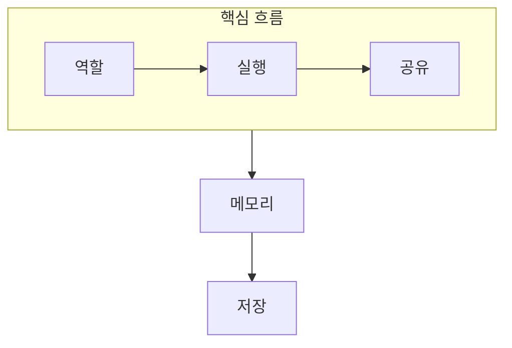

> [!abstract] 학습 경로
> 운영체제는 실행 단위, 공유 자원, 메모리 위치, 저장 장치의 순서로 연결해 공부한다.

## 과목 지도



## 과목 구성

```html preview
<div style="font-family:system-ui,sans-serif;padding:20px">
  <div id="cards" style="display:flex;gap:14px;flex-wrap:wrap"></div>
  <script>
    var stats = [
      ['핵심 단원', '12', '개념 흐름', 'var(--chart-1)'],
      ['보조 노트', '2', '복습·추적', 'var(--chart-2)'],
      ['공개 근거', '0', '원본 단서 제외', 'var(--chart-3)']
    ];
    document.getElementById('cards').innerHTML = stats.map(function (s) {
      return '<div style="flex:1;min-width:150px;padding:16px;background:var(--card);' +
        'color:var(--card-foreground);border:1px solid var(--border);' +
        'border-radius:var(--radius)">' +
        '<div style="font-size:13px;color:var(--muted-foreground)">' + s[0] + '</div>' +
        '<div style="font-size:26px;font-weight:700;margin-top:4px">' + s[1] + '</div>' +
        '<div style="font-size:12px;font-weight:600;margin-top:4px;color:' + s[3] + '">' +
        s[2] + '</div>' +
        '</div>';
    }).join('');
  </script>
</div>
```

## 학습 순서

<Tabs>
  <Tab label="기초">

운영체제의 역할과 권한 경계부터 시작해 프로세스와 스레드를 실행 단위로 구분한다.

  </Tab>
  <Tab label="관리">

스케줄링·동기화·교착상태를 통해 공유 자원의 순서와 안전성을 학습한다.

  </Tab>
  <Tab label="위치">

메모리 주소 변환, 가상 메모리, 파일 시스템, 저장 장치로 논리와 물리의 연결을 학습한다.

  </Tab>
</Tabs>

## 노트 목록

| 순서 | 노트 | 학습 초점 |
| :-- | :-- | :-- |
| 01 | [운영체제의 역할과 발전](<./notes/01. 운영체제의 역할과 발전.md>) | 자원·보호·서비스 |
| 02 | [컴퓨터 시스템과 커널 모드](<./notes/02. 컴퓨터 시스템과 커널 모드.md>) | 권한 경계와 커널 진입 |
| 03 | [프로세스와 생명 주기](<./notes/03. 프로세스와 생명 주기.md>) | 실행 단위와 상태 |
| 04 | [스레드와 멀티태스킹](<./notes/04. 스레드와 멀티태스킹.md>) | 공유와 실행 흐름 |
| 05 | [CPU 스케줄링](<./notes/05. CPU 스케줄링.md>) | 정책과 대기 시간 |
| 06 | [스레드 동기화](<./notes/06. 스레드 동기화.md>) | 임계 구역과 도구 |
| 07 | [교착상태와 회피](<./notes/07. 교착상태와 회피.md>) | 안전성과 대응 |
| 08 | [메모리 관리와 단편화](<./notes/08. 메모리 관리와 단편화.md>) | 연속 할당과 단편화 |
| 09 | [페이징과 주소 변환](<./notes/09. 페이징과 주소 변환.md>) | 논리·물리 주소 |
| 10 | [가상 메모리와 요구 페이징](<./notes/10. 가상 메모리와 요구 페이징.md>) | 부재와 교체 |
| 11 | [파일 시스템 관리](<./notes/11. 파일 시스템 관리.md>) | 이름·메타데이터·블록 |
| 12 | [저장 장치와 디스크 스케줄링](<./notes/12. 저장 장치와 디스크 스케줄링.md>) | 요청 순서와 장치 |
| 90 | [기말 복습 지도](<./notes/90. 기말 복습 지도.md>) | 단원 연결 |
| 91 | [CPU 스케줄링 추적 예](<./notes/91. CPU 스케줄링 추적 예.md>) | 시간선 검산 |

<details>
<summary>자료 매핑 원칙</summary>

핵심 단원 1~12는 각각 대응하는 개념 노트 하나로 정리했다. 종합 복습 자료는 90번, 스케줄링 추적 자료는 91번 연습 노트로 분리했다.

</details>

### source issue

중복으로 판정된 원본 1건, 텍스트 추출이 지나치게 빈약한 범위 자료 1건, 운영 안내 자료 1건은 독립 노트로 만들지 않았다. 보조 과제·알고리즘 자료도 독립 노트화하지 않았다.

### 공개 범위

> [!info] 정책
> 원본 연결, 이미지, 페이지 단서는 공개 노트에서 제외했다.

## 시작 전 점검

> [!question]- 스스로 점검
> **Q.** 스케줄링과 페이징을 연결하는 공통 질문은 무엇인가?
>
> **A.** 제한된 자원을 어떤 단위로 배분하고, 그 선택이 대기·성능·보호에 어떤 비용을 만드는가이다.
