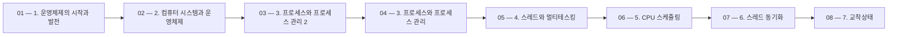

> [!abstract] 사용법
> 이 지도는 현재 폴더의 원본 PDF를 파일 순서대로 묶어 강의 진행 → 핵심 단서 → 점검 포인트를 연결합니다. 세부 개념은 같은 폴더의 주제 노트와 함께 대조하세요.

## 강의 흐름



<Tabs>
  <Tab label="파일 순서">파일명에 포함된 주차·장·버전 표기를 먼저 읽어 강의의 큰 흐름을 잡습니다.</Tab>
  <Tab label="중복 자료">같은 접두사나 버전이 겹치면 앞 자료를 기준으로 뒤 자료의 보충·실습 여부를 비교합니다.</Tab>
  <Tab label="검증">파일명과 쪽수는 탐색용 단서입니다. 정의·식·코드·도식은 각 원본 PDF에서 다시 확인합니다.</Tab>
</Tabs>

## 원본 PDF 목록

| 파일 | 쪽수 | 확인 메모 |
| :-- | --: | :-- |
| 1. 운영체제의 시작과 발전.pdf | 45 | 원본 첫 페이지·본문 대조 |
| 2. 컴퓨터 시스템과 운영체제.pdf | 73 | 원본 첫 페이지·본문 대조 |
| 3. 프로세스와 프로세스 관리 2.pdf | 60 | 원본 첫 페이지·본문 대조 |
| 3. 프로세스와 프로세스 관리.pdf | 60 | 원본 첫 페이지·본문 대조 |
| 4. 스레드와 멀티테스킹.pdf | 63 | 원본 첫 페이지·본문 대조 |
| 5. CPU 스케줄링.pdf | 41 | 원본 첫 페이지·본문 대조 |
| 6. 스레드 동기화.pdf | 53 | 원본 첫 페이지·본문 대조 |
| 7. 교착상태.pdf | 58 | 원본 첫 페이지·본문 대조 |
| 8. 메모리관리.pdf | 36 | 원본 첫 페이지·본문 대조 |
| 9. 페이징 메모리 관리.pdf | 52 | 원본 첫 페이지·본문 대조 |
| 10. 가상 메모리 관리.pdf | 57 | 원본 첫 페이지·본문 대조 |
| 11. 파일 시스템 관리.pdf | 54 | 원본 첫 페이지·본문 대조 |
| 12. 저장 장치 관리.pdf | 54 | 원본 첫 페이지·본문 대조 |
| 기말 정리.pdf | 15 | 원본 첫 페이지·본문 대조 |
| 서술 예상.pdf | 2 | 원본 첫 페이지·본문 대조 |
| 스케줄링의 예.pdf | 5 | 원본 첫 페이지·본문 대조 |
| 자동채점기 사용 방법 안내.pdf | 1 | 원본 첫 페이지·본문 대조 |
| 페이지교체 알고리즘.pdf | 1 | 원본 첫 페이지·본문 대조 |
| BankerAlgorithm.pdf | 2 | 원본 첫 페이지·본문 대조 |
| FCFS 과제.pdf | 1 | 원본 첫 페이지·본문 대조 |
| MemoryAlloc.pdf | 3 | 원본 첫 페이지·본문 대조 |
| SJF 과제.pdf | 1 | 원본 첫 페이지·본문 대조 |
| SRTF 과제.pdf | 1 | 원본 첫 페이지·본문 대조 |

## 원본 단계 인터랙티브

```html preview
<div style="font-family:system-ui,sans-serif;padding:20px;color:var(--foreground)">
  <label for="flow3259897898" style="font-size:14px;font-weight:600">원본 자료 단계</label>
  <div id="flow3259897898-out" style="font-size:24px;font-weight:700;color:var(--chart-1);margin:6px 0">1. 운영체제의 시작과 발전</div>
  <input id="flow3259897898" type="range" min="1" max="23" step="1" value="1" style="width:100%;accent-color:var(--primary)" />
  <p style="font-size:13px;color:var(--muted-foreground)">슬라이더를 움직이면 파일명 순서대로 자료의 위치를 확인합니다.</p>
  <script>
    var flow3259897898 = document.getElementById('flow3259897898');
    var flow3259897898Out = document.getElementById('flow3259897898-out');
    var flow3259897898Steps = ["1. 운영체제의 시작과 발전","2. 컴퓨터 시스템과 운영체제","3. 프로세스와 프로세스 관리 2","3. 프로세스와 프로세스 관리","4. 스레드와 멀티테스킹","5. CPU 스케줄링","6. 스레드 동기화","7. 교착상태","8. 메모리관리","9. 페이징 메모리 관리","10. 가상 메모리 관리","11. 파일 시스템 관리","12. 저장 장치 관리","기말 정리","서술 예상","스케줄링의 예","자동채점기 사용 방법 안내","페이지교체 알고리즘","BankerAlgorithm","FCFS 과제","MemoryAlloc","SJF 과제","SRTF 과제"];
    flow3259897898.addEventListener('input', function () {
      flow3259897898Out.textContent = flow3259897898Steps[Number(flow3259897898.value) - 1] || '';
    });
  </script>
</div>
```

## 점검 포인트

- **범위:** 23개 PDF, 총 738쪽.
- **근거:** 쪽수와 파일명은 현재 sources/ 디렉터리에서 직접 수집했습니다.
- **학습 순서:** 흐름도와 슬라이더를 먼저 훑은 뒤, 주제 노트의 정의·절차·실습 결과를 순서대로 대조합니다.

> [!warning] 과해석 방지
> 이 지도에는 파일명·쪽수·확인 메모만 기록했습니다. PDF에 없는 구현 세부, 성능 수치, 권장 설정은 추가하지 않습니다.

<details>
<summary>다음 읽기</summary>

현재 단계의 원본을 열어 제목·절차·도식을 확인한 뒤, 같은 폴더의 주제 노트에 해당 근거가 반영되었는지 점검하세요.

</details>
