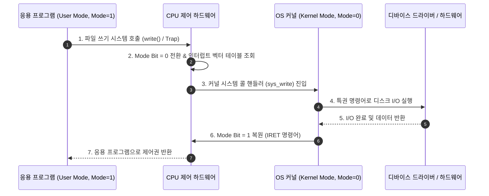

> [!abstract] 핵심 요약
> **운영체제(Operating System)**는 하드웨어 자원을 효율적으로 관리하고 응용 프로그램에 안전한 실행 환경을 제공하는 핵심 시스템 소프트웨어이다.
> 응용 프로그램이 하드웨어(디스크, I/O, 메모리)를 직접 조작하여 시스템을 파괴하는 것을 방지하기 위해 CPU는 **사용자 모드(User Mode, Mode Bit=1)**와 **커널 모드(Kernel Mode / Supervisor Mode, Mode Bit=0)**로 분리된 **이중 모드(Dual-Mode)**로 동작하며, 유저 영역에서 커널 서비스를 요청할 때는 소프트웨어 인터럽트인 **시스템 호출(System Call / Trap)**을 경유한다.

---

## 1. 이중 모드(Dual-Mode)와 시스템 호출 처리 흐름



---

## 2. 하드웨어 인터럽트 vs 소프트웨어 트랩(Trap)

| 구분 | 하드웨어 인터럽트 (Hardware Interrupt) | 소프트웨어 인터럽트 / 트랩 (Trap) |
| :-- | :-- | :-- |
| **발생 주체** | 외부 하드웨어 장치 (키보드, 타이머, 디스크 컨트롤러) | CPU 내부 프로그램 실행 중 (0으로 나누기, 시스템 호출) |
| **발생 시점** | 비동기적 (Asynchronous, 언제든 발생 가능) | 동기적 (Synchronous, 특정 명령어 실행 시점) |
| **목적** | 입출력 완료 또는 타이머 만료 통보 | 예외 처리(Exception) 또는 커널 서비스 요청(System Call) |
| **처리 경로** | CPU 인터럽트 핀 $\to$ 인터럽트 벡터 $\to$ ISR 실행 | 소프트웨어 인터럽트 명령어(INT, Syscall) $\to$ 트랩 테이블 |

---

## 3. 실시간 시스템 호출(System Call) 모드 비트 전환 시뮬레이터

```html preview
<div style="font-family:system-ui,-apple-system,sans-serif;padding:20px;background:var(--card);color:var(--card-foreground);border:1px solid var(--border);border-radius:var(--radius)">
  <div style="font-size:16px;font-weight:700;margin-bottom:14px;color:var(--primary);display:flex;align-items:center;gap:8px">
    <span>🛡️ CPU 이중 모드(User/Kernel Mode) & 시스템 호출 트랩 시뮬레이터</span>
  </div>

  <div style="display:grid;grid-template-columns:1fr 1fr;gap:12px;margin-bottom:14px">
    <div style="padding:10px;background:var(--background);border:1px solid var(--border);border-radius:var(--radius)">
      <div style="font-size:12px;font-weight:700;color:var(--chart-1);margin-bottom:6px">응용 프로그램 동작 요청:</div>
      <div style="display:flex;flex-direction:column;gap:6px">
        <button id="btnUserCalc" style="padding:6px;background:var(--card);color:var(--foreground);border:1px solid var(--border);border-radius:var(--radius);font-size:11px;font-weight:700;cursor:pointer;text-align:left">1. 일반 산술 연산 (a = b + c)</button>
        <button id="btnSyscall" style="padding:6px;background:var(--primary);color:#fff;border:none;border-radius:var(--radius);font-size:11px;font-weight:700;cursor:pointer;text-align:left">2. 디스크 파일 읽기 (read() System Call)</button>
        <button id="btnPrivileged" style="padding:6px;background:var(--destructive, #ef4444);color:#fff;border:none;border-radius:var(--radius);font-size:11px;font-weight:700;cursor:pointer;text-align:left">3. 특권 명령어 직접 실행 (CLI / HLT)</button>
      </div>
    </div>

    <div style="padding:10px;background:var(--background);border:1px solid var(--border);border-radius:var(--radius)">
      <div style="font-size:12px;font-weight:700;color:var(--chart-2);margin-bottom:6px">CPU 및 커널 상태:</div>
      <div style="font-family:monospace;font-size:12px;line-height:1.8">
        • Mode Bit: <span id="modeBitOut" style="font-weight:800;color:var(--chart-1)">1 (User Mode)</span><br/>
        • 실행 위치: <span id="execLocation" style="font-weight:700">사용자 공간 (Ring 3)</span><br/>
        • 하드웨어 접근: <span id="hwAccess" style="font-weight:700;color:var(--muted-foreground)">차단됨 (Protected)</span>
      </div>
    </div>
  </div>

  <div id="modeStatusDesc" style="padding:10px;background:var(--background);border:1px solid var(--border);border-radius:var(--radius);font-size:11px">
    대기 중: 사용자 모드에서 일반 연산이 수행 중입니다.
  </div>

  <script>
    document.getElementById('btnUserCalc').onclick = function() {
      document.getElementById('modeBitOut').textContent = "1 (User Mode)";
      document.getElementById('modeBitOut').style.color = "var(--chart-1)";
      document.getElementById('execLocation').textContent = "사용자 공간 (Ring 3)";
      document.getElementById('hwAccess').textContent = "차단됨 (Protected)";
      document.getElementById('hwAccess').style.color = "var(--muted-foreground)";
      document.getElementById('modeStatusDesc').textContent = "✅ 일반 비특권 명령어(ADD/SUB)는 유저 모드에서 안전하게 실행됩니다.";
    };

    document.getElementById('btnSyscall').onclick = function() {
      document.getElementById('modeBitOut').textContent = "0 (Kernel Mode)";
      document.getElementById('modeBitOut').style.color = "var(--chart-2)";
      document.getElementById('execLocation').textContent = "커널 공간 (Ring 0 - sys_read)";
      document.getElementById('hwAccess').textContent = "허용됨 (I/O 컨트롤러 제어)";
      document.getElementById('hwAccess').style.color = "var(--chart-2)";
      document.getElementById('modeStatusDesc').textContent = "⚡ 트랩(Trap)이 발생하여 Mode Bit가 0으로 전환되었고 커널이 디스크 데이터를 안전하게 읽어 유저 버퍼에 전달합니다.";

      setTimeout(function() {
        document.getElementById('modeBitOut').textContent = "1 (User Mode)";
        document.getElementById('modeBitOut').style.color = "var(--chart-1)";
        document.getElementById('execLocation').textContent = "사용자 공간 (Ring 3)";
        document.getElementById('hwAccess').textContent = "차단됨 (Protected)";
        document.getElementById('hwAccess').style.color = "var(--muted-foreground)";
        document.getElementById('modeStatusDesc').textContent = "✅ 시스템 콜 작업 완료 후 IRET로 사용자 모드(Mode Bit=1)로 안전하게 복귀했습니다.";
      }, 1500);
    };

    document.getElementById('btnPrivileged').onclick = function() {
      document.getElementById('modeStatusDesc').textContent = "⛔ 불법 명령어(Privileged Instruction) 직접 실행 감지! General Protection Fault(Trap) 발생 후 프로세스를 강제 종료(SIGSEGV)합니다.";
      document.getElementById('modeStatusDesc').style.color = "var(--destructive, #ef4444)";
      document.getElementById('modeStatusDesc').style.fontWeight = "bold";
    };
  </script>
</div>
```
