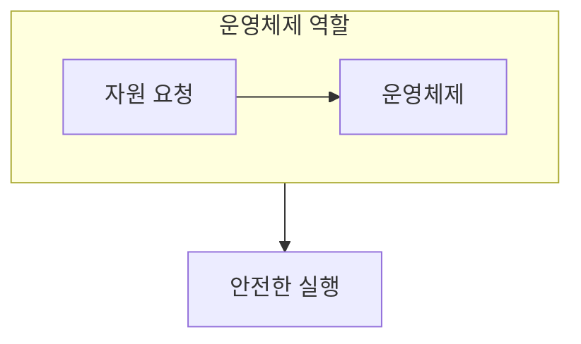

> [!abstract] 운영체제는 제한된 하드웨어를 공유 가능한 실행 환경으로 바꾸는 관리자다.
> 자원 배분과 격리를 함께 보아야 운영체제의 역할이 선명해진다.

## 이 노트의 지도



## 1. 자원을 하나의 환경으로 묶기

CPU, 메모리, 저장 장치처럼 서로 다른 자원은 응용이 직접 다루기 어렵다. ==추상화== 는 복잡한 장치를 일관된 서비스로 보이게 한다.

## 2. 발전의 방향

일괄 처리에서 시간 공유로 옮겨오며, 한 시스템이 여러 작업에 응답하는 방식이 중요해졌다.

<details>
<summary>역할을 구분하는 질문</summary>

응용이 장치마다 다른 제어 절차를 모두 알아야 한다면 재사용과 보호가 약해진다. 운영체제는 공통 인터페이스와 정책으로 이 부담을 나눈다.

</details>

> [!caution] 성능만으로 판단하지 않기
> 빠른 자원 사용도 중요하지만, 한 작업의 오류가 다른 작업으로 번지지 않게 하는 보호가 함께 필요하다.

## 한눈에 비교

```html preview
<div style="font-family:system-ui,sans-serif;padding:20px">
  <div id="cards" style="display:flex;gap:14px;flex-wrap:wrap"></div>
  <script>
    var stats = [
      ['자원', 'CPU·메모리', '배분', 'var(--chart-1)'],
      ['보호', '모드 분리', '격리', 'var(--chart-2)'],
      ['서비스', '파일·입출력', '추상화', 'var(--chart-3)']
    ];
    document.getElementById('cards').innerHTML = stats.map(function (s) {
      return '<div style="flex:1;min-width:150px;padding:16px;background:var(--card);' +
        'color:var(--card-foreground);border:1px solid var(--border);' +
        'border-radius:var(--radius)">' +
        '<div style="font-size:13px;color:var(--muted-foreground)">' + s[0] + '</div>' +
        '<div style="font-size:26px;font-weight:700;margin-top:4px">' + s[1] + '</div>' +
        '<div style="font-size:12px;font-weight:600;margin-top:4px;color:' + s[3] + '">' +
        s[2] + '</div>' +
        '</div>';
    }).join('');
  </script>
</div>
```

## 선택 기준

<Tabs>
  <Tab label="관리">

어떤 작업에 어느 자원을 줄지 정하고, 사용이 끝나면 회수한다.

  </Tab>
  <Tab label="보호">

권한 경계를 두어 작업 사이의 영향을 제한한다.

  </Tab>
</Tabs>

## 핵심 정리

| 구분 | 핵심 | 학습에서 확인할 점 |
| :-- | :-- | :-- |
| 자원 관리 | 배분과 회수 | 공유 자원의 충돌을 찾는다 |
| 보호 | 권한과 격리 | 실패 범위를 좁힌다 |
| 서비스 | 공통 인터페이스 | 응용의 복잡도를 줄인다 |

> [!question]- 스스로 점검
> **Q.** 운영체제가 없는 환경에서 응용이 떠안게 되는 부담은 무엇인가?
>
> **A.** 장치 제어, 자원 충돌 해결, 보호 정책을 각 응용이 직접 처리해야 한다.

## 출처 처리

공개 노트에는 원본 연결, 이미지, 페이지 단서를 남기지 않았다.

---

## 원본 강의 흐름 인터랙티브

```html preview
<div style="font-family:system-ui,sans-serif;padding:20px;color:var(--foreground)">
  <label for="noteFlow727070" style="font-size:14px;font-weight:600">운영체제의 역할과 발전 단계</label>
  <div id="noteFlow727070-out" style="font-size:26px;font-weight:700;color:var(--chart-1);margin:6px 0">운영체제의 역할과 발전 핵심 개념</div>
  <input id="noteFlow727070" type="range" min="1" max="3" step="1" value="1" style="width:100%;accent-color:var(--primary)" />
  <p style="font-size:13px;color:var(--muted-foreground)">슬라이더를 움직이면 원본 PDF에서 정리한 이 노트의 흐름을 확인합니다.</p>
  <script>
    var noteFlow727070 = document.getElementById('noteFlow727070');
    var noteFlow727070Out = document.getElementById('noteFlow727070-out');
    var noteFlow727070Steps = ["운영체제의 역할과 발전 핵심 개념","운영체제의 역할과 발전 처리 절차","운영체제의 역할과 발전 검증·응용"];
    noteFlow727070.addEventListener('input', function () { noteFlow727070Out.textContent = noteFlow727070Steps[Number(noteFlow727070.value) - 1]; });
  </script>
</div>
```
