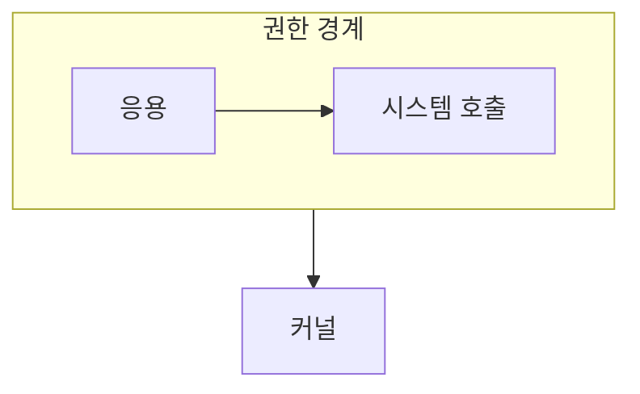

> [!abstract] 모드 전환은 응용의 요청을 보호된 커널 작업으로 전달하는 경계다.
> 누가 요청했는지와 무엇이 발생했는지를 구분하면 시스템 호출과 인터럽트가 갈린다.

## 이 노트의 지도



## 1. 권한을 나누는 이유

응용 프로그램이 모든 명령과 장치에 접근하면 오류 하나가 시스템 전체에 영향을 줄 수 있다. ==커널 모드== 는 보호된 명령과 자원 제어가 허용되는 실행 영역이다.

## 2. 두 가지 진입점

시스템 호출은 응용이 서비스를 요청하는 통로이고, 인터럽트는 하드웨어 사건을 커널에 알리는 신호다.

<details>
<summary>경계를 따라가 보기</summary>

파일을 읽는 응용은 요청을 시스템 호출로 전달한다. 장치가 준비되면 인터럽트가 처리 흐름을 다시 커널로 가져와 결과를 이어 준다.

</details>

> [!warning] 같은 이름의 경계를 섞지 않기
> 사용자 모드와 커널 모드는 권한의 구분이고, 시스템 호출과 인터럽트는 커널로 진입하는 계기다.

## 한눈에 비교

```html preview
<div style="font-family:system-ui,sans-serif;padding:20px">
  <div id="cards" style="display:flex;gap:14px;flex-wrap:wrap"></div>
  <script>
    var stats = [
      ['사용자 모드', '제한 실행', '요청', 'var(--chart-1)'],
      ['시스템 호출', '서비스 진입', '의도적', 'var(--chart-2)'],
      ['인터럽트', '사건 통지', '비동기', 'var(--chart-3)']
    ];
    document.getElementById('cards').innerHTML = stats.map(function (s) {
      return '<div style="flex:1;min-width:150px;padding:16px;background:var(--card);' +
        'color:var(--card-foreground);border:1px solid var(--border);' +
        'border-radius:var(--radius)">' +
        '<div style="font-size:13px;color:var(--muted-foreground)">' + s[0] + '</div>' +
        '<div style="font-size:26px;font-weight:700;margin-top:4px">' + s[1] + '</div>' +
        '<div style="font-size:12px;font-weight:600;margin-top:4px;color:' + s[3] + '">' +
        s[2] + '</div>' +
        '</div>';
    }).join('');
  </script>
</div>
```

## 선택 기준

<details>
<summary>두 관점을 나란히 보기</summary>

**호출.** 응용이 파일, 프로세스, 입출력 같은 운영체제 서비스를 명시적으로 요청한다.

**인터럽트.** 장치나 예외가 현재 실행 흐름에 주의를 요구한다.

</details>

## 핵심 정리

| 구분 | 핵심 | 학습에서 확인할 점 |
| :-- | :-- | :-- |
| 사용자 모드 | 제한된 권한 | 직접 장치 제어가 가능한지 |
| 시스템 호출 | 서비스 요청 | 응용의 의도가 있는지 |
| 인터럽트 | 사건 통지 | 외부 사건이나 예외인지 |

> [!question]- 스스로 점검
> **Q.** 시스템 호출과 인터럽트가 모두 커널로 향해도 구분해야 하는 이유는 무엇인가?
>
> **A.** 발생 주체와 처리 맥락이 달라 보호·제어 흐름을 다르게 이해해야 한다.

## 출처 처리

공개 노트에는 원본 연결, 이미지, 페이지 단서를 남기지 않았다.
