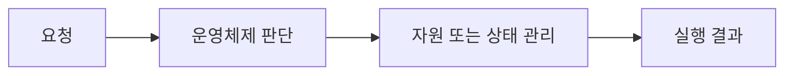

> [!abstract]
> 컴퓨터 시스템은 응용프로그램·운영체제·하드웨어의 계층으로 구성되며, 운영체제는 중개자 역할을 한다.

## 핵심 구조

<Tabs>
<Tab title="계층">응용프로그램, 운영체제, 하드웨어</Tab>
<Tab title="시스템 호출">응용프로그램이 운영체제 서비스에 요청하는 경로</Tab>
<Tab title="실행 모드">사용자 모드와 커널 모드를 분리해 보호</Tab>
</Tabs>



> [!important]
> 응용프로그램, 운영체제, 하드웨어와 응용프로그램이 운영체제 서비스에 요청하는 경로은 별개가 아니라, 운영체제가 실행을 관리할 때 함께 고려하는 관점이다.

```html preview h=145px
<div style="font-family:system-ui,sans-serif;padding:16px;border:1px solid var(--border);border-radius:12px;background:var(--card);color:var(--foreground)"><strong>02. 컴퓨터 시스템과 커널 모드</strong><div style="display:grid;grid-template-columns:repeat(3,1fr);gap:9px;margin-top:13px"><span style="padding:10px;border:1px solid var(--border);border-radius:8px">계층</span><span style="padding:10px;border:1px solid var(--border);border-radius:8px">시스템 호출</span><span style="padding:10px;border:1px solid var(--border);border-radius:8px">실행 모드</span></div></div>
```

<details>
<summary>사용자 프로그램이 장치에 직접 접근하면?</summary>

보호와 자원 관리가 무너지므로 운영체제 경로를 거쳐야 한다.
</details>

## 판단과 검증

==정책의 이름만 외우기보다, 어떤 요청·자원·상태 변화에 적용되는지 추적하는 것이 핵심이다.==

```html preview h=145px
<div style="font-family:system-ui,sans-serif;padding:16px;border:1px solid var(--border);border-radius:12px;background:var(--card);color:var(--foreground)"><div style="display:flex;gap:10px;align-items:center"><span style="padding:10px;background:var(--chart-1);color:var(--background);border-radius:8px">관찰</span><b>→</b><span style="padding:10px;background:var(--chart-2);color:var(--background);border-radius:8px">선택</span><b>→</b><span style="padding:10px;background:var(--chart-3);color:var(--background);border-radius:8px">검증</span></div><p style="margin:12px 0 0">상태와 정책의 결과를 함께 기록한다.</p></div>
```

<details>
<summary>어떤 비교가 필요한가?</summary>

같은 입력 조건에서 정책을 바꿔 보고, 성능뿐 아니라 공정성·보호·자원 사용량의 차이를 관찰한다.
</details>

> [!warning]
> 한 가지 지표만 좋다고 전체 시스템의 선택이 자동으로 정당화되지는 않는다. 충돌하는 목표와 예외 상황을 함께 점검한다.

다음 관찰을 학습 흐름에 연결한다.

> [!tip]
> 학습 팁: 요청이 들어온 순간부터 운영체제가 바꾸는 상태를 화살표로 직접 그려 본다.

### 스스로 점검

- 계층의 역할을 한 문장으로 설명할 수 있는가?
- 시스템 호출와 실행 모드가 어떤 상황에서 연결되는가?
- 정책을 비교할 때 무엇을 측정해야 하는가?
