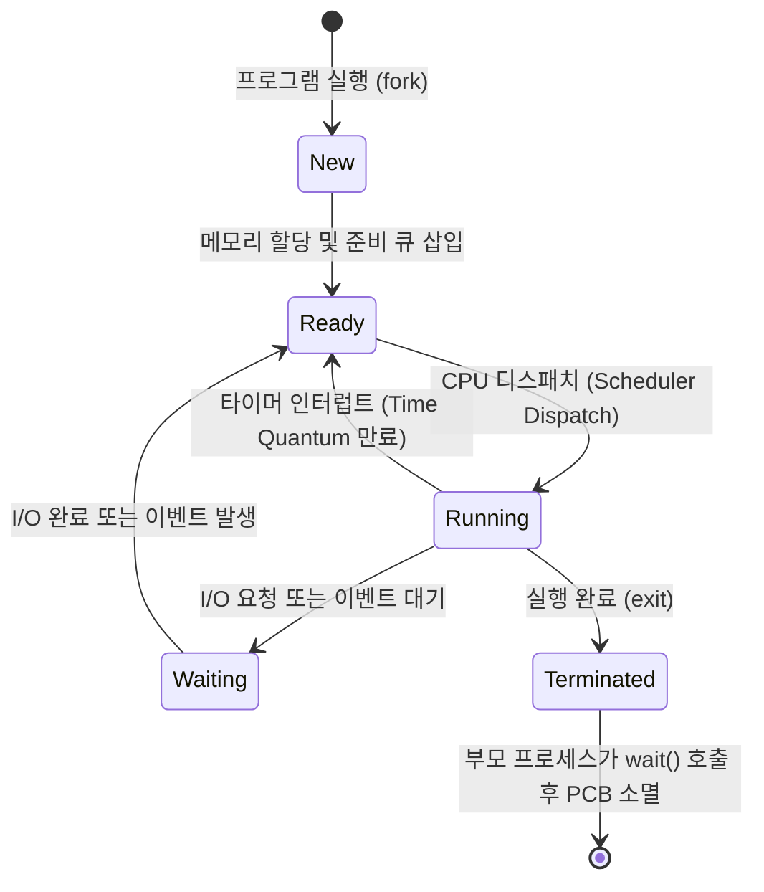
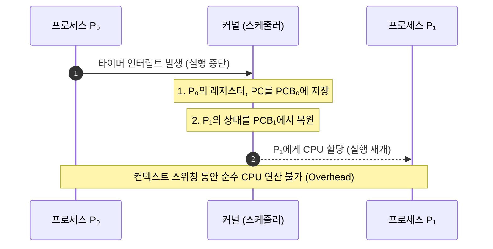
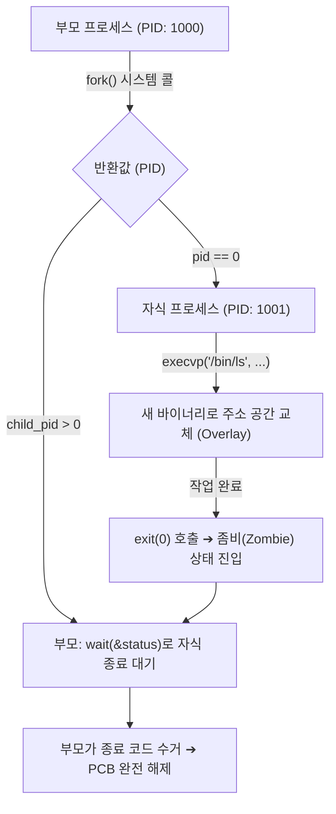

> [!abstract] 핵심 요약
> **프로세스(Process)**는 디스크에 저장된 정적 프로그램이 메모리에 적재되어 CPU 자원을 할당받아 실행 중인 동적 인스턴스이다.
> 각 프로세스는 독립된 가상 주소 공간(**Code·Data·Heap·Stack**)을 가지며, 커널은 **PCB(Process Control Block)**를 통해 프로세스의 모든 상태와 레지스터 컨텍스트를 추적·관리한다. `fork()`를 통한 자식 생성과 `wait()` 미호출로 발생하는 좀비 프로세스의 해결, 프로세스 간 통신(**IPC**)은 시스템 프로그래밍의 핵심이다.

---

## 1. 프로세스 5상태 전이 모델 (Process Life Cycle)



---

## 2. PCB와 컨텍스트 스위칭(Context Switching)



---

## 3. fork() ➔ exec() ➔ wait() ➔ exit() 제어 흐름



---

## 4. 실시간 프로세스 5상태 전이 & PCB 시뮬레이터

```html preview
<div style="font-family:system-ui,-apple-system,sans-serif;padding:20px;background:var(--card);color:var(--card-foreground);border:1px solid var(--border);border-radius:var(--radius)">
  <div style="font-size:16px;font-weight:700;margin-bottom:14px;color:var(--primary);display:flex;align-items:center;gap:8px">
    <span>🔄 프로세스 생명 주기(5-State) & PCB 상태 전이 시뮬레이터</span>
  </div>

  <div style="display:grid;grid-template-columns:1fr 1fr;gap:12px;margin-bottom:14px">
    <div style="padding:10px;background:var(--background);border:1px solid var(--border);border-radius:var(--radius)">
      <div style="font-size:12px;font-weight:700;color:var(--chart-1);margin-bottom:8px">상태 전이 이벤트 발생:</div>
      <div style="display:grid;grid-template-columns:1fr 1fr;gap:6px">
        <button id="evDispatch" style="padding:6px;background:var(--primary);color:#fff;border:none;border-radius:var(--radius);font-size:11px;font-weight:700;cursor:pointer">디스패치 (Dispatch)</button>
        <button id="evTimeout" style="padding:6px;background:var(--card);color:var(--foreground);border:1px solid var(--border);border-radius:var(--radius);font-size:11px;font-weight:700;cursor:pointer">타임아웃 (Timeout)</button>
        <button id="evIoWait" style="padding:6px;background:var(--card);color:var(--foreground);border:1px solid var(--border);border-radius:var(--radius);font-size:11px;font-weight:700;cursor:pointer">I/O 대기 (Block)</button>
        <button id="evIoDone" style="padding:6px;background:var(--card);color:var(--foreground);border:1px solid var(--border);border-radius:var(--radius);font-size:11px;font-weight:700;cursor:pointer">I/O 완료 (Wakeup)</button>
      </div>
    </div>

    <div style="padding:10px;background:var(--background);border:1px solid var(--border);border-radius:var(--radius)">
      <div style="font-size:12px;font-weight:700;color:var(--chart-2);margin-bottom:6px">PCB (Process Control Block) 정보:</div>
      <div style="font-family:monospace;font-size:12px;line-height:1.8">
        • PID: <span style="font-weight:700">1042</span><br/>
        • 프로세스 상태: <span id="pcbStateOut" style="font-weight:800;color:var(--primary)">READY</span><br/>
        • PC (Program Counter): <span id="pcbPcOut" style="font-weight:700">0x00401020</span>
      </div>
    </div>
  </div>

  <div id="stateTransitionLog" style="padding:10px;background:var(--background);border:1px solid var(--border);border-radius:var(--radius);font-size:11px">
    준비 큐(Ready Queue)에서 CPU 스케줄링을 기다리는 중입니다.
  </div>

  <script>
    var curState = "READY";
    var pcVal = 0x00401020;

    function updateStateUI(newState, logMsg) {
      curState = newState;
      document.getElementById('pcbStateOut').textContent = curState;
      document.getElementById('pcbPcOut').textContent = "0x00" + pcVal.toString(16).toUpperCase();
      document.getElementById('stateTransitionLog').textContent = logMsg;

      if (curState === "RUNNING") {
        document.getElementById('pcbStateOut').style.color = "var(--chart-2)";
      } else if (curState === "WAITING") {
        document.getElementById('pcbStateOut').style.color = "var(--chart-1)";
      } else {
        document.getElementById('pcbStateOut').style.color = "var(--primary)";
      }
    }

    document.getElementById('evDispatch').onclick = function() {
      if (curState === "READY") {
        pcVal += 4;
        updateStateUI("RUNNING", "⚡ [Dispatch] CPU를 할당받아 명령어를 실행합니다.");
      }
    };

    document.getElementById('evTimeout').onclick = function() {
      if (curState === "RUNNING") {
        updateStateUI("READY", "⏱️ [Timeout] 타임 퀀텀이 만료되어 준비 큐(Ready Queue) 맨 뒤로 양보합니다.");
      }
    };

    document.getElementById('evIoWait').onclick = function() {
      if (curState === "RUNNING") {
        updateStateUI("WAITING", "💤 [I/O Request] 디스크 입출력을 요청하고 대기 큐(Wait Queue)로 전이합니다.");
      }
    };

    document.getElementById('evIoDone').onclick = function() {
      if (curState === "WAITING") {
        updateStateUI("READY", "🔔 [I/O Interrupt] 입출력이 완료되어 준비 큐(Ready Queue)로 복귀합니다.");
      }
    };
  </script>
</div>
```
