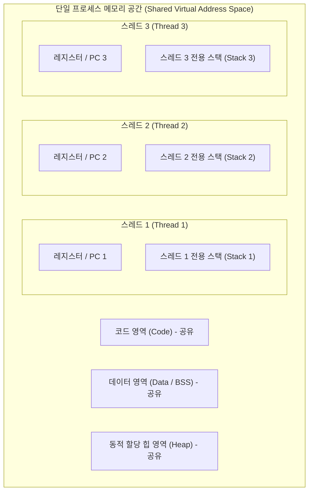
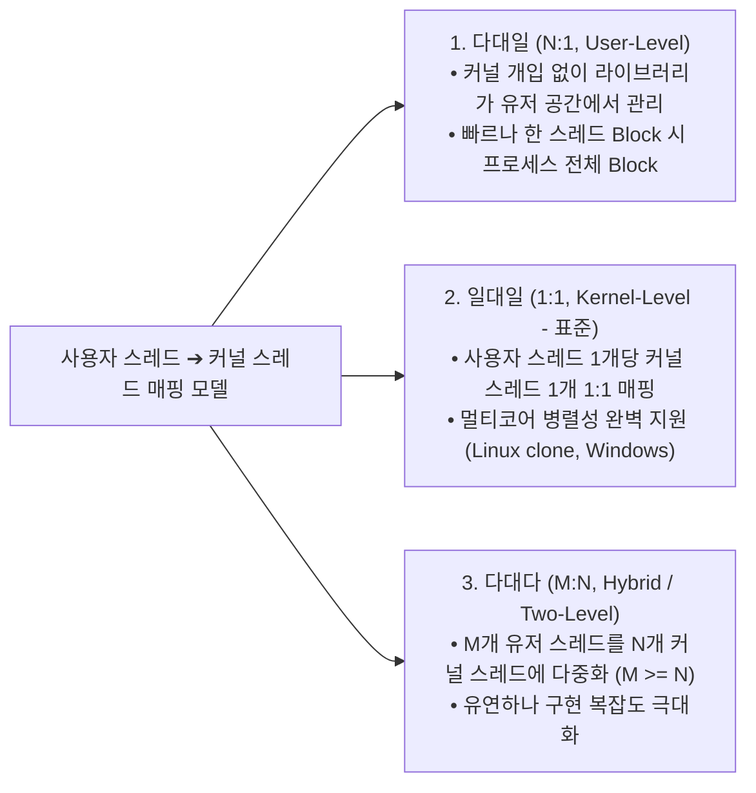

> [!abstract] 핵심 요약
> **스레드(Thread)**는 프로세스 내에서 실행되는 가장 작은 CPU 스케줄링 및 실행 단위(경량 프로세스, LWP)이다.
> 동일 프로세스 내의 스레드들은 **코드(Code), 데이터(Data), 힙(Heap)** 및 열린 파일 디스크립터를 공유하되, 독립적인 함수 호출과 실행 흐름을 위해 **개별 스택(Stack), PC, 레지스터 세트**를 독점한다. 동일 프로세스 내 스레드 간 컨텍스트 스위칭은 메모리 매핑(MMU/TLB) 플러시가 필요 없어 프로세스 간 전환보다 훨씬 가볍고 빠르다.

---

## 1. 단일 스레드 프로세스 vs 멀티 스레드 프로세스 메모리 구조



---

## 2. 3대 멀티스레딩 모델 비교



---

## 3. 프로세스 전환 vs 스레드 전환 오버헤드

| 비교 항목 | 프로세스 컨텍스트 스위칭 (Process CS) | 스레드 컨텍스트 스위칭 (Thread CS) |
| :-- | :-- | :-- |
| **저장/복원 대상** | 모든 CPU 레지스터 + MMU 페이지 테이블 포인터(CR3) | CPU 레지스터 + 스택 포인터(SP), PC |
| **TLB 캐시 플러시** | **필수 (주소 공간이 바뀌므로 TLB 무효화)** | **불필요 (동일 주소 공간 공유)** |
| **캐시 지역성 (Locality)** | 캐시 미스 대량 발생 | 캐시 적중 유지 가능 |
| **소요 시간** | 상대적으로 느림 (수십 마이크로초) | 매우 빠름 (수 마이크로초 이하) |

---

## 4. 실시간 멀티스레드 메모리 공유 & 동시성 카운터 시뮬레이터

```html preview
<div style="font-family:system-ui,-apple-system,sans-serif;padding:20px;background:var(--card);color:var(--card-foreground);border:1px solid var(--border);border-radius:var(--radius)">
  <div style="font-size:16px;font-weight:700;margin-bottom:14px;color:var(--primary);display:flex;align-items:center;gap:8px">
    <span>🧵 멀티스레드 공유 변수(Shared Heap) 경쟁 상태(Race Condition) 시뮬레이터</span>
  </div>

  <div style="display:grid;grid-template-columns:1fr 1fr;gap:12px;margin-bottom:14px">
    <div style="padding:10px;background:var(--background);border:1px solid var(--border);border-radius:var(--radius)">
      <div style="font-size:12px;font-weight:700;color:var(--chart-1);margin-bottom:6px">스레드 1 (Thread A):</div>
      <button id="btnThA" style="width:100%;padding:6px;background:var(--primary);color:#fff;border:none;border-radius:var(--radius);font-size:11px;font-weight:700;cursor:pointer;margin-bottom:4px">count++ 연산 (A 실행)</button>
      <div style="font-size:10px;color:var(--muted-foreground)">1. Read count ➔ 2. Add 1 ➔ 3. Write count</div>
    </div>

    <div style="padding:10px;background:var(--background);border:1px solid var(--border);border-radius:var(--radius)">
      <div style="font-size:12px;font-weight:700;color:var(--chart-2);margin-bottom:6px">스레드 2 (Thread B):</div>
      <button id="btnThB" style="width:100%;padding:6px;background:var(--chart-2);color:#fff;border:none;border-radius:var(--radius);font-size:11px;font-weight:700;cursor:pointer;margin-bottom:4px">count++ 연산 (B 실행)</button>
      <div style="font-size:10px;color:var(--muted-foreground)">동일 힙 메모리 주소(0x1000)를 공유</div>
    </div>
  </div>

  <div style="display:grid;grid-template-columns:1fr 1fr;gap:10px;margin-bottom:12px">
    <div style="padding:10px;background:var(--background);border:1px solid var(--border);border-radius:var(--radius);text-align:center">
      <div style="font-size:11px;color:var(--muted-foreground)">공유 힙 변수 (count)</div>
      <div id="sharedCountOut" style="font-size:20px;font-weight:800;color:var(--primary);margin-top:2px">0</div>
    </div>
    <div style="padding:10px;background:var(--background);border:1px solid var(--border);border-radius:var(--radius);text-align:center">
      <div style="font-size:11px;color:var(--muted-foreground)">총 클릭 누적 횟수</div>
      <div id="totalClicksOut" style="font-size:20px;font-weight:800;color:var(--chart-1);margin-top:2px">0</div>
    </div>
  </div>

  <script>
    var count = 0;
    var totalClicks = 0;

    function updateCounter(worker) {
      count++;
      totalClicks++;
      document.getElementById('sharedCountOut').textContent = count;
      document.getElementById('totalClicksOut').textContent = totalClicks;
    }

    document.getElementById('btnThA').onclick = function() { updateCounter('A'); };
    document.getElementById('btnThB').onclick = function() { updateCounter('B'); };
  </script>
</div>
```
