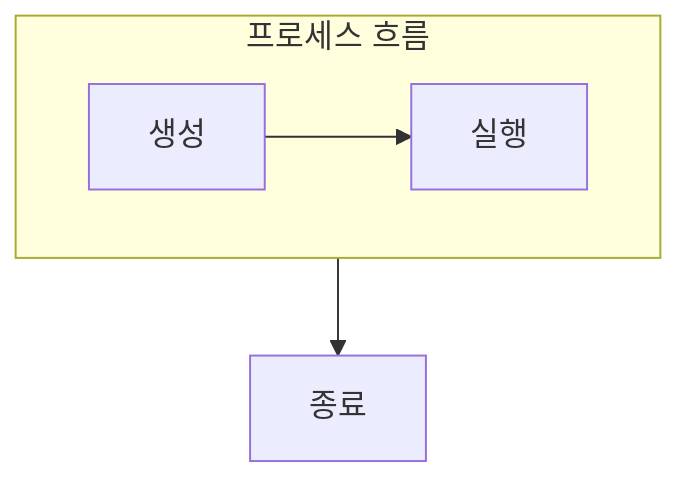

> [!abstract] 프로세스는 실행 중인 프로그램의 메모리와 상태를 함께 관리하는 단위다.
> 프로그램 파일과 실제 실행 단위를 구별하면 생성·대기·종료가 이어진다.

## 이 노트의 지도



## 1. 실행 단위로 보기

프로세스에는 코드뿐 아니라 데이터, 힙, 스택과 실행 상태가 결합된다. ==PID== 는 커널이 각 프로세스를 식별하고 관리하는 기준이다.

## 2. 생성과 교체

새 실행 단위는 생성되고, 다른 프로그램 이미지를 실행하도록 바뀔 수 있으며, 부모는 자식의 종료를 기다릴 수 있다.

<details>
<summary>생명 주기 질문</summary>

생성은 실행 단위를 마련하는 일이고, 실행은 CPU를 얻어 명령을 처리하는 일이다. 종료 뒤에도 부모가 상태를 회수하기 전까지 관리 정보가 남을 수 있다.

</details>

> [!caution] 프로그램과 프로세스를 같은 것으로 보지 않기
> 프로그램은 저장된 코드이고, 프로세스는 그 코드를 실행하기 위해 만들어진 독립된 상태다.

## 한눈에 비교

```html preview
<div style="font-family:system-ui,sans-serif;padding:20px">
  <div id="cards" style="display:flex;gap:14px;flex-wrap:wrap"></div>
  <script>
    var stats = [
      ['식별', 'PID', '관리 기준', 'var(--chart-1)'],
      ['공간', '코드·데이터', '독립', 'var(--chart-2)'],
      ['상태', '실행·대기', '전이', 'var(--chart-3)']
    ];
    document.getElementById('cards').innerHTML = stats.map(function (s) {
      return '<div style="flex:1;min-width:150px;padding:16px;background:var(--card);' +
        'color:var(--card-foreground);border:1px solid var(--border);' +
        'border-radius:var(--radius)">' +
        '<div style="font-size:13px;color:var(--muted-foreground)">' + s[0] + '</div>' +
        '<div style="font-size:26px;font-weight:700;margin-top:4px">' + s[1] + '</div>' +
        '<div style="font-size:12px;font-weight:600;margin-top:4px;color:' + s[3] + '">' +
        s[2] + '</div>' +
        '</div>';
    }).join('');
  </script>
</div>
```

## 선택 기준

<Tabs>
  <Tab label="생성">

새 프로세스는 자원과 초기 상태를 갖춘 실행 단위로 등록된다.

  </Tab>
  <Tab label="종료">

종료 상태와 결과는 부모의 회수 시점까지 관리 대상이 될 수 있다.

  </Tab>
</Tabs>

## 핵심 정리

| 구분 | 핵심 | 학습에서 확인할 점 |
| :-- | :-- | :-- |
| 프로그램 | 저장된 코드 | 실행 상태가 없는가 |
| 프로세스 | 주소 공간과 상태 | 커널이 식별하는가 |
| 부모·자식 | 생성·대기 관계 | 종료 결과를 누가 회수하는가 |

> [!question]- 스스로 점검
> **Q.** 프로세스가 독립된 주소 공간을 가져야 하는 이유는 무엇인가?
>
> **A.** 한 실행 단위의 데이터와 오류가 다른 실행 단위에 직접 영향을 주지 않게 하기 위해서다.

## 출처 처리

> [!info] 공개 노트 정책
> 원본 연결, 이미지, 페이지 단서는 공개 노트에 남기지 않았다.