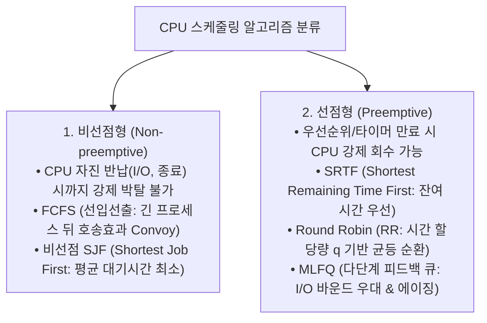

> [!abstract] 핵심 요약
> **CPU 스케줄링(CPU Scheduling)**은 준비 큐(Ready Queue)에 있는 프로세스들 중 어떤 프로세스에게 CPU 코어를 할당할지 결정하는 커널의 핵심 메커니즘이다.
> 도착 순서대로 처리하는 **FCFS(호송 효과 유발)**, CPU 버스트가 짧은 순으로 처리하여 평균 대기 시간을 이론상 최소화하는 **SJF/SRTF**, 공정한 응답 시간을 보장하는 시분할 **라운드로빈(Round Robin)**, 그리고 동적으로 프로세스 특성을 학습하는 **다단계 피드백 큐(MLFQ)**의 트레이드오프를 정량적으로 계산할 수 있어야 한다.

---

## 1. 스케줄링 5대 핵심 알고리즘 비교



---

## 2. 주요 성능 지표 공식 (Metrics)

$$T_{\text{turnaround}} = T_{\text{completion}} - T_{\text{arrival}}$$
$$T_{\text{waiting}} = T_{\text{turnaround}} - T_{\text{burst}}$$
$$\text{Average Waiting Time (AWT)} = \frac{1}{n}\sum_{i=1}^n T_{\text{waiting}, i}$$

---

## 3. 실시간 FCFS vs SJF 간트 차트 및 평균 대기시간 계산기

```html preview
<div style="font-family:system-ui,-apple-system,sans-serif;padding:20px;background:var(--card);color:var(--card-foreground);border:1px solid var(--border);border-radius:var(--radius)">
  <div style="font-size:16px;font-weight:700;margin-bottom:14px;color:var(--primary);display:flex;align-items:center;gap:8px">
    <span>⏱️ CPU 스케줄러 (FCFS vs 비선점 SJF) 간트 차트 및 AWT 실시간 비교기</span>
  </div>

  <div style="margin-bottom:14px">
    <table style="width:100%;border-collapse:collapse;font-size:11px;text-align:center">
      <tr style="border-bottom:1px solid var(--border);color:var(--muted-foreground)">
        <th>프로세스</th><th>도착 시간 (Arrival)</th><th>버스트 시간 (Burst)</th>
      </tr>
      <tr><td>P1</td><td>0 ms</td><td><input id="p1b" type="number" value="24" min="1" style="width:60px;padding:3px;text-align:center;background:var(--background);color:var(--foreground);border:1px solid var(--border);border-radius:var(--radius);font-weight:700" /> ms</td></tr>
      <tr><td>P2</td><td>0 ms</td><td><input id="p2b" type="number" value="3" min="1" style="width:60px;padding:3px;text-align:center;background:var(--background);color:var(--foreground);border:1px solid var(--border);border-radius:var(--radius);font-weight:700" /> ms</td></tr>
      <tr><td>P3</td><td>0 ms</td><td><input id="p3b" type="number" value="3" min="1" style="width:60px;padding:3px;text-align:center;background:var(--background);color:var(--foreground);border:1px solid var(--border);border-radius:var(--radius);font-weight:700" /> ms</td></tr>
    </table>
  </div>

  <div style="display:grid;grid-template-columns:1fr 1fr;gap:12px;margin-bottom:12px">
    <div style="padding:10px;background:var(--background);border:1px solid var(--border);border-radius:var(--radius)">
      <div style="font-size:12px;font-weight:700;color:var(--chart-1)">1. FCFS 스케줄링 (P1 ➔ P2 ➔ P3)</div>
      <div id="fcfsAwtOut" style="font-family:monospace;font-size:14px;font-weight:800;margin-top:4px">AWT = 17.0 ms</div>
      <div style="font-size:10px;color:var(--muted-foreground);margin-top:2px">호송 효과(Convoy Effect) 발생</div>
    </div>
    <div style="padding:10px;background:var(--background);border:1px solid var(--border);border-radius:var(--radius)">
      <div style="font-size:12px;font-weight:700;color:var(--chart-2)">2. SJF 스케줄링 (P2 ➔ P3 ➔ P1)</div>
      <div id="sjfAwtOut" style="font-family:monospace;font-size:14px;font-weight:800;margin-top:4px">AWT = 3.0 ms</div>
      <div style="font-size:10px;color:var(--primary);margin-top:2px">이론상 최소 대기시간 보장</div>
    </div>
  </div>

  <script>
    function updateScheduling() {
      var b1 = parseFloat(document.getElementById('p1b').value) || 24;
      var b2 = parseFloat(document.getElementById('p2b').value) || 3;
      var b3 = parseFloat(document.getElementById('p3b').value) || 3;

      // FCFS: P1, P2, P3
      var w1_fcfs = 0;
      var w2_fcfs = b1;
      var w3_fcfs = b1 + b2;
      var awt_fcfs = (w1_fcfs + w2_fcfs + w3_fcfs) / 3;

      // SJF (도착시간 0 동일 가정)
      var procs = [{ name: 'P1', b: b1 }, { name: 'P2', b: b2 }, { name: 'P3', b: b3 }];
      procs.sort(function(a, b) { return a.b - b.b; });

      var curTime = 0;
      var totalWaitSjf = 0;
      for (var i = 0; i < 3; i++) {
        totalWaitSjf += curTime;
        curTime += procs[i].b;
      }
      var awt_sjf = totalWaitSjf / 3;

      document.getElementById('fcfsAwtOut').textContent = "평균 대기시간 (AWT): " + awt_fcfs.toFixed(2) + " ms";
      document.getElementById('sjfAwtOut').textContent = "평균 대기시간 (AWT): " + awt_sjf.toFixed(2) + " ms (" + procs.map(function(p){return p.name;}).join(' ➔ ') + ")";
    }

    ['p1b', 'p2b', 'p3b'].forEach(function(id) {
      document.getElementById(id).addEventListener('input', updateScheduling);
    });
    updateScheduling();
  </script>
</div>
```
