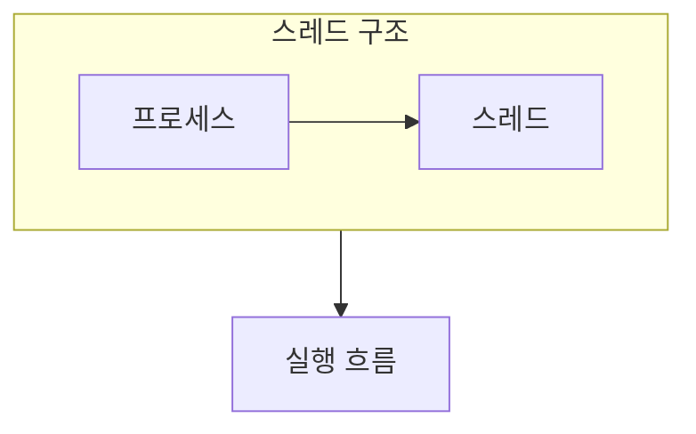

> [!abstract] 스레드는 프로세스 안에서 실제로 스케줄되는 실행 흐름이다.
> 공유되는 것과 각 스레드가 따로 갖는 것을 나누면 동시성 문제의 출발점이 보인다.

## 이 노트의 지도



## 1. 공유와 독립

같은 프로세스의 스레드는 코드, 데이터, 힙을 공유하면서 각자의 실행 문맥을 가진다. ==TCB== 는 스레드의 실행 상태를 관리하는 정보로 볼 수 있다.

## 2. 멀티태스킹의 의미

여러 흐름이 번갈아 CPU를 얻으면 사용자에게는 동시에 진행되는 것처럼 보일 수 있다.

<details>
<summary>공유 자원을 먼저 표시하기</summary>

공유 데이터는 협업을 쉽게 하지만, 두 실행 흐름이 같은 값을 동시에 바꾸려 하면 결과가 순서에 따라 달라질 수 있다.

</details>

> [!important] 공유가 항상 빠른 것은 아니다
> 공유 메모리는 전달 비용을 줄일 수 있지만, 동기화가 빠지면 재현하기 어려운 오류가 생긴다.

## 한눈에 비교

```html preview
<div style="font-family:system-ui,sans-serif;padding:20px">
  <div id="cards" style="display:flex;gap:14px;flex-wrap:wrap"></div>
  <script>
    var stats = [
      ['실행', '스레드', '스케줄 단위', 'var(--chart-1)'],
      ['공유', '코드·데이터', '협업', 'var(--chart-2)'],
      ['독립', '문맥', '전환', 'var(--chart-3)']
    ];
    document.getElementById('cards').innerHTML = stats.map(function (s) {
      return '<div style="flex:1;min-width:150px;padding:16px;background:var(--card);' +
        'color:var(--card-foreground);border:1px solid var(--border);' +
        'border-radius:var(--radius)">' +
        '<div style="font-size:13px;color:var(--muted-foreground)">' + s[0] + '</div>' +
        '<div style="font-size:26px;font-weight:700;margin-top:4px">' + s[1] + '</div>' +
        '<div style="font-size:12px;font-weight:600;margin-top:4px;color:' + s[3] + '">' +
        s[2] + '</div>' +
        '</div>';
    }).join('');
  </script>
</div>
```

## 선택 기준

<details>
<summary>두 관점을 나란히 보기</summary>

**프로세스.** 자원과 주소 공간을 담는 컨테이너로 본다.

**스레드.** 그 컨테이너 안에서 실제 명령을 이어서 실행하는 흐름으로 본다.

</details>

## 핵심 정리

| 구분 | 핵심 | 학습에서 확인할 점 |
| :-- | :-- | :-- |
| 프로세스 | 주소 공간과 자원 | 무엇을 공유하는가 |
| 스레드 | 실행 문맥 | 무엇이 따로 필요한가 |
| 멀티태스킹 | 시간 분할 | 동시처럼 보이는 이유는 무엇인가 |

> [!question]- 스스로 점검
> **Q.** 스레드가 공유하는 자원이 동기화 문제를 만드는 이유는 무엇인가?
>
> **A.** 실행 순서가 달라지면 같은 데이터에 대한 읽기와 쓰기의 결과가 달라질 수 있기 때문이다.

## 출처 처리

공개 노트에는 원본 연결, 이미지, 페이지 단서를 남기지 않았다.

---

## 원본 강의 흐름 인터랙티브

```html preview
<div style="font-family:system-ui,sans-serif;padding:20px;color:var(--foreground)">
  <label for="noteFlow668353" style="font-size:14px;font-weight:600">스레드와 멀티태스킹 단계</label>
  <div id="noteFlow668353-out" style="font-size:26px;font-weight:700;color:var(--chart-1);margin:6px 0">스레드와 멀티태스킹 핵심 개념</div>
  <input id="noteFlow668353" type="range" min="1" max="3" step="1" value="1" style="width:100%;accent-color:var(--primary)" />
  <p style="font-size:13px;color:var(--muted-foreground)">슬라이더를 움직이면 원본 PDF에서 정리한 이 노트의 흐름을 확인합니다.</p>
  <script>
    var noteFlow668353 = document.getElementById('noteFlow668353');
    var noteFlow668353Out = document.getElementById('noteFlow668353-out');
    var noteFlow668353Steps = ["스레드와 멀티태스킹 핵심 개념","스레드와 멀티태스킹 처리 절차","스레드와 멀티태스킹 검증·응용"];
    noteFlow668353.addEventListener('input', function () { noteFlow668353Out.textContent = noteFlow668353Steps[Number(noteFlow668353.value) - 1]; });
  </script>
</div>
```
