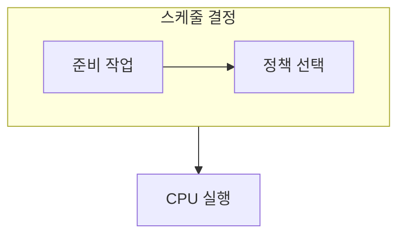

> [!abstract] CPU 스케줄링은 다음에 실행할 작업을 고르는 정책이며, 어떤 시간을 최적화할지에 따라 선택이 달라진다.
> 짧은 평균 대기 시간과 공정한 응답은 항상 같은 선택을 요구하지 않는다.

## 이 노트의 지도



## 1. 측정값을 먼저 정하기

대기 시간, 반환 시간, 응답 시간은 정책을 비교하는 서로 다른 관점이다. ==시간 할당량== 은 순환 방식에서 한 작업이 CPU를 계속 점유하지 않게 하는 단위다.

## 2. 대표 정책의 직관

FCFS는 도착 순서를 따르고, SJF와 SRTF는 짧은 작업을 우선하며, RR은 순환 기회를 준다.

<details>
<summary>정책을 평가하는 순서</summary>

작업의 도착 시점과 실행 시간을 적고, 정책이 선택하는 순서를 따라간다. 그 뒤 각 작업의 기다린 시간을 계산해 평균과 분포를 함께 본다.

</details>

> [!warning] 평균 하나로 공정성을 단정하지 않기
> 평균 대기 시간이 작아도 긴 작업이 계속 뒤로 밀리면 특정 작업의 체감 응답은 나빠질 수 있다.

## 한눈에 비교

```html preview
<div style="font-family:system-ui,sans-serif;padding:20px">
  <div id="cards" style="display:flex;gap:14px;flex-wrap:wrap"></div>
  <script>
    var stats = [
      ['FCFS', '도착 순서', '단순', 'var(--chart-1)'],
      ['SJF', '짧은 작업', '평균 대기', 'var(--chart-2)'],
      ['RR', '시간 할당', '응답성', 'var(--chart-3)']
    ];
    document.getElementById('cards').innerHTML = stats.map(function (s) {
      return '<div style="flex:1;min-width:150px;padding:16px;background:var(--card);' +
        'color:var(--card-foreground);border:1px solid var(--border);' +
        'border-radius:var(--radius)">' +
        '<div style="font-size:13px;color:var(--muted-foreground)">' + s[0] + '</div>' +
        '<div style="font-size:26px;font-weight:700;margin-top:4px">' + s[1] + '</div>' +
        '<div style="font-size:12px;font-weight:600;margin-top:4px;color:' + s[3] + '">' +
        s[2] + '</div>' +
        '</div>';
    }).join('');
  </script>
</div>
```

## 선택 기준

<Tabs>
  <Tab label="비선점">

실행을 시작한 작업이 스스로 양보하거나 끝날 때까지 CPU를 유지하는 방식이다.

  </Tab>
  <Tab label="선점">

더 적절한 작업이나 시간 할당량 만료에 따라 실행 중인 작업을 바꿀 수 있다.

  </Tab>
</Tabs>

## 식으로 확인

$$
\bar{W} = \frac{1}{n}\sum_{i=1}^{n} W_i
$$

## 핵심 정리

| 구분 | 핵심 | 학습에서 확인할 점 |
| :-- | :-- | :-- |
| FCFS | 도착 순서 | 앞선 긴 작업의 영향 |
| SJF·SRTF | 짧은 작업 우선 | 실행 시간 정보와 기아 가능성 |
| RR | 순환 실행 | 시간 할당량의 크기 |

> [!question]- 스스로 점검
> **Q.** RR의 시간 할당량을 지나치게 작게 잡으면 어떤 비용이 커질 수 있는가?
>
> **A.** 작업 전환이 잦아져 전환 비용이 커질 수 있다.

## 출처 처리

공개 노트에는 원본 연결, 이미지, 페이지 단서를 남기지 않았다.

---

## 원본 강의 흐름 인터랙티브

```html preview
<div style="font-family:system-ui,sans-serif;padding:20px;color:var(--foreground)">
  <label for="noteFlow30824" style="font-size:14px;font-weight:600">CPU 스케줄링 단계</label>
  <div id="noteFlow30824-out" style="font-size:26px;font-weight:700;color:var(--chart-1);margin:6px 0">CPU 스케줄링 핵심 개념</div>
  <input id="noteFlow30824" type="range" min="1" max="3" step="1" value="1" style="width:100%;accent-color:var(--primary)" />
  <p style="font-size:13px;color:var(--muted-foreground)">슬라이더를 움직이면 원본 PDF에서 정리한 이 노트의 흐름을 확인합니다.</p>
  <script>
    var noteFlow30824 = document.getElementById('noteFlow30824');
    var noteFlow30824Out = document.getElementById('noteFlow30824-out');
    var noteFlow30824Steps = ["CPU 스케줄링 핵심 개념","CPU 스케줄링 처리 절차","CPU 스케줄링 검증·응용"];
    noteFlow30824.addEventListener('input', function () { noteFlow30824Out.textContent = noteFlow30824Steps[Number(noteFlow30824.value) - 1]; });
  </script>
</div>
```
