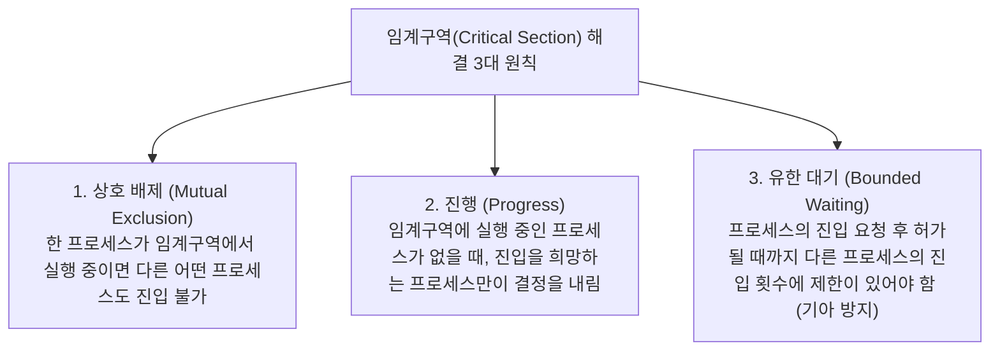
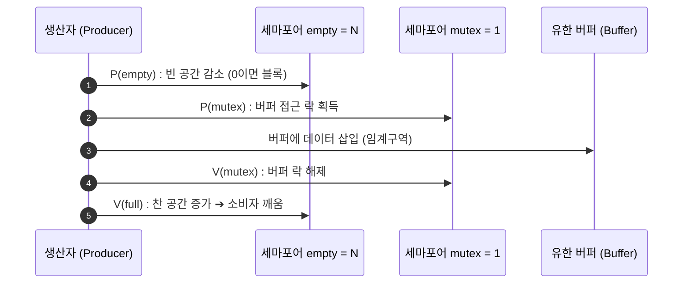

> [!abstract] 핵심 요약
> **프로세스 동기화(Synchronization)**는 여러 실행 흐름이 공유 자원에 동시 접근할 때 데이터의 일관성(Consistency)을 유지하기 위한 핵심 규약이다.
> 공유 변수를 수정하는 코드 구간인 **임계구역(Critical Section)**은 **상호 배제(Mutual Exclusion)**, **진행(Progress)**, **유한 대기(Bounded Waiting)**의 3대 조건을 반드시 만족해야 하며, 이를 위해 하드웨어적 원자적 연산(**CAS**)과 OS 수준의 **뮤텍스(Mutex)** 및 **세마포어(Semaphore $P/V$)**가 사용된다.

---

## 1. 임계구역 문제 해결의 3대 필수 조건



---

## 2. 세마포어(Semaphore)의 $P$ (wait) / $V$ (signal) 원자적 연산



---

## 3. 실시간 생산자-소비자(Bounded Buffer) 세마포어 시뮬레이터

```html preview
<div style="font-family:system-ui,-apple-system,sans-serif;padding:20px;background:var(--card);color:var(--card-foreground);border:1px solid var(--border);border-radius:var(--radius)">
  <div style="font-size:16px;font-weight:700;margin-bottom:14px;color:var(--primary);display:flex;align-items:center;gap:8px">
    <span>📦 유한 버퍼(Bounded Buffer) 세마포어 동기화 시뮬레이터</span>
  </div>

  <div style="display:grid;grid-template-columns:repeat(3, 1fr);gap:10px;margin-bottom:14px">
    <div style="padding:10px;background:var(--background);border:1px solid var(--border);border-radius:var(--radius);text-align:center">
      <div style="font-size:10px;color:var(--muted-foreground)">세마포어 mutex (락)</div>
      <div id="semMutex" style="font-size:16px;font-weight:800;color:var(--chart-1)">1 (Unlocked)</div>
    </div>
    <div style="padding:10px;background:var(--background);border:1px solid var(--border);border-radius:var(--radius);text-align:center">
      <div style="font-size:10px;color:var(--muted-foreground)">세마포어 empty (빈 슬롯)</div>
      <div id="semEmpty" style="font-size:16px;font-weight:800;color:var(--chart-2)">5</div>
    </div>
    <div style="padding:10px;background:var(--background);border:1px solid var(--border);border-radius:var(--radius);text-align:center">
      <div style="font-size:10px;color:var(--muted-foreground)">세마포어 full (찬 슬롯)</div>
      <div id="semFull" style="font-size:16px;font-weight:800;color:var(--primary)">0</div>
    </div>
  </div>

  <div style="display:flex;gap:10px;margin-bottom:14px">
    <button id="btnProduce" style="flex:1;padding:8px;background:var(--primary);color:#fff;border:none;border-radius:var(--radius);font-size:12px;font-weight:700;cursor:pointer">생산자 실행 (Produce Item)</button>
    <button id="btnConsume" style="flex:1;padding:8px;background:var(--chart-2);color:#fff;border:none;border-radius:var(--radius);font-size:12px;font-weight:700;cursor:pointer">소비자 실행 (Consume Item)</button>
  </div>

  <div id="syncLogOut" style="padding:10px;background:var(--background);border:1px solid var(--border);border-radius:var(--radius);font-size:11px;font-family:monospace">
    버퍼가 비어 있습니다 (용량 5개).
  </div>

  <script>
    var CAPACITY = 5;
    var emptySlots = 5;
    var fullSlots = 0;

    function updateSyncUI(msg) {
      document.getElementById('semEmpty').textContent = emptySlots;
      document.getElementById('semFull').textContent = fullSlots;
      document.getElementById('syncLogOut').textContent = msg;
    }

    document.getElementById('btnProduce').onclick = function() {
      if (emptySlots > 0) {
        emptySlots--;
        fullSlots++;
        updateSyncUI("✅ [Producer] P(empty) ➔ P(mutex) ➔ 아이템 적재 ➔ V(mutex) ➔ V(full) 완료.");
      } else {
        updateSyncUI("⛔ [Producer Blocked] 버퍼가 가득 차(empty=0) 소비자가 꺼낼 때까지 대기합니다.");
      }
    };

    document.getElementById('btnConsume').onclick = function() {
      if (fullSlots > 0) {
        fullSlots--;
        emptySlots++;
        updateSyncUI("✅ [Consumer] P(full) ➔ P(mutex) ➔ 아이템 소비 ➔ V(mutex) ➔ V(empty) 완료.");
      } else {
        updateSyncUI("⛔ [Consumer Blocked] 버퍼가 비어(full=0) 생산자가 생성할 때까지 대기합니다.");
      }
    };
  </script>
</div>
```
