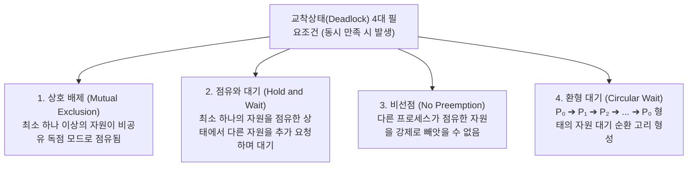
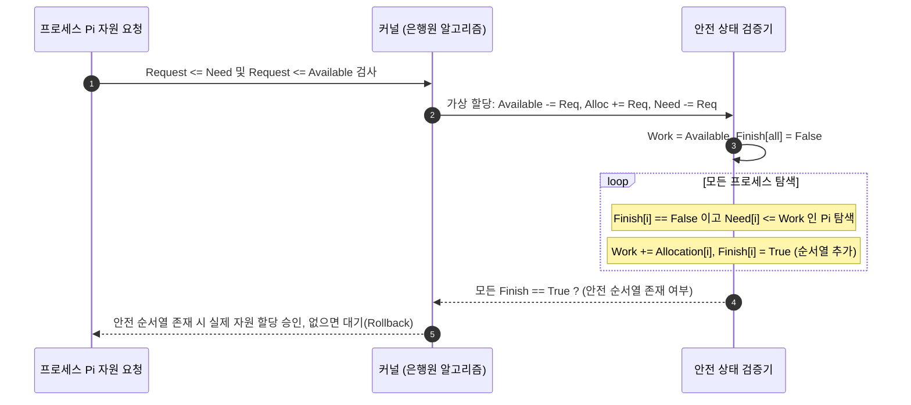

> [!abstract] 핵심 요약
> **교착상태(Deadlock)**는 복수의 프로세스가 각자 다른 프로세스가 점유한 자원을 무한정 기다리며 시스템 전체의 진행이 영구 중단되는 현상이다.
> 교착상태가 발생하기 위한 **코프만 4대 조건(상호배제, 점유대기, 비선점, 환형대기)**을 이해하고, 자원 요청 시 시스템이 항상 **안전 상태(Safe State)**를 유지하도록 보증하는 **은행원 알고리즘(Banker's Algorithm)**의 `Need = Max - Allocation` 안전 순서열 탐색은 OS 시험과 시스템 설계의 핵심이다.

---

## 1. 교착상태 4대 필요조건 (Coffman Conditions)



---

## 2. 안전 상태(Safe State)와 은행원 알고리즘 (Banker's Algorithm)

$$\text{Need}[i][j] = \text{Max}[i][j] - \text{Allocation}[i][j]$$



---

## 3. 실시간 은행원 알고리즘(Banker's Algorithm) 안전 순서열 계산기

```html preview
<div style="font-family:system-ui,-apple-system,sans-serif;padding:20px;background:var(--card);color:var(--card-foreground);border:1px solid var(--border);border-radius:var(--radius)">
  <div style="font-size:16px;font-weight:700;margin-bottom:14px;color:var(--primary);display:flex;align-items:center;gap:8px">
    <span>🏦 은행원 알고리즘(Banker's Algorithm) 실시간 안전 상태(Safe State) 검사기</span>
  </div>

  <div style="margin-bottom:12px">
    <div style="font-size:11px;color:var(--muted-foreground)">가용 자원 벡터 Available [A, B, C]:</div>
    <div style="font-family:monospace;font-size:14px;font-weight:700;color:var(--chart-1);margin-top:2px">[3, 3, 2]</div>
  </div>

  <table style="width:100%;border-collapse:collapse;font-size:11px;text-align:center;margin-bottom:14px">
    <thead style="border-bottom:1px solid var(--border);color:var(--muted-foreground)">
      <tr><th>프로세스</th><th>Allocation (할당)</th><th>Max (최대 필요)</th><th>Need (잔여 필요)</th></tr>
    </thead>
    <tbody>
      <tr><td>P0</td><td>[0, 1, 0]</td><td>[7, 5, 3]</td><td>[7, 4, 3]</td></tr>
      <tr><td>P1</td><td>[2, 0, 0]</td><td>[3, 2, 2]</td><td>[1, 2, 2]</td></tr>
      <tr><td>P2</td><td>[3, 0, 2]</td><td>[9, 0, 2]</td><td>[6, 0, 0]</td></tr>
      <tr><td>P3</td><td>[2, 1, 1]</td><td>[2, 2, 2]</td><td>[0, 1, 1]</td></tr>
      <tr><td>P4</td><td>[0, 0, 2]</td><td>[4, 3, 3]</td><td>[4, 3, 1]</td></tr>
    </tbody>
  </table>

  <button id="runBankerBtn" style="padding:8px 16px;background:var(--primary);color:#fff;border:none;border-radius:var(--radius);font-size:12px;font-weight:700;cursor:pointer;margin-bottom:12px">안전 순서열(Safe Sequence) 탐색 실행</button>

  <div id="bankerResOut" style="padding:10px;background:var(--background);border:1px solid var(--border);border-radius:var(--radius);font-family:monospace;font-size:12px;line-height:1.6">
    버튼을 누르면 안전 순서열을 계산합니다.
  </div>

  <script>
    document.getElementById('runBankerBtn').onclick = function() {
      var n = 5, m = 3;
      var avail = [3, 3, 2];
      var alloc = [
        [0, 1, 0],
        [2, 0, 0],
        [3, 0, 2],
        [2, 1, 1],
        [0, 0, 2]
      ];
      var max = [
        [7, 5, 3],
        [3, 2, 2],
        [9, 0, 2],
        [2, 2, 2],
        [4, 3, 3]
      ];
      var need = [];
      for (var i = 0; i < n; i++) {
        need[i] = [];
        for (var j = 0; j < m; j++) {
          need[i][j] = max[i][j] - alloc[i][j];
        }
      }

      var work = [avail[0], avail[1], avail[2]];
      var finish = [false, false, false, false, false];
      var safeSeq = [];

      for (var k = 0; k < n; k++) {
        for (var i = 0; i < n; i++) {
          if (!finish[i]) {
            var possible = true;
            for (var j = 0; j < m; j++) {
              if (need[i][j] > work[j]) {
                possible = false;
                break;
              }
            }
            if (possible) {
              for (var j = 0; j < m; j++) {
                work[j] += alloc[i][j];
              }
              finish[i] = true;
              safeSeq.push("P" + i);
            }
          }
        }
      }

      var isSafe = safeSeq.length === n;
      if (isSafe) {
        document.getElementById('bankerResOut').innerHTML = "<span style='color:var(--chart-2);font-weight:800'>✅ 시스템은 안전 상태(Safe State)입니다!</span><br/>안전 순서열: <b>" + safeSeq.join(" ➔ ") + "</b>";
      } else {
        document.getElementById('bankerResOut').innerHTML = "<span style='color:var(--destructive,#ef4444);font-weight:800'>⛔ 교착상태 위험 (Unsafe State)</span>";
      }
    };
  </script>
</div>
```
