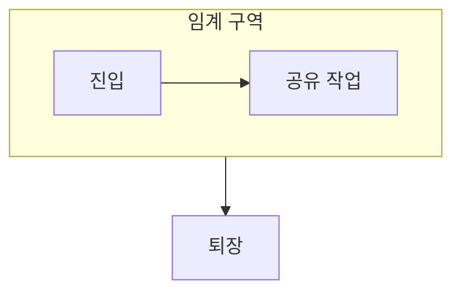

> [!abstract] 동기화는 공유 상태를 바꾸는 실행 흐름이 서로의 순서를 안전하게 맞추는 방법이다.
> 임계 구역을 식별한 뒤 필요한 도구를 고르는 순서가 핵심이다.

## 이 노트의 지도



## 1. 임계 구역 찾기

공유 값의 읽기와 쓰기가 묶여야 하는 부분은 다른 실행 흐름과 겹치지 않게 관리해야 한다. ==상호 배제== 는 한 시점에 하나의 흐름만 임계 구역에 들어가게 하는 성질이다.

## 2. 도구의 역할 차이

뮤텍스는 소유를 중심으로 잠그고, 스핀락은 기다리는 방식에, 세마포어는 이용 가능한 수량의 표현에 초점을 둔다.

<details>
<summary>경쟁 조건을 검토하는 질문</summary>

두 스레드가 같은 값을 읽고 각각 갱신한 뒤 쓰면, 한 갱신이 사라질 수 있다. 읽기·변경·쓰기를 하나의 보호 범위로 볼지 점검한다.

</details>

> [!caution] 잠금 순서도 설계 대상
> 여러 잠금을 얻는 순서가 일관되지 않으면, 상호 배제가 있어도 서로 기다리는 상황으로 이어질 수 있다.

## 한눈에 비교

```html preview
<div style="font-family:system-ui,sans-serif;padding:20px">
  <div id="cards" style="display:flex;gap:14px;flex-wrap:wrap"></div>
  <script>
    var stats = [
      ['뮤텍스', '소유 잠금', '상호 배제', 'var(--chart-1)'],
      ['스핀락', '짧은 대기', '반복 확인', 'var(--chart-2)'],
      ['세마포어', '가용 수량', '조율', 'var(--chart-3)']
    ];
    document.getElementById('cards').innerHTML = stats.map(function (s) {
      return '<div style="flex:1;min-width:150px;padding:16px;background:var(--card);' +
        'color:var(--card-foreground);border:1px solid var(--border);' +
        'border-radius:var(--radius)">' +
        '<div style="font-size:13px;color:var(--muted-foreground)">' + s[0] + '</div>' +
        '<div style="font-size:26px;font-weight:700;margin-top:4px">' + s[1] + '</div>' +
        '<div style="font-size:12px;font-weight:600;margin-top:4px;color:' + s[3] + '">' +
        s[2] + '</div>' +
        '</div>';
    }).join('');
  </script>
</div>
```

## 선택 기준

<Tabs>
  <Tab label="보호">

공유 상태가 일관되게 갱신되도록 임계 구역을 한 흐름에 맡긴다.

  </Tab>
  <Tab label="조율">

어떤 조건이 만족될 때까지 기다리거나, 가용 자원의 수를 표현한다.

  </Tab>
</Tabs>

## 핵심 정리

| 구분 | 핵심 | 학습에서 확인할 점 |
| :-- | :-- | :-- |
| 임계 구역 | 공유 상태 변경 | 동시에 들어갈 수 있는가 |
| 뮤텍스 | 소유 기반 잠금 | 해제 주체가 분명한가 |
| 세마포어 | 수량 기반 신호 | 남은 자원을 표현하는가 |

> [!question]- 스스로 점검
> **Q.** 스핀락이 오래 걸리는 작업에 부적절할 수 있는 이유는 무엇인가?
>
> **A.** 기다리는 동안에도 CPU를 사용해 다른 유용한 작업의 기회를 줄일 수 있기 때문이다.

## 출처 처리

> [!info] 공개 노트 정책
> 원본 연결, 이미지, 페이지 단서는 공개 노트에 남기지 않았다.