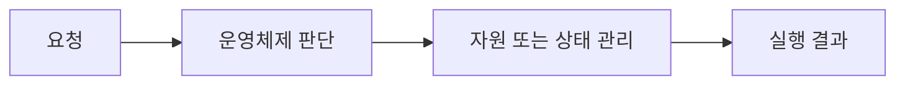

> [!abstract]
> 교착상태는 각 실행 주체가 자원을 보유한 채 다른 주체의 자원을 기다리면서 누구도 진행하지 못하는 상태다.

## 핵심 구조

<Tabs>
<Tab title="모델">자원 할당 그래프로 대기 관계 표현</Tab>
<Tab title="조건">코프만의 네 조건이 함께 성립할 때 가능</Tab>
<Tab title="대응">예방·회피·감지와 복구·무시</Tab>
</Tabs>



> [!important]
> 자원 할당 그래프로 대기 관계 표현와 코프만의 네 조건이 함께 성립할 때 가능은 별개가 아니라, 운영체제가 실행을 관리할 때 함께 고려하는 관점이다.

```html preview h=145px
<div style="font-family:system-ui,sans-serif;padding:16px;border:1px solid var(--border);border-radius:12px;background:var(--card);color:var(--foreground)"><strong>07. 교착상태와 회피</strong><div style="display:grid;grid-template-columns:repeat(3,1fr);gap:9px;margin-top:13px"><span style="padding:10px;border:1px solid var(--border);border-radius:8px">모델</span><span style="padding:10px;border:1px solid var(--border);border-radius:8px">조건</span><span style="padding:10px;border:1px solid var(--border);border-radius:8px">대응</span></div></div>
```

<details>
<summary>대기와 교착상태는 같은가?</summary>

일시 대기는 진행 가능하지만, 순환 대기는 모두가 멈추는 교착상태가 될 수 있다.
</details>

## 판단과 검증

==정책의 이름만 외우기보다, 어떤 요청·자원·상태 변화에 적용되는지 추적하는 것이 핵심이다.==

```html preview h=145px
<div style="font-family:system-ui,sans-serif;padding:16px;border:1px solid var(--border);border-radius:12px;background:var(--card);color:var(--foreground)"><div style="display:flex;gap:10px;align-items:center"><span style="padding:10px;background:var(--chart-1);color:var(--background);border-radius:8px">관찰</span><b>→</b><span style="padding:10px;background:var(--chart-2);color:var(--background);border-radius:8px">선택</span><b>→</b><span style="padding:10px;background:var(--chart-3);color:var(--background);border-radius:8px">검증</span></div><p style="margin:12px 0 0">상태와 정책의 결과를 함께 기록한다.</p></div>
```

<details>
<summary>어떤 비교가 필요한가?</summary>

같은 입력 조건에서 정책을 바꿔 보고, 성능뿐 아니라 공정성·보호·자원 사용량의 차이를 관찰한다.
</details>

> [!warning]
> 한 가지 지표만 좋다고 전체 시스템의 선택이 자동으로 정당화되지는 않는다. 충돌하는 목표와 예외 상황을 함께 점검한다.

다음 관찰을 학습 흐름에 연결한다.

> [!tip]
> 학습 팁: 요청이 들어온 순간부터 운영체제가 바꾸는 상태를 화살표로 직접 그려 본다.

### 스스로 점검

- 모델의 역할을 한 문장으로 설명할 수 있는가?
- 조건와 대응가 어떤 상황에서 연결되는가?
- 정책을 비교할 때 무엇을 측정해야 하는가?
