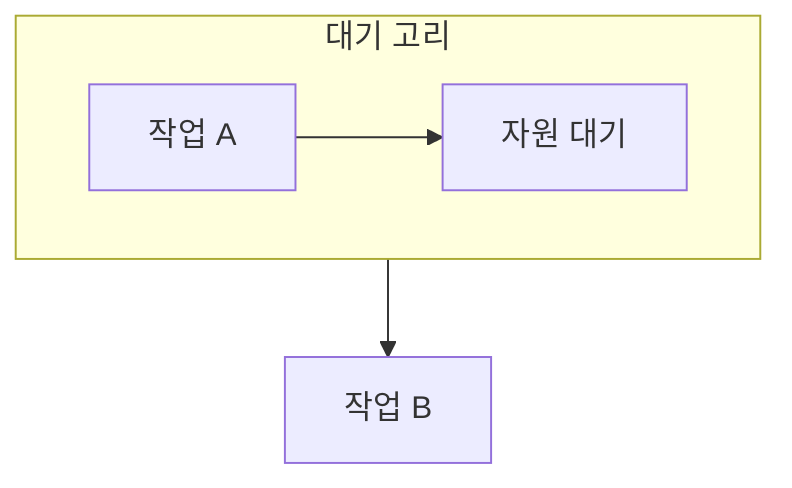

> [!abstract] 교착상태는 작업들이 서로가 가진 자원을 기다려 더 이상 진행하지 못하는 상태다.
> 현재의 대기와 앞으로 안전하게 끝낼 수 있는 상태를 구별해야 한다.

## 이 노트의 지도



## 1. 고리를 읽는 법

자원 할당 관계에서 한 작업의 요청이 다른 작업의 보유와 맞물리면 대기 고리가 생길 수 있다. ==안전 상태== 는 어떤 완료 순서를 선택하면 모든 작업이 끝날 수 있는 상태를 뜻한다.

## 2. 대응의 층위

예방은 조건을 미리 제한하고, 회피는 요청 시점의 안전성을 확인하며, 탐지는 발생 뒤 복구를 준비한다.

<details>
<summary>회피를 적용하는 순서</summary>

현재 가용 자원과 각 작업의 최대 요구·할당을 비교한다. 하나를 끝낼 수 있으면 그 자원을 반환한다고 가정해 다음 작업을 찾는다.

</details>

> [!warning] 그래프의 고리만으로 항상 결론내리지 않기
> 자원 종류와 인스턴스 수에 따라 고리의 의미가 달라질 수 있으므로, 실제 할당 가능성도 함께 확인한다.

## 한눈에 비교

```html preview
<div style="font-family:system-ui,sans-serif;padding:20px">
  <div id="cards" style="display:flex;gap:14px;flex-wrap:wrap"></div>
  <script>
    var stats = [
      ['예방', '조건 제한', '사전', 'var(--chart-1)'],
      ['회피', '안전 검사', '요청 시', 'var(--chart-2)'],
      ['탐지', '발생 확인', '사후', 'var(--chart-3)']
    ];
    document.getElementById('cards').innerHTML = stats.map(function (s) {
      return '<div style="flex:1;min-width:150px;padding:16px;background:var(--card);' +
        'color:var(--card-foreground);border:1px solid var(--border);' +
        'border-radius:var(--radius)">' +
        '<div style="font-size:13px;color:var(--muted-foreground)">' + s[0] + '</div>' +
        '<div style="font-size:26px;font-weight:700;margin-top:4px">' + s[1] + '</div>' +
        '<div style="font-size:12px;font-weight:600;margin-top:4px;color:' + s[3] + '">' +
        s[2] + '</div>' +
        '</div>';
    }).join('');
  </script>
</div>
```

## 선택 기준

<Tabs>
  <Tab label="예방">

교착상태를 가능하게 하는 조건 중 일부를 설계 단계에서 제한한다.

  </Tab>
  <Tab label="회피">

요청을 바로 허용하지 않고, 허용한 뒤에도 완료 순서가 남는지 본다.

  </Tab>
</Tabs>

## 핵심 정리

| 구분 | 핵심 | 학습에서 확인할 점 |
| :-- | :-- | :-- |
| 예방 | 조건을 제한 | 자원 이용률과의 균형 |
| 회피 | 안전 상태 검사 | 최대 요구 정보의 신뢰성 |
| 탐지·복구 | 발생 뒤 처리 | 희생 작업과 복구 비용 |

<details>
<summary>스스로 점검</summary>

**Q.** 안전 상태가 교착상태가 아닌 상태보다 더 강한 표현인 이유는 무엇인가?

**A.** 현재 막히지 않았을 뿐 아니라, 앞으로 모두 종료할 수 있는 순서가 존재함을 요구하기 때문이다.

</details>

## 출처 처리

공개 노트에는 원본 연결, 이미지, 페이지 단서를 남기지 않았다.

---

## 원본 강의 흐름 인터랙티브

```html preview
<div style="font-family:system-ui,sans-serif;padding:20px;color:var(--foreground)">
  <label for="noteFlow425176" style="font-size:14px;font-weight:600">교착상태와 회피 단계</label>
  <div id="noteFlow425176-out" style="font-size:26px;font-weight:700;color:var(--chart-1);margin:6px 0">교착상태와 회피 핵심 개념</div>
  <input id="noteFlow425176" type="range" min="1" max="3" step="1" value="1" style="width:100%;accent-color:var(--primary)" />
  <p style="font-size:13px;color:var(--muted-foreground)">슬라이더를 움직이면 원본 PDF에서 정리한 이 노트의 흐름을 확인합니다.</p>
  <script>
    var noteFlow425176 = document.getElementById('noteFlow425176');
    var noteFlow425176Out = document.getElementById('noteFlow425176-out');
    var noteFlow425176Steps = ["교착상태와 회피 핵심 개념","교착상태와 회피 처리 절차","교착상태와 회피 검증·응용"];
    noteFlow425176.addEventListener('input', function () { noteFlow425176Out.textContent = noteFlow425176Steps[Number(noteFlow425176.value) - 1]; });
  </script>
</div>
```
