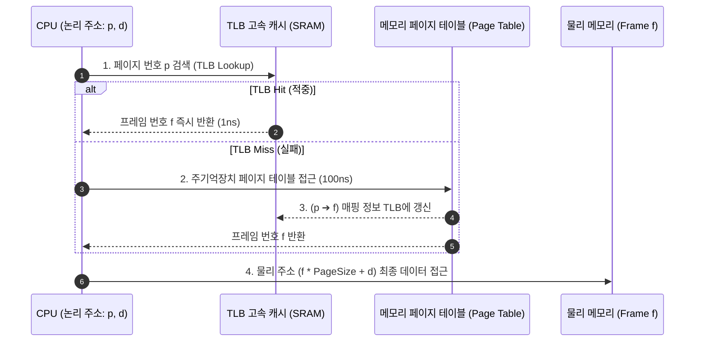

> [!abstract] 핵심 요약
> **메모리 관리(Memory Management)**는 한정된 물리 RAM 자원을 여러 프로세스에 안전하고 효율적으로 분할·할당하는 운영체제의 핵심 기능이다.
> 연속 할당에서 발생하는 **외부 단편화(External Fragmentation)**를 해결하기 위해 프로세스 주소 공간을 고정 크기 **페이지(Page)**로 분할하여 물리 메모리의 **프레임(Frame)**에 비연속 사상하는 **페이징(Paging)** 기법이 현대 OS의 표준이며, 2단계 메모리 조회를 1단계로 가속하는 **TLB(Translation Lookaside Buffer)**는 시스템 처리 속도를 결정짓는 핵심 하드웨어이다.

---

## 1. 페이징(Paging) 논리 주소 ➔ 물리 주소 변환

$$\text{Page Number } (p) = \lfloor \text{Logical Address} / \text{Page Size} \rfloor$$
$$\text{Offset } (d) = \text{Logical Address} \pmod{\text{Page Size}}$$
$$\text{Physical Address} = (\text{Frame Number } f \times \text{Page Size}) + d$$



---

## 2. TLB 유효 접근 시간 (Effective Access Time, EAT)

TLB 적중률을 $\alpha$, TLB 검색 시간을 $t_{\text{TLB}}$, 메인 메모리 접근 시간을 $t_m$이라 할 때:

$$\text{EAT} = (t_{\text{TLB}} + t_m)\alpha + (t_{\text{TLB}} + 2t_m)(1 - \alpha) = 2t_m + t_{\text{TLB}} - \alpha t_m$$

---

## 3. 실시간 TLB 적중률 기반 EAT 유효 접근 시간 계산기

```html preview
<div style="font-family:system-ui,-apple-system,sans-serif;padding:20px;background:var(--card);color:var(--card-foreground);border:1px solid var(--border);border-radius:var(--radius)">
  <div style="font-size:16px;font-weight:700;margin-bottom:14px;color:var(--primary);display:flex;align-items:center;gap:8px">
    <span>⚡ TLB 페이징 유효 메모리 접근 시간(EAT) 실시간 시뮬레이터</span>
  </div>

  <div style="display:grid;grid-template-columns:repeat(3, 1fr);gap:10px;margin-bottom:14px">
    <div>
      <label style="font-size:11px;color:var(--muted-foreground)">TLB 적중률 α (%):</label>
      <input id="inAlphaEAT" type="number" value="98" min="0" max="100" style="width:100%;padding:4px 8px;background:var(--background);color:var(--foreground);border:1px solid var(--border);border-radius:var(--radius);font-weight:700" />
    </div>
    <div>
      <label style="font-size:11px;color:var(--muted-foreground)">TLB 검색 시간 (ns):</label>
      <input id="inTlbTime" type="number" value="2" min="0.1" style="width:100%;padding:4px 8px;background:var(--background);color:var(--foreground);border:1px solid var(--border);border-radius:var(--radius);font-weight:700" />
    </div>
    <div>
      <label style="font-size:11px;color:var(--muted-foreground)">메모리 접근 시간 (ns):</label>
      <input id="inMemTime" type="number" value="100" min="1" style="width:100%;padding:4px 8px;background:var(--background);color:var(--foreground);border:1px solid var(--border);border-radius:var(--radius);font-weight:700" />
    </div>
  </div>

  <div style="display:grid;grid-template-columns:1fr 1fr;gap:12px">
    <div style="padding:10px;background:var(--background);border:1px solid var(--border);border-radius:var(--radius);text-align:center">
      <div style="font-size:11px;color:var(--muted-foreground)">유효 접근 시간 (EAT)</div>
      <div id="eatResultOut" style="font-size:18px;font-weight:800;color:var(--primary);margin-top:2px"></div>
    </div>
    <div style="padding:10px;background:var(--background);border:1px solid var(--border);border-radius:var(--radius);text-align:center">
      <div style="font-size:11px;color:var(--muted-foreground)">TLB 미스 대비 감속비</div>
      <div id="eatSlowdownOut" style="font-size:18px;font-weight:800;color:var(--chart-2);margin-top:2px"></div>
    </div>
  </div>

  <script>
    function calcEAT() {
      var alpha = (parseFloat(document.getElementById('inAlphaEAT').value) || 98) / 100;
      var tTlb = parseFloat(document.getElementById('inTlbTime').value) || 2;
      var tMem = parseFloat(document.getElementById('inMemTime').value) || 100;

      var eat = (tTlb + tMem) * alpha + (tTlb + 2 * tMem) * (1 - alpha);
      var noTlb = tTlb + 2 * tMem;

      document.getElementById('eatResultOut').textContent = eat.toFixed(2) + " ns";
      document.getElementById('eatSlowdownOut').textContent = (noTlb / eat).toFixed(2) + " 배 빠름";
    }

    ['inAlphaEAT', 'inTlbTime', 'inMemTime'].forEach(function(id) {
      document.getElementById(id).addEventListener('input', calcEAT);
    });
    calcEAT();
  </script>
</div>
```
