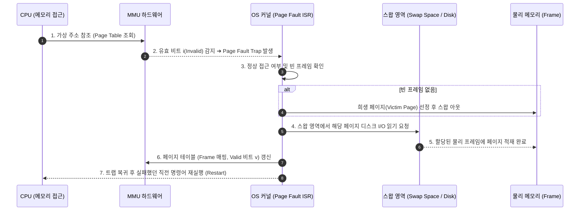
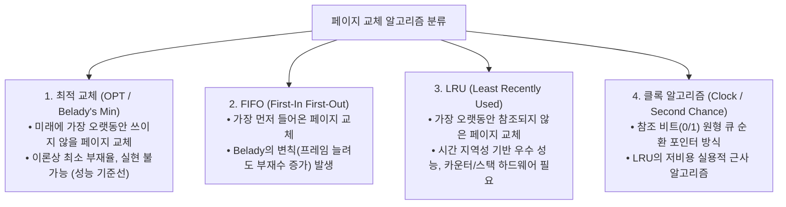

> [!abstract] 핵심 요약
> **가상 메모리(Virtual Memory)**는 물리 RAM 크기의 한계를 극복하여 프로세스가 연속된 거대한 논리 메모리 공간을 독점하는 것처럼 환상을 제공하는 핵심 기법이다.
> 필요한 페이지만 물리 메모리에 올리는 **요구 페이징(Demand Paging)**에서 페이지 부재(Page Fault) 발생 시 희생 프레임을 선정하는 **FIFO(벨레이디 변칙 발생)**, **LRU(과거 참조 기반)**, **Clock(참조 비트 활용)** 교체 알고리즘과, 메모리 부족으로 디스크 I/O만 폭증하는 **스레싱(Thrashing)** 방지 기법을 마스터해야 한다.

---

## 1. 페이지 부재(Page Fault) 7단계 처리 시퀀스



---

## 2. 4대 페이지 교체 알고리즘(Page Replacement) 비교



---

## 3. 실시간 FIFO vs LRU 페이지 교체 및 부재율(Page Fault) 시뮬레이터

```html preview
<div style="font-family:system-ui,-apple-system,sans-serif;padding:20px;background:var(--card);color:var(--card-foreground);border:1px solid var(--border);border-radius:var(--radius)">
  <div style="font-size:16px;font-weight:700;margin-bottom:14px;color:var(--primary);display:flex;align-items:center;gap:8px">
    <span>📑 페이지 교체 알고리즘 (FIFO vs LRU) 실시간 비교기</span>
  </div>

  <div style="margin-bottom:12px">
    <label style="font-size:11px;color:var(--muted-foreground)">페이지 참조열 (Reference String):</label>
    <input id="refStringInput" type="text" value="7, 0, 1, 2, 0, 3, 0, 4, 2, 3, 0, 3, 2, 1, 2, 0, 1, 7, 0, 1" style="width:100%;padding:4px 8px;background:var(--background);color:var(--foreground);border:1px solid var(--border);border-radius:var(--radius);font-family:monospace;font-size:12px" />
  </div>

  <div style="display:flex;gap:10px;align-items:center;margin-bottom:14px">
    <label style="font-size:11px;font-weight:700">물리 프레임 수 (Frames):</label>
    <input id="inFrameCount" type="number" value="3" min="1" max="6" style="width:50px;padding:3px;text-align:center;background:var(--background);color:var(--foreground);border:1px solid var(--border);border-radius:var(--radius);font-weight:700" />
    <button id="calcPageBtn" style="padding:6px 14px;background:var(--primary);color:#fff;border:none;border-radius:var(--radius);font-size:11px;font-weight:700;cursor:pointer">교체 시뮬레이션 계산</button>
  </div>

  <div style="display:grid;grid-template-columns:1fr 1fr;gap:12px">
    <div style="padding:10px;background:var(--background);border:1px solid var(--border);border-radius:var(--radius)">
      <div style="font-size:12px;font-weight:700;color:var(--chart-1)">1. FIFO 교체 결과</div>
      <div id="fifoResOut" style="font-family:monospace;font-size:14px;font-weight:800;margin-top:4px"></div>
    </div>
    <div style="padding:10px;background:var(--background);border:1px solid var(--border);border-radius:var(--radius)">
      <div style="font-size:12px;font-weight:700;color:var(--chart-2)">2. LRU 교체 결과</div>
      <div id="lruResOut" style="font-family:monospace;font-size:14px;font-weight:800;margin-top:4px"></div>
    </div>
  </div>

  <script>
    function runSim() {
      var str = document.getElementById('refStringInput').value;
      var refs = str.split(',').map(function(s) { return parseInt(s.trim()); }).filter(function(v) { return !isNaN(v); });
      var numFrames = parseInt(document.getElementById('inFrameCount').value) || 3;

      // 1. FIFO
      var fifoFrames = [];
      var fifoFaults = 0;
      for (var i = 0; i < refs.length; i++) {
        var p = refs[i];
        if (fifoFrames.indexOf(p) === -1) {
          fifoFaults++;
          if (fifoFrames.length < numFrames) {
            fifoFrames.push(p);
          } else {
            fifoFrames.shift();
            fifoFrames.push(p);
          }
        }
      }

      // 2. LRU
      var lruFrames = [];
      var lruFaults = 0;
      for (var i = 0; i < refs.length; i++) {
        var p = refs[i];
        var idx = lruFrames.indexOf(p);
        if (idx === -1) {
          lruFaults++;
          if (lruFrames.length < numFrames) {
            lruFrames.push(p);
          } else {
            lruFrames.shift();
            lruFrames.push(p);
          }
        } else {
          lruFrames.splice(idx, 1);
          lruFrames.push(p);
        }
      }

      document.getElementById('fifoResOut').textContent = "페이지 부재: " + fifoFaults + " 회 (" + ((fifoFaults / refs.length) * 100).toFixed(1) + "%)";
      document.getElementById('lruResOut').textContent = "페이지 부재: " + lruFaults + " 회 (" + ((lruFaults / refs.length) * 100).toFixed(1) + "%)";
    }

    document.getElementById('calcPageBtn').addEventListener('click', runSim);
    runSim();
  </script>
</div>
```
